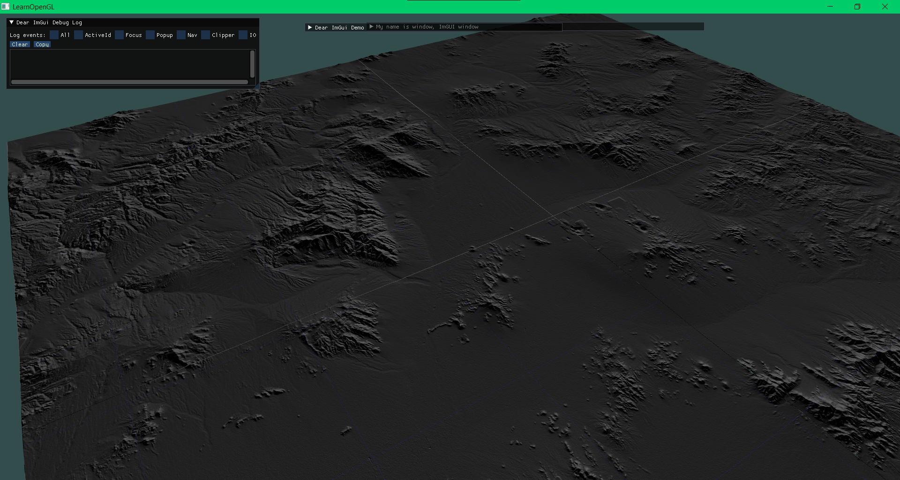

```glsl
#version 330 core
out vec4 FragColor;
  
in vec4 Position;
in vec4 WorldPosition;
in vec3 Normal;
in vec2 TexCoord;
in vec3 Color;

uniform sampler2D texture0;
uniform sampler2D texture1;

uniform mat4 inv_view_projection;
uniform vec3 camera_position;

uniform float lean;
uniform float lean_sq;
uniform float offset;

uniform float min_grass;
//uniform vec3 grass_color;

void main()
{
    vec3 grass_color = vec3(0.0,1.0,0.0);

    float mask = mix(0.6 + min_grass/10.0, 1.0, texture(texture1, TexCoord).r);

    float alpha = 1.0;
    float ht = mask*(texture(texture0, TexCoord*4.0 + vec2(WorldPosition.z*lean + pow(WorldPosition.z*lean_sq, 2.0), 0)).r-(0.3+offset))/(1.0-(0.3+offset));
    float h = WorldPosition.z*10.0;
    if (h >= ht) alpha = 0.0;//1.0 - (h-ht)*20.00;

	FragColor = vec4(grass_color*h, alpha);
}
```


```cpp
//for arbitrary data in binary blob
texture::texture(std::string path, int width, int height, int channels, int bytes_per_channel, unsigned int gl_format, unsigned int gl_internal_format, unsigned int gl_type, bool byte_swap)
{
	glGenTextures(1, &gl_texture_id);
	glBindTexture(GL_TEXTURE_2D, gl_texture_id);

	if (byte_swap) glPixelStoref(GL_UNPACK_SWAP_BYTES, 1);
	glPixelStoref(GL_UNPACK_ALIGNMENT, 1);
	glPixelStoref(GL_PACK_ALIGNMENT, 1);

	set_default_wrap_filter();

	std::vector<char> data = std::vector<char>(width*height*channels*bytes_per_channel);

	std::ifstream input = std::ifstream(path, std::ios::binary);
	int total_bytes = width * height * channels * bytes_per_channel;
	input.read(data.data(), total_bytes);
	bool valid = total_bytes == input.gcount();

	if (valid)
	{
		glTexImage2D(GL_TEXTURE_2D, 0, gl_internal_format, width, height, 0, gl_format, gl_type, data.data());
		std::cout << glGetError() << std::endl;
		glGenerateMipmap(GL_TEXTURE_2D);
	}
	else
	{
		std::cout << "Failed to load texture from raw file: " << path << std::endl;
		throw new std::invalid_argument("Failed to load texture from raw file.");
	}
}
```



Simple terrain shader:

```glsl
#version 330 core
out vec4 FragColor;
 
in vec4 Position;
in vec4 WorldPosition;
in vec3 Normal;
in vec2 TexCoord;
in vec3 Color;

uniform sampler2D texture0;
uniform sampler2D texture1;

uniform mat4 inv_view_projection;
uniform vec3 camera_position;

uniform float ddx;

void main()
{
	vec4 n  = noised(WorldPosition.xyz);

	//FragColor = vec4(TexCoord.xy, 0.0, 1.0);
	float mn = 0;
	float mx = (12000/3.0)/65535.0;

	vec2 im = texture(texture0, TexCoord).xy*1000.0;
	float dddx = 1.0;
	float h = texture(texture0, TexCoord).x;//*32768.0;
	float hx = texture(texture0, TexCoord+vec2(dddx/3601.0, 0.0)).x;//*32768.0;
	float hy = texture(texture0, TexCoord+vec2(0.0, dddx/3601.0)).x;//*32768.0;

	vec3 dx = normalize(vec3(1.0/3601.0, hx-h, 0));
	vec3 dy = normalize(vec3(0, hy-h, 1.0/3601.0));

	vec3 norm = normalize(cross(dy, dx));

	vec3 light_dir = normalize(vec3(1, -0.1, 1));
	float light = 0.25 + 0.75*dot(light_dir, norm);//modified lambertian

	float light_avg = 0.25 + 0.75*dot(light_dir, vec3(0,0,1));

	vec3 color = vec3(0.4353, 0.4353, 0.4353);

	vec3 line_color = vec3(0,0,0.4);
	float spacing = 1000.0;
	vec2 xy_mod = ((TexCoord*3601.0) % spacing) - spacing/2.0;

	float k=5.0;
	float line_intensity = max(exp(-k*(xy_mod.x*xy_mod.x)),exp(-k*(xy_mod.y*xy_mod.y)));

	FragColor = vec4((light_avg + 0.8*(light-light_avg))*color + line_color*line_intensity, 1.0);
	//FragColor = vec4((h-2000.0)/1000.0, 0.0, 0.0, 1.0);
	//FragColor = vec4(dot(normalize(vec3(0.4,0.3,1)), Normal)*vec3(1,1,1).xy, hit, 1.0);
}
```