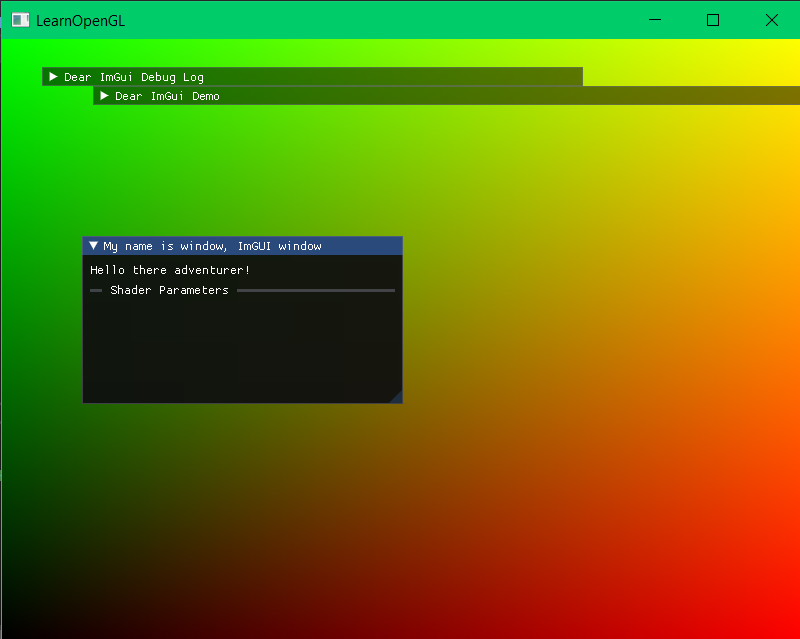

OK. So plan is eventually to make a particle filter-esque ray tracer.

first get a really simple tracer going to demo generating a CPU space image

then maybe work on some correct oop organization

get a proper makefile for compilaton on linux?

terrain loader?

basic setup:

- main program
  - camera
  - renderer
  - element
    - draw
    - update
    - imgui_render
    - children
    - keep track of their transforms for recursive drawing
  - triangles
    - cone
    - box
    - sphere
  - lines
    - circle
    - cone
  - image
  - shader
    - hot reloadable shader / compilation
    - parameter temp settings


Add:
- rendertarget
- pdf
- octree
- element
  - cast_ray


First progress:



got an initial generated image to be displayed

```c
int w = 800;
int h = 600;
int bytes = 3;

std::vector<unsigned char> data = std::vector<unsigned char>(w*h*bytes);

generate_image(data.data(), w, h);

//load and bind texture
unsigned texture0 = bind_rgb_texture(data.data(), w, h);
```

```c
void generate_image(unsigned char* data, int width, int height)
{
	//fill data with stuff

	for (int i = 0; i < width; i++)
	{
		for (int j = 0; j < height; j++)
		{
			data[(i + j * width) * 3 + 0] = (255 * i) / width;
			data[(i + j * width) * 3 + 1] = (255 * j) / height;
		}
	}
}

unsigned int bind_rgb_texture(unsigned char* data, int width, int height)
{
	unsigned int texture;
	glGenTextures(1, &texture);
	glBindTexture(GL_TEXTURE_2D, texture);

	glTexParameteri(GL_TEXTURE_2D, GL_TEXTURE_WRAP_S, GL_REPEAT);
	glTexParameteri(GL_TEXTURE_2D, GL_TEXTURE_WRAP_T, GL_REPEAT);
	glTexParameteri(GL_TEXTURE_2D, GL_TEXTURE_MIN_FILTER, GL_LINEAR_MIPMAP_LINEAR);
	glTexParameteri(GL_TEXTURE_2D, GL_TEXTURE_MAG_FILTER, GL_LINEAR);
	
	if (data)
	{
		glTexImage2D(GL_TEXTURE_2D, 0, GL_RGB, width, height, 0, GL_RGB, GL_UNSIGNED_BYTE, data);
		glGenerateMipmap(GL_TEXTURE_2D);
	}
	else
	{
		std::cout << "Failed to load texture" << std::endl;
		return NULL;
	}

	return texture;
}
```

My initial goals are:

create really simple situation with some balls and light sources
write code to facilitate drawing ray paths for debugging
have some sort of split screen where I can see the generated image and the 3D scene
I can orbit aroung the scene and not re-render the light paths

target structure
- camera
- scene
- element
- ray sampler
- material


So some more thoughts:
- needs to be on linux
- each program needs to be very small and run on its own so I don't have to wreck a demo to write another
- so keep repeated code in a library
- get a makefile going again

- ffmpeg stuff into video

It is incredibly slow to generate a full frame image on the CPU, so look into splatting photons via the vertex shader??? idk if that will work but it'd be neat
split screen between developing render and view of where the photons have been going

I think I might need to buy a linux laptop lol
