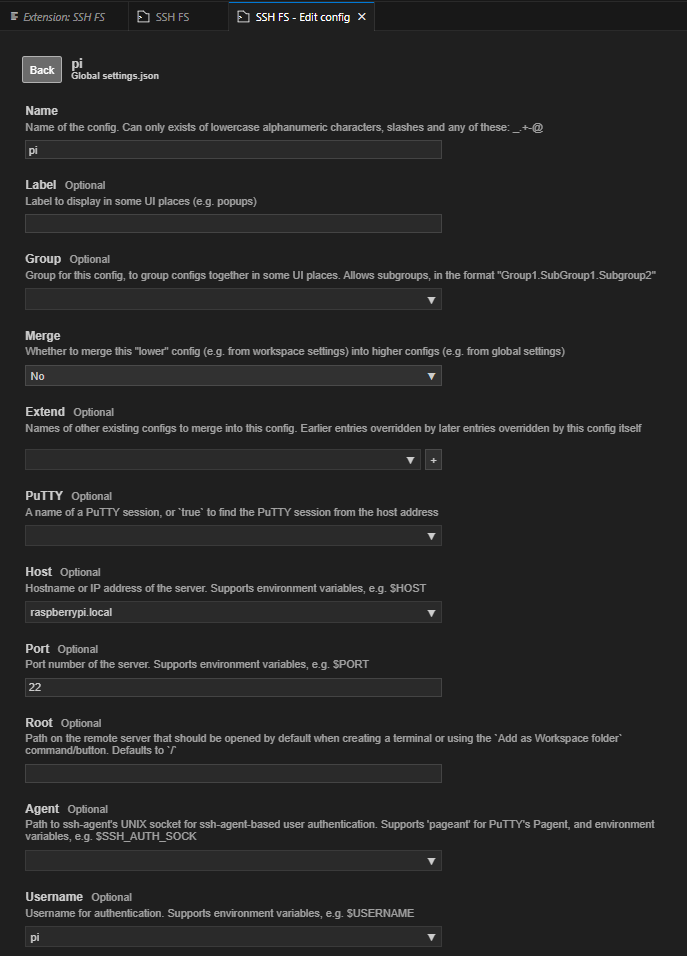
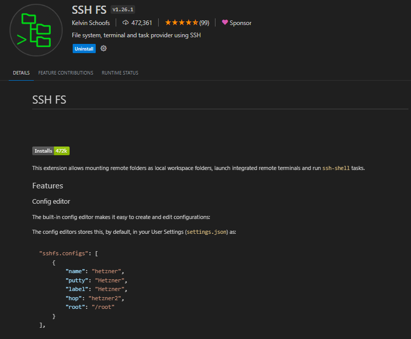
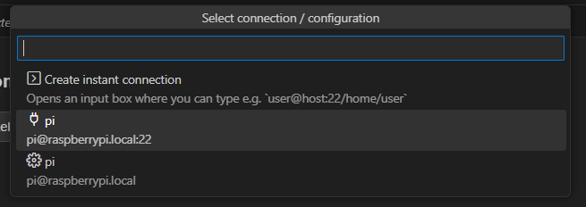
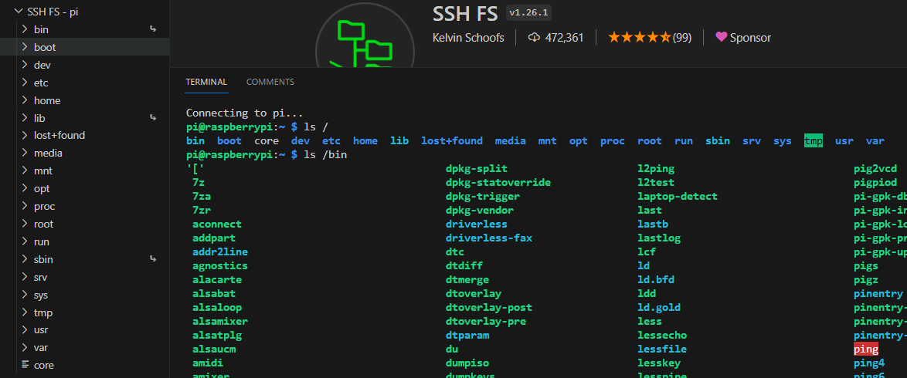
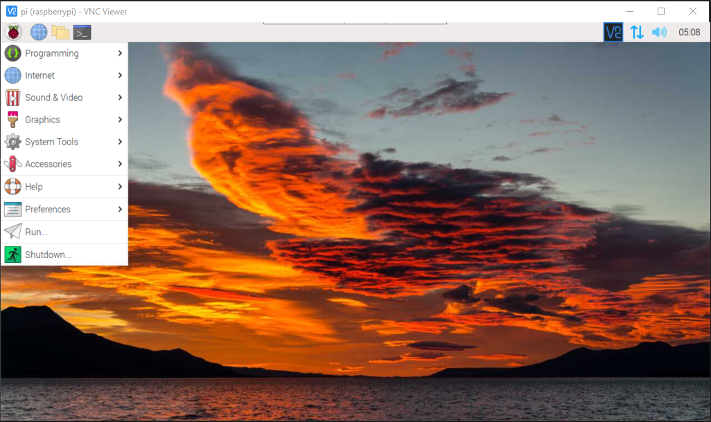

# Pi setup and new goals

Outline:
- finding old pi password
- configuring internet passthrough
- digging up old teammates opencv code

Sooo on ICS - just wait a while, and if you get a 192.169.137... ip, you're good

Setup of Pi zero development env:
- git
- vscode
- opencv
- etc

vscode:
- so ssh install insn't supported
- looking into ssh fs (ssh file server)
    (Use a vscode extension??)

VSCode setup:

VNC also works:

