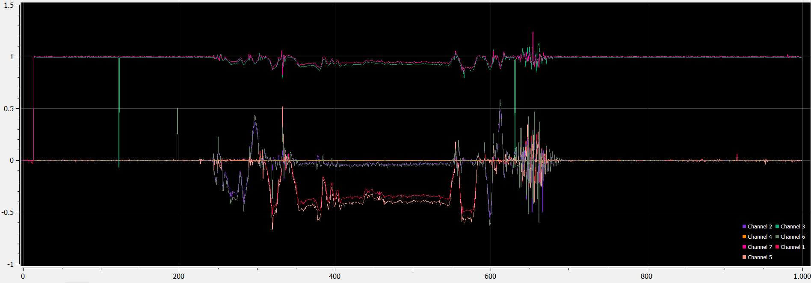

# 8/10/2023

Today I fired up the drone and the code editor for the first time since the end of Senior Design. Things were a bit rusty in my memory as well as the hardware. Eventually I got all the necessary cables dug up and connected, and removed the non-operational I2C harness for the LiDAR. We'll get that working eventually.

My first objective is to play around with the MPU9250 onboard, and see if I can't coax some better performance out of the DSP.
I think this would be the perfect situation to implement a Kalman filter or something similar.

Mostly my goals are to get back into the swing of things in embeddded development while I decide what my next step with this project is, or what a future project should consist of.

First order of business is to ensure correct scaling, signs, and channel matching from one IMU to the next. On this board there are 2 IMUs, the MPU9250 and the LSM6DS3.

Scaling code looks like it should work...

```cpp
    read_axes_MPU6500();

	last_time = current_time;
	current_time = ftime();

	gyro_rate_x = (gyro_raw_x - gyro_cal_x) * G_GAIN_500DPS;
	gyro_rate_y = (gyro_raw_y - gyro_cal_y) * G_GAIN_500DPS;
	gyro_rate_z = (gyro_raw_z - gyro_cal_z) * G_GAIN_500DPS;

	gyro_angle_x += gyro_rate_x * (current_time - last_time);
	gyro_angle_y += gyro_rate_y * (current_time - last_time);
	gyro_angle_z += gyro_rate_z * (current_time - last_time);

	accel_x = (accel_raw_x - accel_cal_x) * A_GAIN_4G;
	accel_y = (accel_raw_y - accel_cal_y) * A_GAIN_4G;
	accel_z = (accel_raw_z - accel_cal_z) * A_GAIN_4G;
```

...But requires some sign swapping to match the other device:

```cpp
printf("%f,\t%f,\t%f,\t%f,\n", -accel_x, -accel_y, accel_z, current_time - last_time);

```


