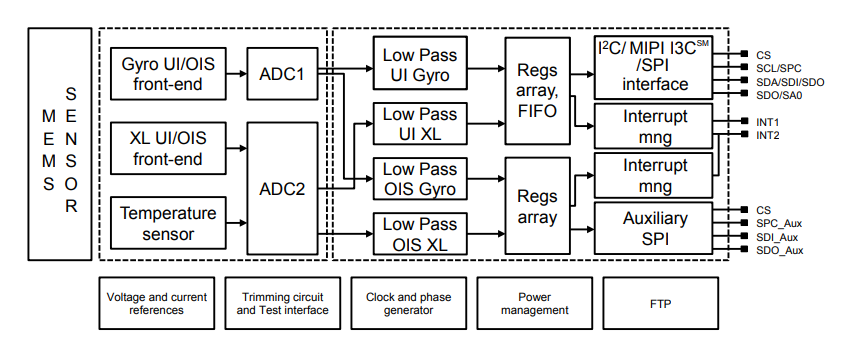

<h1 class="text-center mt-3">{{ title }}</h1>

<div class="container align-content-center" style="height: 100%">
<div class="row">
<div class="col-lg align-content-center">

Boot log:

```log
-----------------------------------------
ECE477 STM32F446RET6 Flight Controller V0
-----------------------------------------
	USB_USART_DIV_FRACTION:  13
	USB_USART_DIV_MANTISSA:  48
SYSTICK:
	SYSTICK_LOAD:		22499
	AHB_CLOCK:			180000000
	AHB_CLOCK_DIV_8:	22500000

```

```c
#define AHB_CLOCK 		SystemCoreClock		//48 MHz
#define AHB_CLOCK_DIV_8 (AHB_CLOCK/8)	//6 MHz
#define SYSTICK_INT_FREQ 1000			//1KHz desired interrupt frequency
#define SYSTICK_LOAD	((AHB_CLOCK_DIV_8/SYSTICK_INT_FREQ)-1)

void init_SYSTICK()
{
	SysTick->LOAD = SYSTICK_LOAD;
	SysTick->VAL = 0;

	SysTick->CTRL |= (1<<0);
	SysTick->CTRL |= (SysTick_CTRL_TICKINT_Msk | SysTick_CTRL_ENABLE_Msk/* | SysTick_CTRL_CLKSOURCE_Msk*/);

	printf("SYSTICK:\n");
	printf("\tSYSTICK_LOAD:		%d\n", SYSTICK_LOAD);
	printf("\tAHB_CLOCK:		%d\n", AHB_CLOCK);
	printf("\tAHB_CLOCK_DIV_8:	%d\n", AHB_CLOCK_DIV_8);
}
```

</div>
<div class="col-lg align-content-center">



</div>
</div>
</div>


