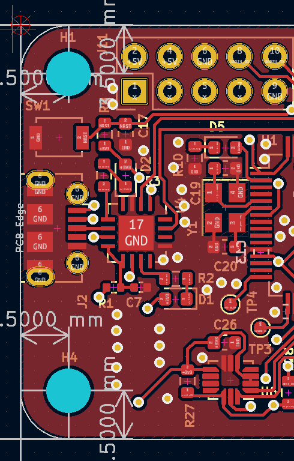

# Week 12

Boot log:

```c
void init_SYSTICK()
{
	SysTick->LOAD = SYSTICK_LOAD;
	SysTick->VAL = 0;

	SysTick->CTRL |= (1<<0);
	SysTick->CTRL |= (SysTick_CTRL_TICKINT_Msk | SysTick_CTRL_ENABLE_Msk/* | SysTick_CTRL_CLKSOURCE_Msk*/);

	printf("SYSTICK:\n");
	printf("\tSYSTICK_LOAD:		%d\n", SYSTICK_LOAD);
	printf("\tAHB_CLOCK:		%d\n", AHB_CLOCK);
	printf("\tAHB_CLOCK_DIV_8:	%d\n", AHB_CLOCK_DIV_8);
}

```



