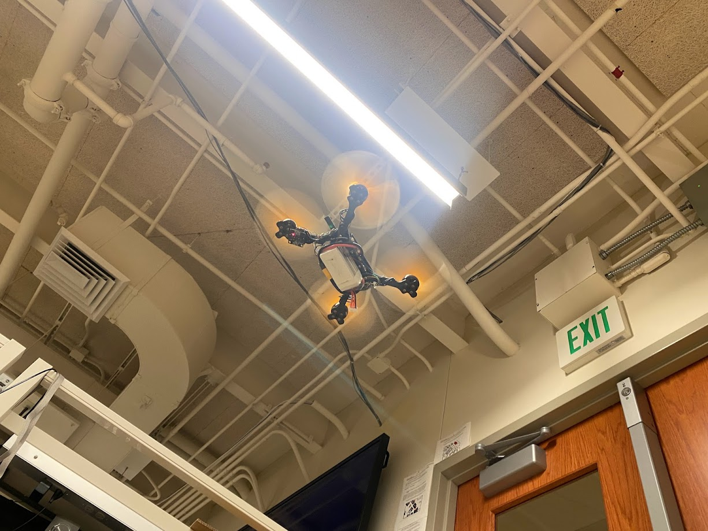

# Week 12

Boot log:

```c
#define AHB_CLOCK 		SystemCoreClock		//48 MHz
#define AHB_CLOCK_DIV_8 (AHB_CLOCK/8)	//6 MHz
#define SYSTICK_INT_FREQ 1000			//1KHz desired interrupt frequency
#define SYSTICK_LOAD	((AHB_CLOCK_DIV_8/SYSTICK_INT_FREQ)-1)

void init_SYSTICK()
{
	SysTick->LOAD = SYSTICK_LOAD;
	SysTick->VAL = 0;

	SysTick->CTRL |= (1<<0);
	SysTick->CTRL |= (SysTick_CTRL_TICKINT_Msk | SysTick_CTRL_ENABLE_Msk/* | SysTick_CTRL_CLKSOURCE_Msk*/);

	printf("SYSTICK:\n");
	printf("\tSYSTICK_LOAD:		%d\n", SYSTICK_LOAD);
	printf("\tAHB_CLOCK:		%d\n", AHB_CLOCK);
	printf("\tAHB_CLOCK_DIV_8:	%d\n", AHB_CLOCK_DIV_8);
}

uint8_t watchdog = 0;
uint32_t ticks = 0;

void SysTick_Handler(void)
{
	ticks++;
	//GPIOC->ODR ^= 0x1 << 13;

	if (check_arm_code())
	{
		if (watchdog > 50)
		{
			pwm_output_t zeros;
			zeros.duty_cycle_ch0 = 0;
			zeros.duty_cycle_ch1 = 0;
			zeros.duty_cycle_ch2 = 0;
			zeros.duty_cycle_ch3 = 0;

			set_PWM_duty_cycle(zeros);
		}
		else
		{
			//that way watchdog won't rollover.
			watchdog++;
		}
	}
	else
	{
		watchdog = 0;
	}
}

```

$$ y[n]=ky[n-1]+(1-k)x[n] $$

$$  \frac{Y(z)}{X(z)} =  \frac{k}{1-(1-k) z^{-1}} \bigg|_{z=j\omega} $$



