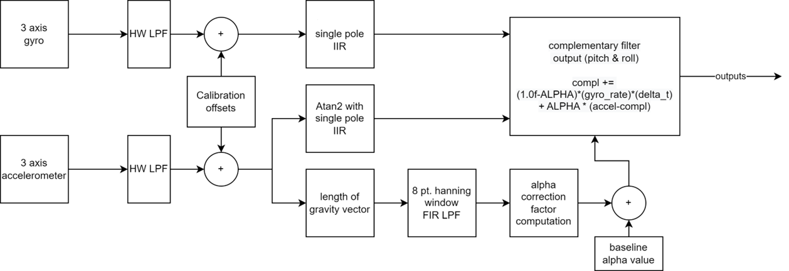
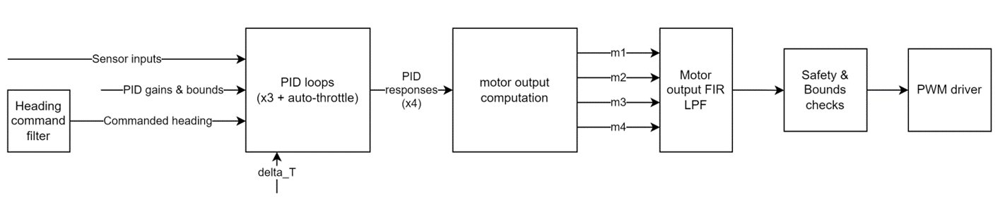
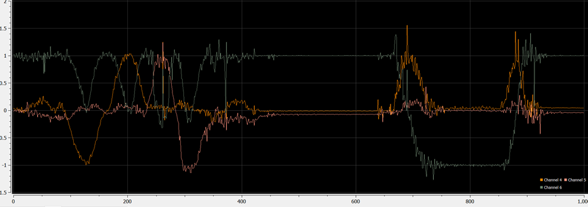
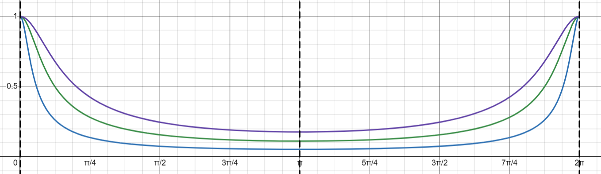
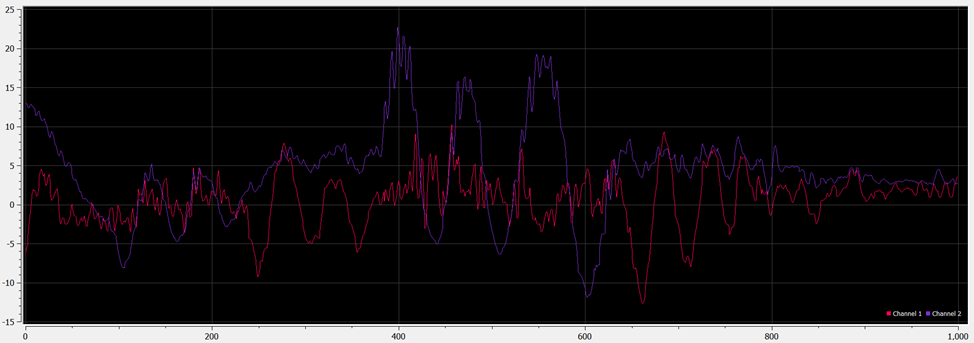
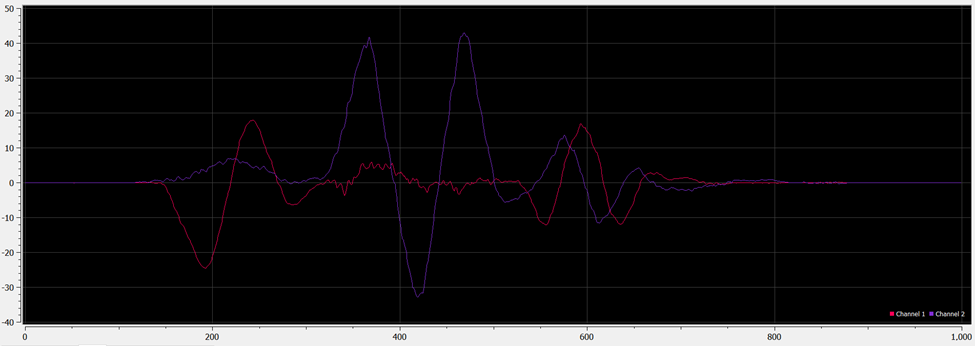

<div class="carousel-item" style="height: 100%">
<h1 class="text-center mt-3">{{ title }}</h1>
<div class="container align-content-center" style="height: 100%">
<div class="row">
<div class="col-lg-4 align-content-center">

**Sensor fusion block diagram**

Once the basic function of streaming was complete, I put quite a bit of time into calibrating and adapting the IMU software to filter and combine the accelerometer and gyroscope.

The sensor fusion algorithm I settled on is composed of some initial filtering steps followed by a simple alpha/beta filter that combines the angular rate of the gyro with the high-noise but reliable accelerometer pitch and roll values. The alpha/beta parameter is also driven by a motion and noise sensing step to tune it to the most reliable sensor.

</div>
<div class="col-lg-8 align-content-center">





</div>
</div>
</div>
</div>

<div class="carousel-item" style="height: 100%">
<h1 class="text-center mt-3">{{ title }}</h1>
<div class="container align-content-center" style="height: 100%">



<div class="row">
<div class="col-lg-6 align-content-center">

I created a very simple IIR filter for the accelerometer data, single pole:

$$ y[n]=ky[n-1]+(1-k)x[n] $$

$$  \frac{Y(z)}{X(z)} =  \frac{k}{1-(1-k) z^{-1}} \bigg|_{z=e^{j\omega}} $$

I’ve plotted the frequency response of the filter (which isn’t amazing, but it runs pretty fast seeing as it’s single pole).

</div>
<div class="col-lg-6 align-content-center">



</div>
</div>
</div>
</div>


<div class="carousel-item" style="height: 100%">
<h1 class="text-center mt-3">{{ title }}</h1>
<div class="container align-content-center" style="height: 100%">
<div class="row">
<div class="col-lg-9 align-content-center">

I also created the conversion code from accelerometer g readings to estimated pitch and roll using the arctan function. The gravity vector is sensed by taking the dot product of the gravity vector and the axes of the accelerometer, giving 3 acceleration values. Assuming no other acceleration is present (haha like that’ll happen), the arctan function can be used to find the angle of the vector formed by the axes readings.

*IIR filter implementation within atan2 conversion*
```cpp
accel_pitch = atan2(accel_x, sqrt(accel_z*accel_z + accel_y*accel_y)) * (180.0f/3.1415963f) * 0.01f + 0.99f*accel_pitch;
accel_roll = atan2(accel_y, sqrt(accel_z*accel_z + accel_x*accel_x)) * (180.0f/3.1415963f) * 0.01f + 0.99f*accel_roll;
```

</div>
<div class="col-lg-3 align-content-center">

")

</div>
</div>



</div>
</div>


<div class="carousel-item" style="height: 100%">
<h1 class="text-center mt-3">{{ title }}</h1>
<div class="container align-content-center" style="height: 100%">

Lastly I implemented a filter called the complementary filter, which combines the high frequency gyroscope readings (which are reliable in the short term), and the noisy but long-term stable accelerometer angle, to compute a simple estimate of the true angle.

On top of that, I added an algorithm to modify in real time the parameter controlling the relative trust the complementary filter has in the gyro vs. the accelerometer. It works by sensing when the length of the vector comprising the total acceleration felt by the accelerometer is greater in magnitude than 1G, indicating that noise or movement is taking place. The differential is the used to generate a correction factor to apply to the parameter ‘Alpha’ which estimates which measurement is more accurate.

```cpp
accel_pitch = atan2(accel_x, sqrt(accel_z*accel_z + accel_y*accel_y)) * (180.0f/3.1415963f) * 0.01f + 0.99f*accel_pitch;
accel_roll = atan2(accel_y, sqrt(accel_z*accel_z + accel_x*accel_x)) * (180.0f/3.1415963f) * 0.01f + 0.99f*accel_roll;

float alpha_correction = pow(total_acceleration_filtered-1.0f, 2.0f);
...
float ALPHA = (ALPHA_0 + alpha_correction);

compl_pitch += (1.0f-ALPHA)*(gyro_rate_y*2.0f)*(current_time - last_time) + ALPHA * (accel_pitch-compl_pitch);
compl_roll +=  (1.0f-ALPHA)*(gyro_rate_x*2.0f)*(current_time - last_time) + ALPHA * (accel_roll-compl_roll);
```

<div class="text-center text-muted">Fig. 15- 1. Source code of filter correction algorithm</div>



</div>
</div>

<div class="carousel-item" style="height: 100%">
<h1 class="text-center mt-3">{{ title }}</h1>
<div class="container align-content-center" style="height: 100%">

https://youtu.be/g4PSVRbhDk8

</div>
</div>