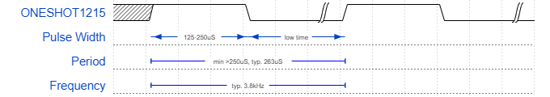
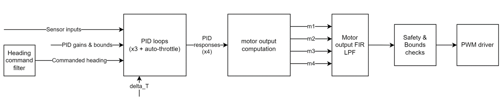

<div class="carousel-item" style="height: 100%">
<h1 class="text-center mt-3">{{ title }}</h1>
<div class="container align-content-center" style="height: 100%">
<div class="row">
<div class="col-lg-6 align-content-center">

This week I also switched to using OneShot125 correctly and running it at maximum data rate, around 3.8kHz, rather than the previous 400Hz.



After testing the PID loops with the motors running, and readying the drone for test flights, I needed to ensure that the propellers on the drone were spinning the correct direction. The torque induced from the motors rotating is very significant, and if the motors spin the wrong direction this torque will not be counteracted and will spin the drone out of control.

For this reason, half the motors have to spin counterclockwise and half clockwise. However, if just any two are chosen, then when the drone attempts to counteract an imbalance in pitch or roll, it may change the speeds of the motor pair that spins in the same direction, resulting in a torque differential, and then spin. Thus, it must have the motors on a diagonal with each other spin in the same direction. Thus when any pair of motors on a side changes speeds, both the CCW spinning motor and the CW spinning motor will change speeds equally, resulting in net zero torque.

</div>
<div class="col-lg-6 align-content-center">


</div>
</div>
</div>
</div>


<div class="carousel-item" style="height: 100%">
<h1 class="text-center mt-3">{{ title }}</h1>
<div class="container align-content-center" style="height: 100%">

https://www.youtube.com/embed/4aSOW4n8nL4

</div>
</div>

<div class="carousel-item" style="height: 100%">
<h1 class="text-center mt-3">{{ title }}</h1>
<div class="container align-content-center" style="height: 100%">

With the motors and IMU now all working, I tried running the full PID loop + motor + radio code to test the response of the drone. Unfortunately, I noticed immediately that there was a huge issue with the noise induced in the data by the vibration from the motors running. 
I took a look at the noise spectrum while the motors were running, hoping all the noise was high frequency, or tonal and could be filtered, however it was broadband, and the gyro was hitting its max dynamic range as well.

As evidence of all this, with the motors running and the drone still, the pitch and roll quickly diverged from an accurate measurement of the heading.


</div>
</div>

<div class="carousel-item" style="height: 100%">
<h1 class="text-center mt-3">{{ title }}</h1>
<div class="container align-content-center" style="height: 100%">
<div class="row">
<div class="col-lg-8 align-content-center">

In order to fix the vibration issues, I had to use an alternate mount to the original rigid mounting setup. I found a piece of soft anti-static foam, and glued the 3D printed mount onto the foam, and then onto the motor controller.

I initially just tried using O-rings at the mount points, however this wasn’t sufficient. 


</div>
<div class="col-lg-4 align-content-center">


</div>
</div>
</div>
</div>

<div class="carousel-item" style="height: 100%">
<h1 class="text-center mt-3">{{ title }}</h1>
<div class="container align-content-center" style="height: 100%">
<div class="row">
<div class="col-lg-2 align-content-center"></div>
<div class="col-lg-8 align-content-center">



</div>
<div class="col-lg-2 align-content-center"></div>
</div>

<div class="row">
<div class="col-lg-6 align-content-center">

```c
float update_PID(struct PID* pid, float real, float desired) {
	pid->Error = desired - real;

	pid->P_Error = bound( pid->Error * pid->kP, pid->maxP);
	pid->I_Error = bound( pid->I_Error + (pid->Error)*pid->kI, pid->maxI);
	pid->D_Error = bound((pid->Error - pid->Last_Error)*pid->kD, pid->maxD);

	pid->Output =  pid->P_Error;
	pid->Output += pid->I_Error;
	pid->Output += pid->D_Error;

	pid->Last_Error = pid->Error;
	pid->Last_Output = pid->Output;

	return pid->Output;
}
```

</div>
<div class="col-lg-6 align-content-center">

https://youtu.be/K2zn1jZydOI

</div>
</div>
</div>
</div>


<div class="carousel-item" style="height: 100%">
<h1 class="text-center mt-3">{{ title }}</h1>
<div class="container align-content-center" style="height: 100%">
<div class="row">
<div class="col-lg-6 align-content-center">

Boot log:

```c
-----------------------------------------
ECE477 STM32F446RET6 Flight Controller V0
-----------------------------------------

USB_USART:
	USB_USART_BAUDRATE:      115200
	CLOCK_RATE:              90000000
	USB_USART_CLOCK_RATE:    90000000
	USB_USART_DIV:           48
	USB_USART_DIV_FRACTION:  13
	USB_USART_DIV_MANTISSA:  48
SYSTICK:
	SYSTICK_LOAD:		22499
	AHB_CLOCK:		180000000
	AHB_CLOCK_DIV_8:	22500000
RX_USART:
	RX_USART_BAUDRATE:      420000
	CLOCK_RATE:             90000000
	RX_USART_CLOCK_RATE:    90000000
	RX_USART_DIV:           13
	RX_USART_DIV_FRACTION:  6
	RX_USART_DIV_MANTISSA:  13
	CRSF_RX_BAUDRATE:       420000
	CRSF_NUM_CHANNELS:      16
	CRSF_CHANNEL_VALUE_MIN: 172
	CRSF_CHANNEL_VALUE_MID: 992
	CRSF_CHANNEL_VALUE_MAX: 1811
	CRSF_MAX_PACKET_LEN:    64
```

</div>
<div class="col-lg-6 align-content-center">

*(Continued...)*

```c
PI_USART:
	PI_USART_BAUDRATE:      115200
	CLOCK_RATE:             45000000
	PI_USART_CLOCK_RATE:    45000000
	PI_USART_DIV:           24
	PI_USART_DIV_FRACTION:  6
	PI_USART_DIV_MANTISSA:  24
	PI_FRAME_START_CODE:    65
	PI_FRAME_END_CODE:      66
PWM:
	PWM_FREQ:        3800
	PWM_PERIOD [uS]: 263.157898
	MIN_PULSE  [uS]: 125
	MAX_PULSE  [uS]: 250
	PWM_ARR:         5262
	UPPERBOUNDCRRX:  5000
	LOWERBOUNDCRRX:  2500
	RANGE:           2500
SPI1:
	SPI_CR1_BR_PCLOCK_DIV_32: 0x20
	SPI_PCLOCK_DIV_32:        2812500
LSM6DSO Calibration:
	gyro_cal_x: 4
	gyro_cal_y: 14
	gyro_cal_z: 0
MPU6500 Calibration:
	gyro_cal_x: 6419
	gyro_cal_y: 5340
	gyro_cal_z: 0
```

</div>
</div>
</div>
</div>