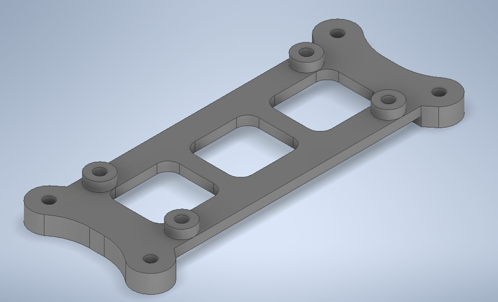
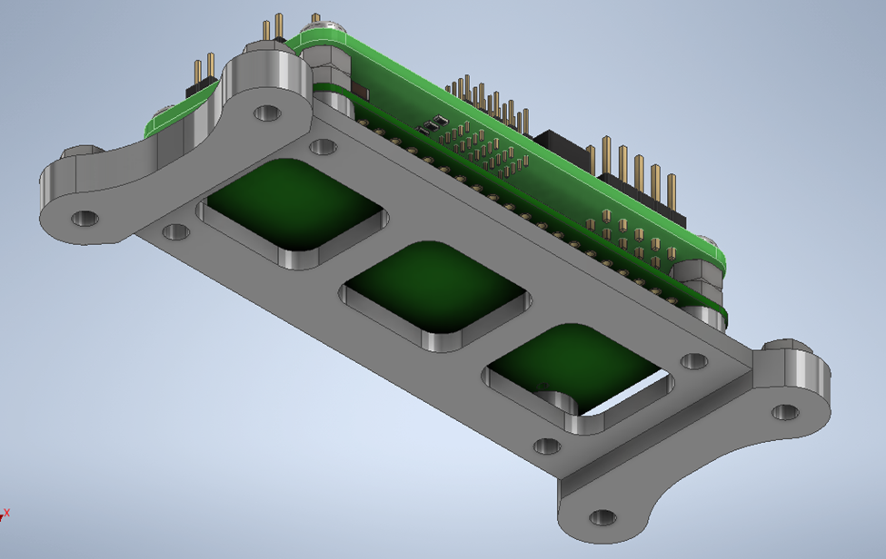
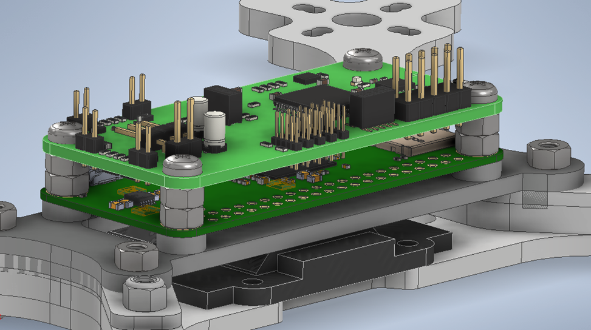
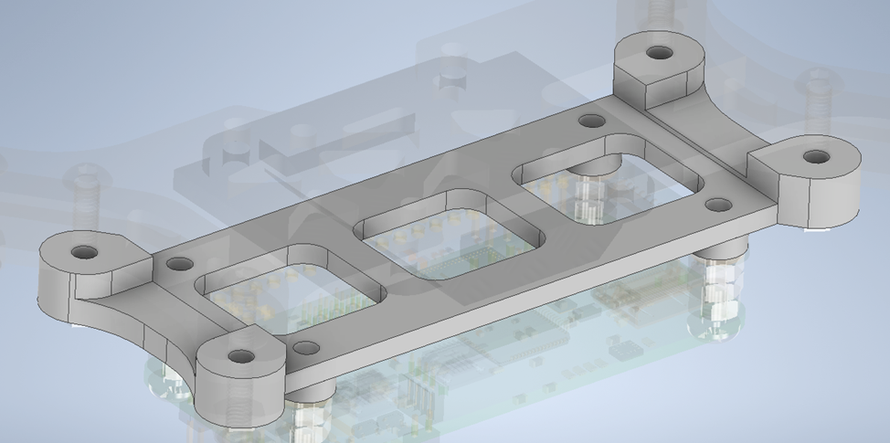

<h1 class="text-center mt-3">{{ title }}</h1>

**Mechanical assembly**

As the flight controller development continues, I completed the wiring of the motors and ESC, along with the battery, as that has arrived as well. Soldering anything to the ESC is a bit of a challenge, as the heat dissipation and thermal mass of the board is so high. I have to set the temperature of the iron past 900 deg.F, and that seems to work alright. I started out by wrapping the motor cables around the arms of the frame to take up the slack in the cables, but allow for rewiring and flexing of the cable. I taped them in their positions, and then worked on mounting the ESC to the frame.

<h1 class="text-center mt-3">{{ title }}</h1>

The ESC wasn’t hard to mount, it simply needed ¾” M3 screws and nuts to hold it in place.
Once the ESC was mounted, I soldered the power cable, and then the motors. Once complete, I powered it up and verified that each motor vibrated as it generated the startup sound.

<h1 class="text-center mt-3">{{ title }}</h1>

**Flight Controller Mount Design**

I decided to model everything in Inventor including the Pi Zero and the PCB, so I spent quite a bit of time figuring out how to export a model from KiCAD that Inventor could understand without it losing a significant amount of information. I also added the screws and nuts that we will use, both because I think it looks nice, and it makes sure that each part has the needed clearance to be screwed in.

<h1 class="text-center mt-3">{{ title }}</h1>

<h1 class="text-center mt-3">{{ title }}</h1>

Once the mounting bracket was printed, I tried it out to see if it needed any changes/reprint. After removing the raft and support material, and cleaning off the thin wisps of print material, the bracket was looking good.

An initial evaluation revealed however that I had forgotten a couple very important components when designing this, the motor cables and the motor controller clearance. As can be seen in Fig. 7, the bracket doesn’t leave any space between the screw holes for the motor cables to pass under, as well as coming real close to the top of the motor controller.

<h1 class="text-center mt-3">{{ title }}</h1>

These issues didn’t seem to be solvable without damaging the mount, or modification of the motor cable routing (which I definitely didn’t want to change), so I decided to make some modifications and reprint.

I fixed both issues by extruding the part of the bracket that surrounds the mounting screws, but leaving space for the motor cables – this increased the clearance while making space for the wires, solving both issues.

