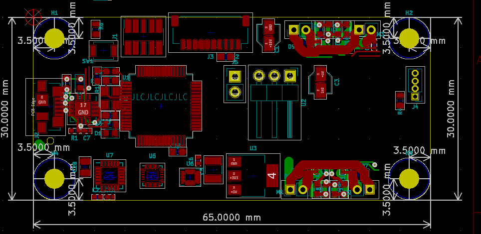
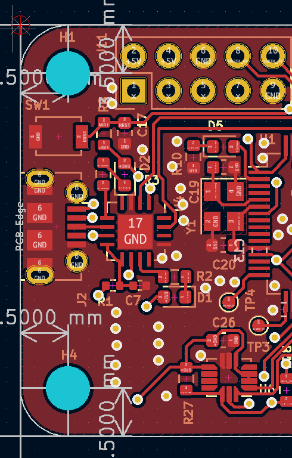

<h1 class="text-center mt-3">{{ title }}</h1>

 

<!--
INSERT PCB design section
-->

<h1 class="text-center mt-3">{{ title }}</h1>

<h1 class="text-center mt-3">{{ title }}</h1>

<h1 class="text-center mt-3">{{ title }}</h1>

I also added the PI Zero connector that I had put off for last, selecting a part of the Pi header to interface to that contains the UART, +5V, and ground. This is pins 1 through 10 at the far edge of the PI PCB. This ended up being a relatively convenient spot after I moved a couple things out of its way.

<h1 class="text-center mt-3">{{ title }}</h1>

Now that the part was in the ~mostly correct spot, I had to ensure that the connector would line up perfectly by looking up the exact dimensions of the board, and by verifying the setup by printing a to-scale version of the board and checking it against the Pi Zero I own.

Using these measurements, I worked to place it in what I believed was the best position. Then I printed off the to-scale version and compared. I noticed that while all the corner holes were properly aligned, the connector was about a millimeter too far to the right. I then readjusted and printed again. Much better! A visual check shows the pins at the exact right spot.

