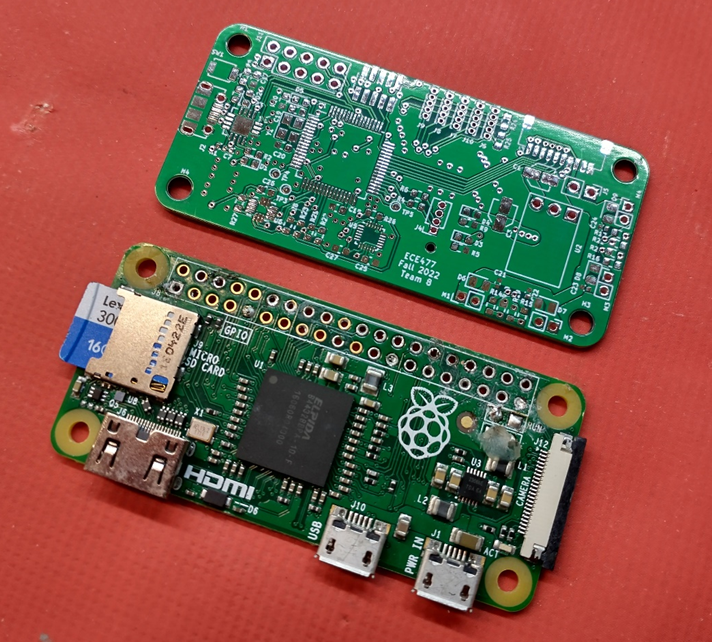
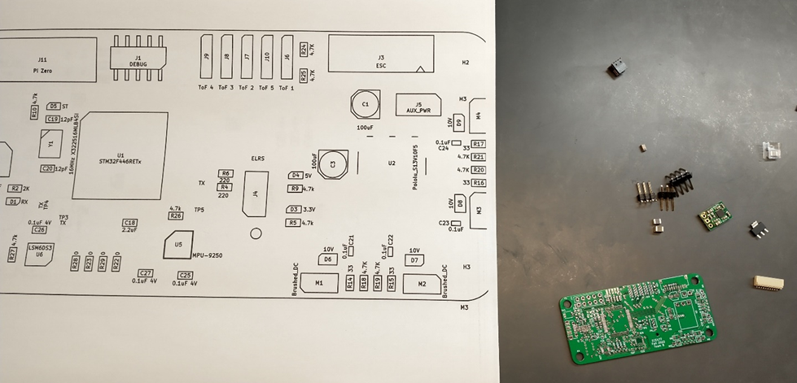
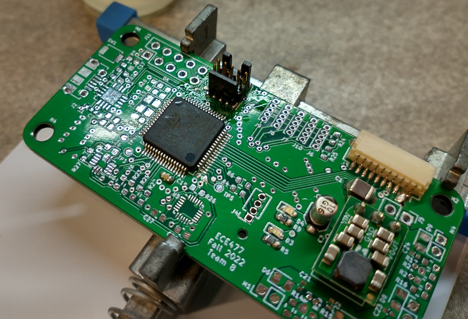

<h1 class="text-center mt-3">{{ title }}</h1>

Our PCBs arrived this week from JLCPCB, allowing us to start the hardware build process. The boards look good, however not tenting the vias is going to make certain aspects of the board much harder to solder, on an already very dense and small pitch build. We’ll see how this goes. Figure 11- 1 shows one of the boards upon arrival.

First, I wanted to perform some electrical tests on the board, which it passed. I tested continuity for many different nets, particularly those with very tight trace tolerances. Next I tested the physical layout of the board by comparing it to the Pi Zero, onto which it needs to mount. I was happy to see the boards fit perfectly with the Pi Zero form factor and screw positions, as well as the communication connector lining right up with the Pi Zero header. 

<h1 class="text-center mt-3">{{ title }}</h1>

Once satisfied that the boards weren’t total trash, I began soldering, starting with the power supply, to verify that first. This board uses mostly 0603 SMT passive components, with a couple 0402s and 1206 & 1210s for power capacitors. This means the lab doesn’t have the majority of the components we need. Thankfully, I have a personal stockpile of a variety of different 0603 SMT passives, and a few assorted 1206 & 1210s from previous flight controller board projects.

")

I first laid out the components on the board without soldering, to get a sense of how everything was fitting, and if there were any mistakes with footprints. I then went into KiCAD and generated a plot of the reference designator and value of every component on the board, at much larger scale. This helps a lot when trying to figure out which miniscule SMT part goes where

<h1 class="text-center mt-3">{{ title }}</h1>

First I soldered the power capacitors, 5V switching regulator, and then the ESC connector. I then tested the regulator by wiring the connector to the ESC and powering on, and measuring the voltage and ripple.

After this, I added all the 3.3V microcontroller caps, and then the microcontroller. This is one of the most difficult parts to solder, and definitely took a while. First I covered the board in flux, and brushed solder across the pads. Then I tacked a pin from each corner down, and then dragged the tinned iron across the pins. Next I added the programming header. At first this appeared to work, but after attempting to program with no success, I realized that some of the solder joints on the micro had very little solder, so I reheated multiple joints individually, and then the device was able to program. 

