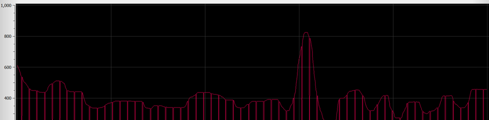
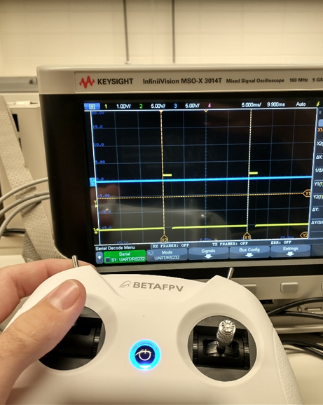

<div class="carousel-item" style="height: 100%">
<h1 class="text-center mt-3">{{ title }}</h1>

<div class="container align-content-center" style="height: 100%">
<div class="row">
<div class="col-lg-4 align-content-center">

**Radio data parsing**

The first improvements done on the receiver code were proper interpretations of the channel bit data. They were actually 11 bit values rather than the 10 bits stated online. I assume this is just due to the sign bit and that is why it was not included. After creating a packed struct, the bits are easily extracted and the ensuing data could be extracted properly mapped to the correct channel.

To improve the existing radio receiver code, I had to put bounds on the input data streaming in. There were periodic packets coming in with valid frame starts, but with different content than channel data. This resulted in every 50 or so packets being invalid data, creating a useless and choppy input signal. To begin, I put a bound on the length of a packet before it gets parsed. If it fell within the valid range, it can then be processed.

The prior output of the parsing algorithm shows the clear issue:

</div>
<div class="col-lg-8 align-content-center">



After properly filtering the packets to the proper data content, the data smoothly varies as expected.


</div>
</div>
</div>
</div>


<div class="carousel-item" style="height: 100%">
<h1 class="text-center mt-3">{{ title }}</h1>

<div class="container align-content-center" style="height: 100%">
<div class="row">
<div class="col-lg-4 align-content-center">

**Radio Code**

Finally, I overhauled my CRSF implementation from the original hacky demo to integrated and reliable firware – the original worked but performed almost no data validation (dangerous!), and was very inefficient.

For the new design, I chose a circular buffer, where the ‘start’ of the buffer would be shifted up until the end of the buffer, and then back around, rather than shifting the buffer contents while looking for a valid packet. This is significantly more efficient. Once it sees a valid starting character, it places a struct pointer at that location in memory, and begins to decode the data from that position, pulling out descriptors like the frame length from the point indicated my the struct definition. If needed, the ‘rolled over’ part of memory in the circular buffer is copied over to free space at the end of the buffer so the data frame is contiguous. Then the address, frame type, and CRC are checked. If these are valid, then the channel data is copied over to the global location for the latest radio channel data.

This system actually worked almost perfectly first try, which was great! I only had to fix a couple pointer casts and offsets, and the system was good to go. Another benefit is I went to the source code on the ELRS site and used their #defines and enums, so that my code is using not only the right values, but the canonical names for each field.

</div>
<div class="col-lg-8 align-content-center">

```c

if ((crsf_addr_e)(*rx_buffer_start) == CRSF_ADDRESS_FLIGHT_CONTROLLER)
{
  //go through and attempt to parse
  //place the data struct at this location and see if it passes
  //first task is to verify the length is within bounds, and
  //that the message type is what we're looking for
  //Then verify it has a valid CRC

  crsf_packet_t* crsf_packet = (crsf_packet_t*)rx_buffer_start;

  if (crsf_packet->header.type == CRSF_FRAMETYPE_RC_CHANNELS_PACKED)
  {
    if (crsf_packet->header.frame_size == sizeof(crsf_channels_t)+2/*type, crc, and payload*/)
    {
      //validate CRC

      //copy everything from bottom to the rx_buffer_start point into the 
      //upper half of the array to make it contiguous
      memcpy(rx_buffer + BUFFER_SIZE, rx_buffer, rx_buffer_start-rx_buffer);

      uint8_t calculated_crc = calc_crc(&(crsf_packet->header.type), sizeof(crsf_channels_t)+1);
      uint8_t rx_crc = crsf_packet->crc;

      if (rx_crc == calculated_crc)
      {
        //valid packet
        //TODO save the last 30 or so channel packets for filtering if needed
        memcpy((void*)&saved_channel_data, (void*)&(crsf_packet->channels), sizeof(crsf_channels_t));
        return 1;
      }
    }
  }
}

```

</div>
</div>
</div>
</div>

<!-- ----


Here put the week 7 radio code improvements

**Radio Code**

I also revisited my radio CRSF interpretation code this week, in order to improve my relatively hacky code – which worked but performed almost no data validation (dangerous!), and was very inefficient.

For the new design, I chose a circular buffer, where the ‘start’ of the buffer would be shifted up until the end of the buffer, and then back around, rather than shifting the buffer contents while looking for a valid packet. This is significantly more efficient. Once it sees a valid starting character, it places a struct pointer at that location in memory, and begins to decode the data from that position, pulling out descriptors like the frame length from the point indicated my the struct definition. If needed, the ‘rolled over’ part of memory in the circular buffer is copied over to free space at the end of the buffer so the data frame is contiguous. Then the address, frame type, and CRC are checked. If these are valid, then the channel data is copied over to the global location for the latest radio channel data.

This system actually worked almost perfectly first try, which was great! I only had to fix a couple pointer casts and offsets, and the system was good to go. Another benefit is I went to the source code on the ELRS site and used their #defines and enums, so that my code is using not only the right values, but the canonical names for each field.

```c

if ((crsf_addr_e)(*rx_buffer_start) == CRSF_ADDRESS_FLIGHT_CONTROLLER)
{
  //go through and attempt to parse
  //place the data struct at this location and see if it passes
  //first task is to verify the length is within bounds, and
  //that the message type is what we're looking for
  //Then verify it has a valid CRC
  //move everything from the beginning of memory to

  crsf_packet_t* crsf_packet = (crsf_packet_t*)rx_buffer_start;

  if (crsf_packet->header.type == CRSF_FRAMETYPE_RC_CHANNELS_PACKED)
  {
    if (crsf_packet->header.frame_size == sizeof(crsf_channels_t)+2/*type, crc, and payload*/)
    {
      //validate CRC

      //copy everything from bottom to the rx_buffer_start point into the upper half of the array to make it contiguous
      memcpy(rx_buffer + BUFFER_SIZE, rx_buffer, rx_buffer_start-rx_buffer);

      uint8_t calculated_crc = calc_crc(&(crsf_packet->header.type), sizeof(crsf_channels_t)+1/*don't include the CRC in the CRC calc haha*/);
      uint8_t rx_crc = crsf_packet->crc;

      if (rx_crc == calculated_crc)
      {
        //valid packet
        //TODO save the last 30 or so channel packets for filtering if needed
        memcpy((void*)&saved_channel_data, (void*)&(crsf_packet->channels), sizeof(crsf_channels_t));
        return 1;
      }
    }
  }
}

```


```c
typedef struct
{
    uint16_t ch0 : 11;
    uint16_t ch1 : 11;
    uint16_t ch2 : 11;
    uint16_t ch3 : 11;
    uint16_t ch4 : 11;
    uint16_t ch5 : 11;
    uint16_t ch6 : 11;
    uint16_t ch7 : 11;
    uint16_t ch8 : 11;
    uint16_t ch9 : 11;
    uint16_t ch10 : 11;
    uint16_t ch11 : 11;
    uint16_t ch12 : 11;
    uint16_t ch13 : 11;
    uint16_t ch14 : 11;
    uint16_t ch15 : 11;
} __attribute__ ((packed)) crsf_channels_t;

typedef struct
{
    uint8_t device_addr; // from crsf_addr_e
    uint8_t frame_size;  // counts size after this byte, so it must be the payload size + 2 (type and crc)
    uint8_t type;        // from crsf_frame_type_e
} __attribute__ ((packed)) crsf_header_t;

typedef struct
{
	crsf_header_t header;
	crsf_channels_t channels;
	uint8_t crc;
} __attribute__ ((packed)) crsf_packet_t;

typedef enum
{
    CRSF_FRAMETYPE_GPS = 0x02,
    CRSF_FRAMETYPE_BATTERY_SENSOR = 0x08,
    CRSF_FRAMETYPE_LINK_STATISTICS = 0x14,
    CRSF_FRAMETYPE_RC_CHANNELS_PACKED = 0x16,
    CRSF_FRAMETYPE_ATTITUDE = 0x1E,
    CRSF_FRAMETYPE_FLIGHT_MODE = 0x21,
    // Extended Header Frames, range: 0x28 to 0x96
    CRSF_FRAMETYPE_DEVICE_PING = 0x28,
    CRSF_FRAMETYPE_DEVICE_INFO = 0x29,
    CRSF_FRAMETYPE_PARAMETER_SETTINGS_ENTRY = 0x2B,
    CRSF_FRAMETYPE_PARAMETER_READ = 0x2C,
    CRSF_FRAMETYPE_PARAMETER_WRITE = 0x2D,
    CRSF_FRAMETYPE_COMMAND = 0x32,
    // MSP commands
    CRSF_FRAMETYPE_MSP_REQ = 0x7A,   // response request using msp sequence as command
    CRSF_FRAMETYPE_MSP_RESP = 0x7B,  // reply with 58 byte chunked binary
    CRSF_FRAMETYPE_MSP_WRITE = 0x7C, // write with 8 byte chunked binary (OpenTX outbound telemetry buffer limit)
} crsf_frame_type_e;

typedef enum
{
    CRSF_ADDRESS_BROADCAST = 0x00,
    CRSF_ADDRESS_USB = 0x10,
    CRSF_ADDRESS_TBS_CORE_PNP_PRO = 0x80,
    CRSF_ADDRESS_RESERVED1 = 0x8A,
    CRSF_ADDRESS_CURRENT_SENSOR = 0xC0,
    CRSF_ADDRESS_GPS = 0xC2,
    CRSF_ADDRESS_TBS_BLACKBOX = 0xC4,
    CRSF_ADDRESS_FLIGHT_CONTROLLER = 0xC8,
    CRSF_ADDRESS_RESERVED2 = 0xCA,
    CRSF_ADDRESS_RACE_TAG = 0xCC,
    CRSF_ADDRESS_RADIO_TRANSMITTER = 0xEA,
    CRSF_ADDRESS_CRSF_RECEIVER = 0xEC,
    CRSF_ADDRESS_CRSF_TRANSMITTER = 0xEE,
} crsf_addr_e;
```

---- -->

<div class="carousel-item" style="height: 100%">
<h1 class="text-center mt-3">PWM Integration</h1>

<div class="container align-content-center" style="height: 100%">
<div class="row">
<div class="col-lg-5 align-content-center">

**PWM development**

PWM is a very common protocol for controlling brushless ESCs. They commonly use a simple protocol of a 20ms period, and a pulse width varying from 1 to 2ms depending on throttle value (0% = 1ms, 100% = 2ms). A teammate had already created the driver code to produce this general signal, but it had to be implemented with the correct timing.

Some timing calculations had to be done to create a PWM signal working off of this code that had the correct pulse width and duty cycle. After refreshing myself about the internal timer operation, I created both code and an excel tool to calculate the PSC and ARR and CCMR values for the PWM driver.

<div class="d-flex justify-content-center">

| PWM PSC & ARR |          |
| ------------- | -------- |
| period        | 0.02     |
| Fclk          | 1.60E+07 |
| freq          | 50       |
| PSC           | 15       |
| ARR           | 19999.00 |
| freq_out      | 50       |
| period_out    | 0.02     |
| period_ms     | 20       |

</div>
<div class="d-flex justify-content-center">
Table 6.1. Table to calculate the registers.
</div>


</div>
<div class="col-lg-7 align-content-center">

After calculating the proper register values, the oscilloscope data displays the desired PWM signal. As can be seen in Figure 6.3., the pulse width is the desired 20ms.


</div>
</div>
</div>
</div>

<div class="carousel-item" style="height: 100%">
<h1 class="text-center mt-3">Radio and PWM integration</h1>

<div class="container align-content-center" style="height: 100%">
<div class="row">
<div class="col-lg-7 align-content-center">

**Radio and PWM integration demo**

Now with both PWM and radio receiver working, I thought it would be a good demonstration, and also good work towards system integration, to make a radio channel value control the pulse width of the radio receiver. After changing some pins and channel values, and writing more configurable pin and register setup code, I was able to vary the pulse width by moving the sticks on the radio transmitter.


https://www.youtube.com/embed/zwQ3Dvz2RXk?feature=oembed

</div>
<div class="col-lg-5 align-content-center">



</div>
</div>
</div>
</div>