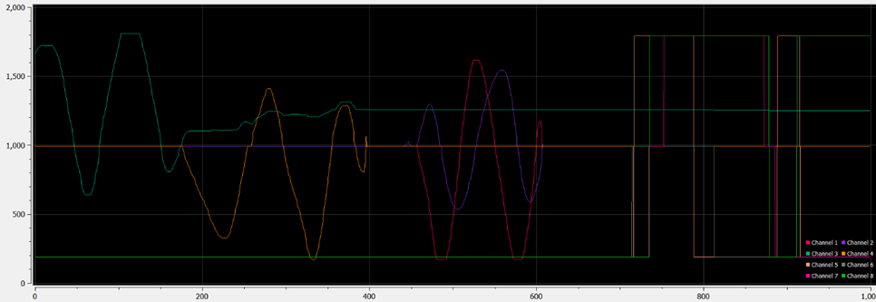
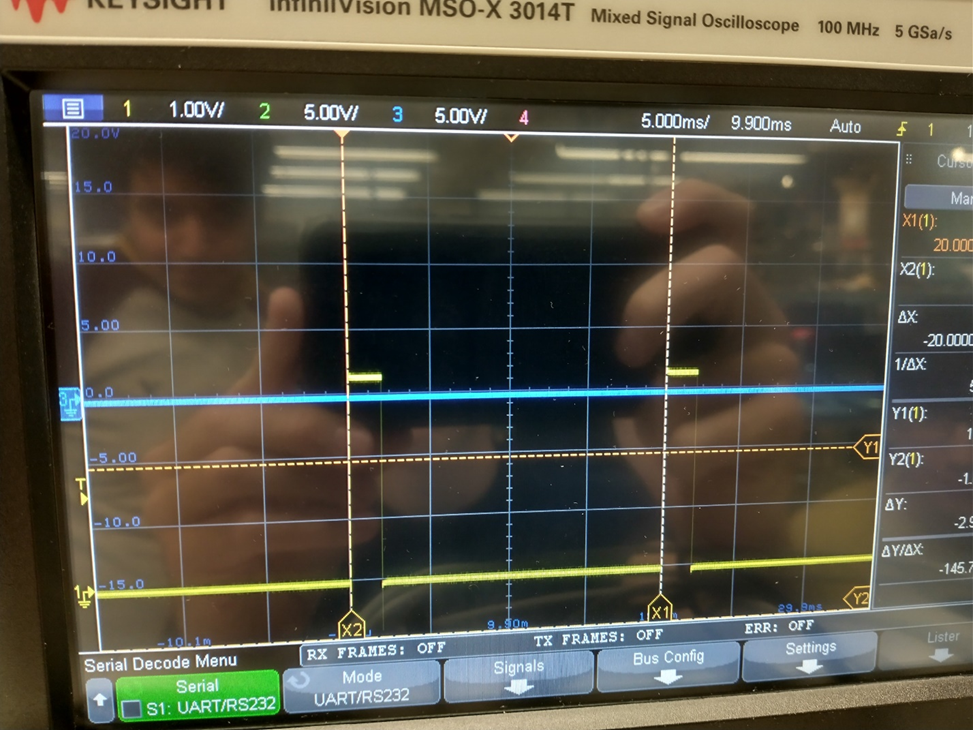

<h1 class="text-center mt-3">{{ title }}</h1>

**Radio data parsing**

The first improvements done on the receiver code were proper interpretations of the channel bit data. They were actually 11 bit values rather than the 10 bits stated online. I assume this is just due to the sign bit and that is why it was not included. After creating a packed struct, the bits are easily extracted and the ensuing data could be extracted properly mapped to the correct channel.

To improve the existing radio receiver code, I had to put bounds on the input data streaming in. There were periodic packets coming in with valid frame starts, but with different content than channel data. This resulted in every 50 or so packets being invalid data, creating a useless and choppy input signal. To begin, I put a bound on the length of a packet before it gets parsed. If it fell within the valid range, it can then be processed.

The prior output of the parsing algorithm shows the clear issue:

After properly filtering the packets to the proper data content, the data smoothly varies as expected.

<h1 class="text-center mt-3">PWM Integration</h1>

**PWM development**

PWM is a very common protocol for controlling brushless ESCs. They commonly use a simple protocol of a 20ms period, and a pulse width varying from 1 to 2ms depending on throttle value (0% = 1ms, 100% = 2ms). A teammate had already created the driver code to produce this general signal, but it had to be implemented with the correct timing.

Some timing calculations had to be done to create a PWM signal working off of this code that had the correct pulse width and duty cycle. After refreshing myself about the internal timer operation, I created both code and an excel tool to calculate the PSC and ARR and CCMR values for the PWM driver.

| PWM PSC & ARR |          |
| ------------- | -------- |
| period        | 0.02     |
| Fclk          | 1.60E+07 |
| freq          | 50       |
| PSC           | 15       |
| ARR           | 19999.00 |
| freq_out      | 50       |
| period_out    | 0.02     |
| period_ms     | 20       |

Table 6.1. Table to calculate the registers.

After calculating the proper register values, the oscilloscope data displays the desired PWM signal. As can be seen in Figure 6.3., the pulse width is the desired 20ms.

<h1 class="text-center mt-3">Radio and PWM integration</h1>

**Radio and PWM integration demo**

Now with both PWM and radio receiver working, I thought it would be a good demonstration, and also good work towards system integration, to make a radio channel value control the pulse width of the radio receiver. After changing some pins and channel values, and writing more configurable pin and register setup code, I was able to vary the pulse width by moving the sticks on the radio transmitter.

https://www.youtube.com/embed/zwQ3Dvz2RXk?feature=oembed

