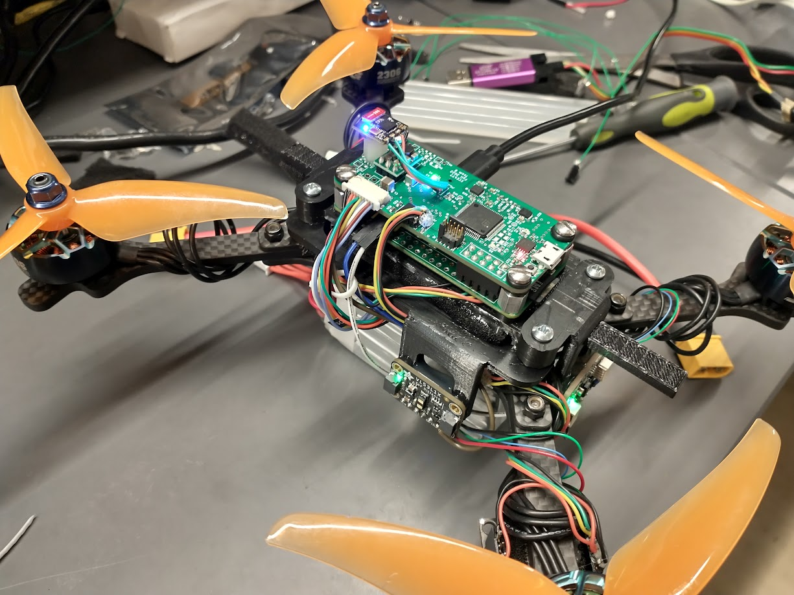

<h1 class="text-center mt-3">{{ title }}</h1>

<h1 class="text-center mt-3">{{ title }}</h1>

https://youtu.be/wpnE13KWtOQ

<h1 class="text-center mt-3">{{ title }}</h1>

<h1 class="text-center">Questions?</h1>

<h1 class="text-center">Thank you!</h1>

