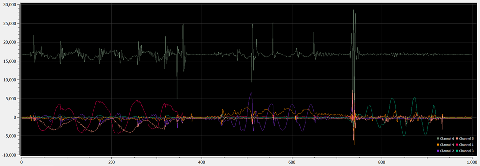
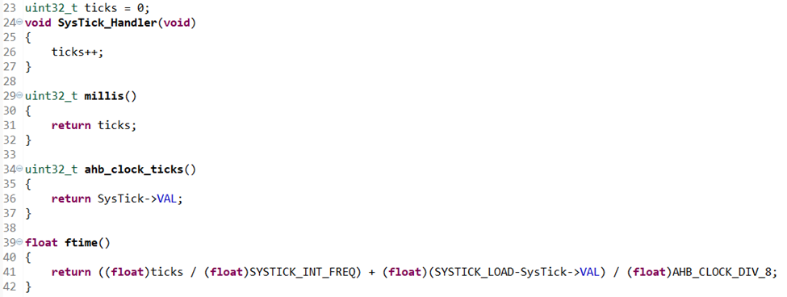
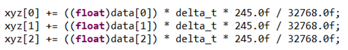
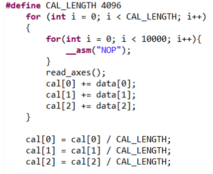
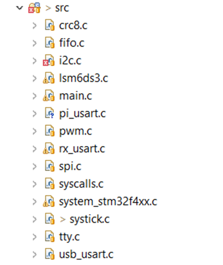
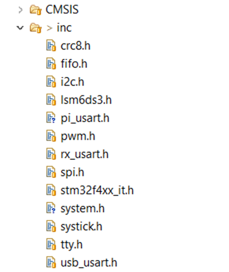
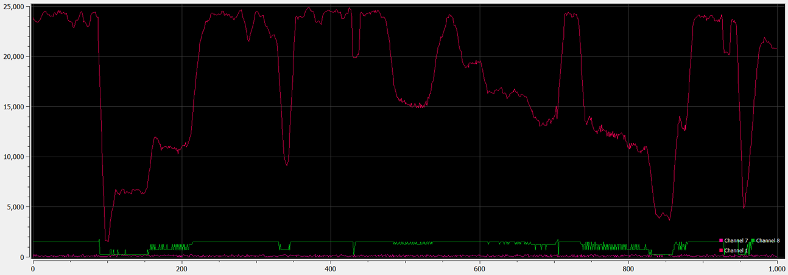

# Week 10

**Accelerometer**

Much effort was spent this week taking the working example code from Owen and getting the axis values to be read properly, calibrated, and integrated into gyro headings in correct units.

Starting out, the data was too slow, and had the wrong bit format. After fixing the bit shifting etc., and setting a higher data rate, it was clear all 6 axes were being properly read.



Once this was clearly working, I created a working timing driver to measure sub-millisecond time deltas as well as those with sub-millisecond fidelity but multi-millisecond span.

To do this, I combined the Systick timer’s countdown register, and a ‘tick’ variable incremented on every systick interrupt. I calculated the Systick roll-over value based on the clock frequency such that the interrupt occurs once every millisecond, giving a simple 1KHz timer.

```c
#define AHB_CLOCK 		SystemCoreClock		//48 MHz
#define AHB_CLOCK_DIV_8 (AHB_CLOCK/8)	//6 MHz
#define SYSTICK_INT_FREQ 1000			//1KHz desired interrupt frequency
#define SYSTICK_LOAD	((AHB_CLOCK_DIV_8/SYSTICK_INT_FREQ)-1)

void init_SYSTICK()
{
	SysTick->LOAD = SYSTICK_LOAD;
	SysTick->VAL = 0;

	SysTick->CTRL |= (1<<0);
	SysTick->CTRL |= (SysTick_CTRL_TICKINT_Msk | SysTick_CTRL_ENABLE_Msk/* | SysTick_CTRL_CLKSOURCE_Msk*/);

	printf("SYSTICK:\n");
	printf("\tSYSTICK_LOAD:		%d\n", SYSTICK_LOAD);
	printf("\tAHB_CLOCK:		%d\n", AHB_CLOCK);
	printf("\tAHB_CLOCK_DIV_8:	%d\n", AHB_CLOCK_DIV_8);
}
```

To calculate inter-interrupt timing, I use the value of the systick down-counting register to determine how many decrements remain before rollover. When compared to the clock frequency (how many decrements per second), a floating point time in units of seconds can be calculated. I still need to determine however if fixed point math would be better suited to this though. The STM32F4 has an FPU to accelerate these calculations, although 32 bit fixed point may be better.

```c
uint32_t ticks = 0;
void SysTick_Handler(void)
{
	ticks++;
	//GPIOC->ODR ^= 0x1 << 13;

	if (check_arm_code())
	{
		if (watchdog > 50)
		{
			pwm_output_t zeros;
			zeros.duty_cycle_ch0 = 0;
			zeros.duty_cycle_ch1 = 0;
			zeros.duty_cycle_ch2 = 0;
			zeros.duty_cycle_ch3 = 0;

			set_PWM_duty_cycle(zeros);
		}
		else
		{
			//that way watchdog won't rollover.
			watchdog++;
		}
	}
	else
	{
		watchdog = 0;
	}
}

void systick_clear_watchdog()
{
	watchdog = 0;
}

uint32_t millis()
{
	return ticks;
}

uint32_t ahb_clock_ticks()
{
	return SysTick->VAL;
}

float ftime()
{
	return ((float)ticks / (float)SYSTICK_INT_FREQ) + (float)(SYSTICK_LOAD-SysTick->VAL) / (float)AHB_CLOCK_DIV_8;
}
```



Once this was created, I could calculate the precise timestep between readings of the gyro data. This is crucial for accurate integration of the gyro angular rate data. Although much remains to be configured in terms of low pass filters, aliasing prevention, etc. I was able to obtain unit-correct heading data.



(max 245 Degrees per second, signed 16 bit number -> 32768 max value)

Before this was usable however, I had to create calibration code, so that the average value returned by the gyro for angular rate would be zero. Otherwise the integration of the angular rate to get heading would result in immediate drift and a useless measurement. Therefore, the system sums up for each axis a few thousand readings at reasonable time intervals, then divides that sum by the umber of samples to get the average reading. That is then subtracted from all future readings to get a zero mean angular rate reading.



Owen is working this week on incorporating everything into #defines so that this code is much more configurable as we start tuning these parameters.

")

**Code organization**

Now that interfacing code is nearly complete, I am integrating each example source code project into its own driver file, headers, and separating base hardware drivers from device drivers (i.e. separate IMU driver from SPI driver). I am also ensuring all code is driven by #defines, so that clock frequency changes, baud rates, etc. can be quickly changed to their proper values, and register values based off those parameters can automatically scale.





**Lidar ToF research and debugging**

Lastly, I’ve been helping those working on the LIDAR to get it working. To improve timing, I have added the systick driver, and to add debugging functionality, I implemented a USB Uart driver to allow printf to debug their incoming data.

This allowed me to determine that although the primary read function was returning a not-so-accurate reading of distance, using an FIR filter on one of the internal variables to the driver provided a much higher fidelity distance measurement.

Work still remains, but it is a huge jump in functionality from before!

.")

