# Week 11

**Motors / ESC**

As the flight controller development continues, I decided to complete the wiring of the motors and ESC, along with the battery, as that has arrived as well. Soldering anything to the ESC is a bit of a challenge, as the heat dissipation and thermal mass of the board is so high. I have to set the temperature of the iron past 900 deg.F, and that seems to work alright. I started out by wrapping the motor cables around the arms of the frame to take up the slack in the cables, but allow for rewiring and flexing of the cable. I taped them in their positions, and then worked on mounting the ESC to the frame.

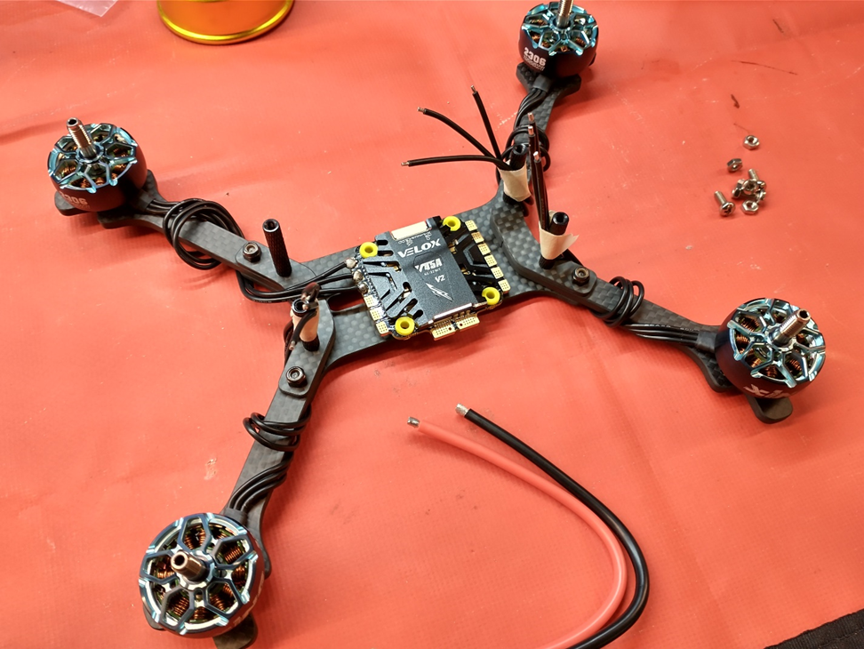

The ESC wasn’t hard to mount, it simply needed ¾” M3 screws and nuts to hold it in place. This may change later when the mounting solution for the flight controller is complete, but is very satisfactory for now.

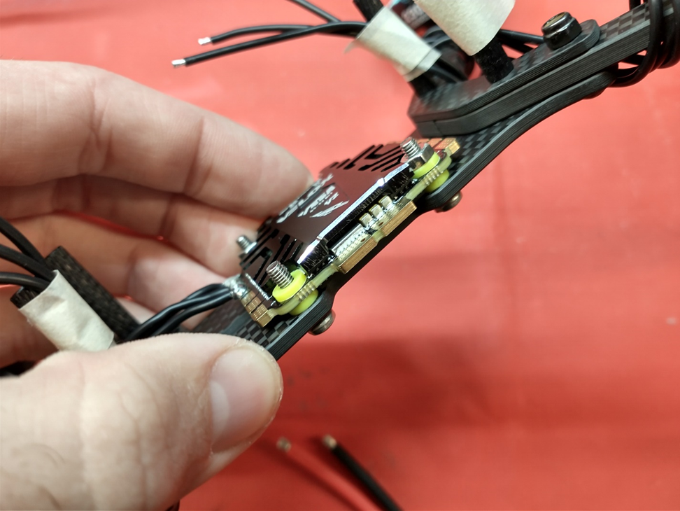

Once the ESC was mounted, I soldered the power cable, and then the motors. Once complete, I powered it up and verified that each motor vibrated as it generated the startup sound.

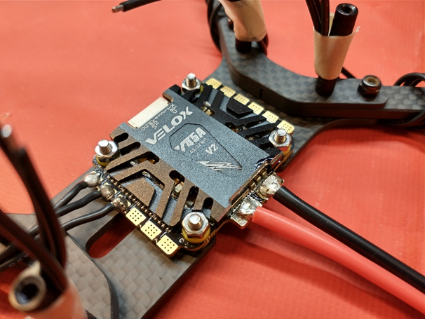

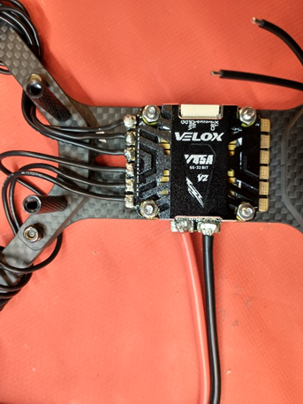

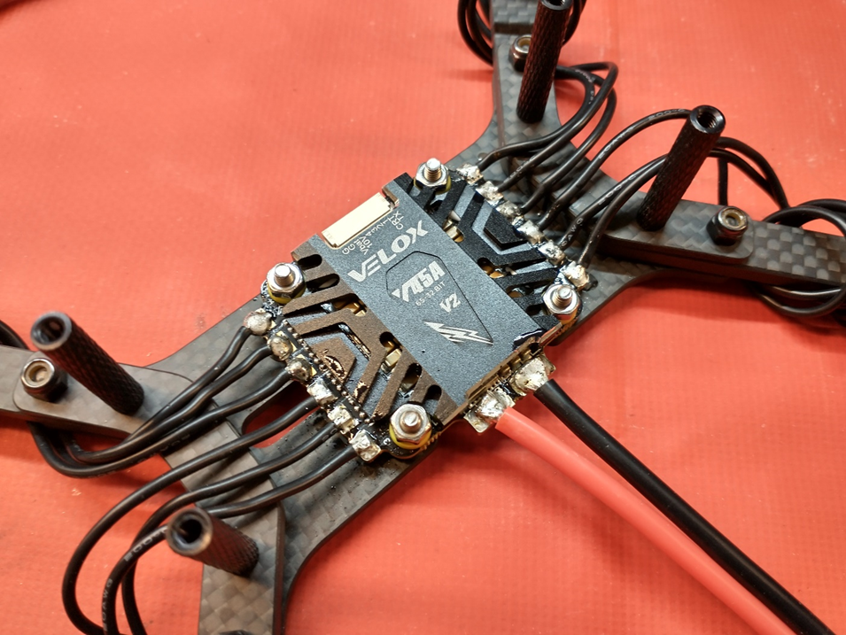

**PCB**

Our PCBs arrived this week from JLCPCB, allowing us to start the hardware build process. The boards look good, however not tenting the vias is going to make certain aspects of the board much harder to solder, on an already very dense and small pitch build. We’ll see how this goes. Figure 11- 1 shows one of the boards upon arrival.

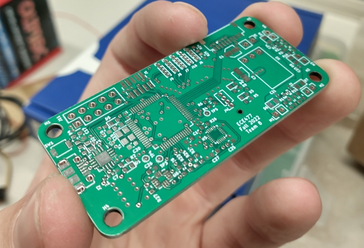

First, I wanted to perform some electrical tests on the board, which it passed. I tested continuity for many different nets, particularly those with very tight trace tolerances. Next I tested the physical layout of the board by comparing it to the Pi Zero, onto which it needs to mount. I was happy to see the boards fit perfectly with the Pi Zero form factor and screw positions, as well as the communication connector lining right up with the Pi Zero header. 

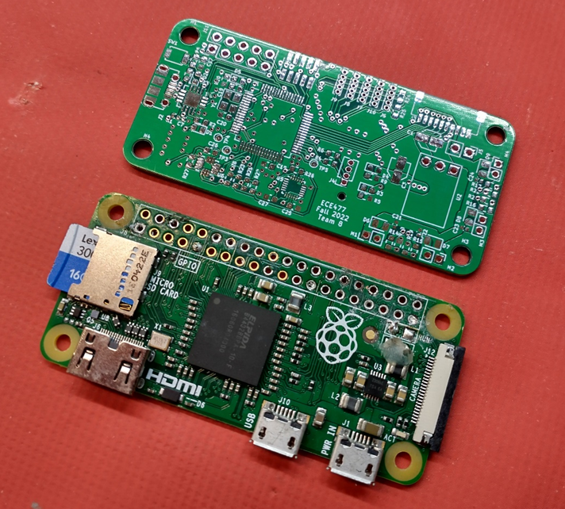

Once satisfied that the boards weren’t total trash, I began soldering, starting with the power supply, to verify that first. This board uses mostly 0603 SMT passive components, with a couple 0402s and 1206 & 1210s for power capacitors. This means the lab doesn’t have the majority of the components we need. Thankfully, I have a personal stockpile of a variety of different 0603 SMT passives, and a few assorted 1206 & 1210s from previous flight controller board projects.

")

I first laid out the components on the board without soldering, to get a sense of how everything was fitting, and if there were any mistakes with footprints. I then went into KiCAD and generated a plot of the reference designator and value of every component on the board, at much larger scale. This helps a lot when trying to figure out which miniscule SMT part goes where

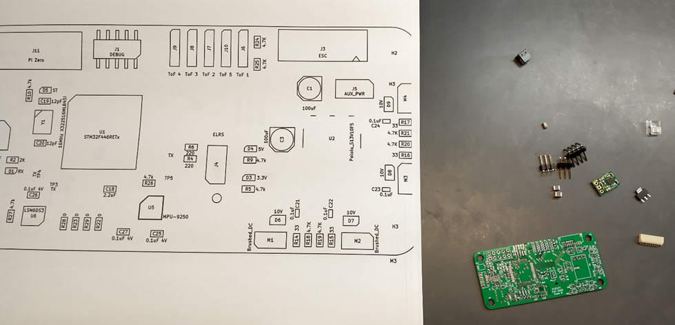

First I soldered the power capacitors, 5V switching regulator, and then the ESC connector. I then tested the regulator by wiring the connector to the ESC and powering on, and measuring the voltage and ripple.

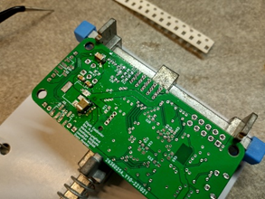

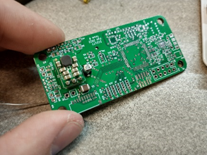

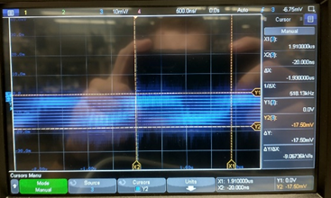

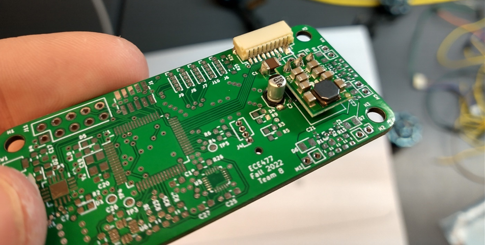

Next I added the 3.3V regulator, and 5V and 3.3V supply indicator LEDs.

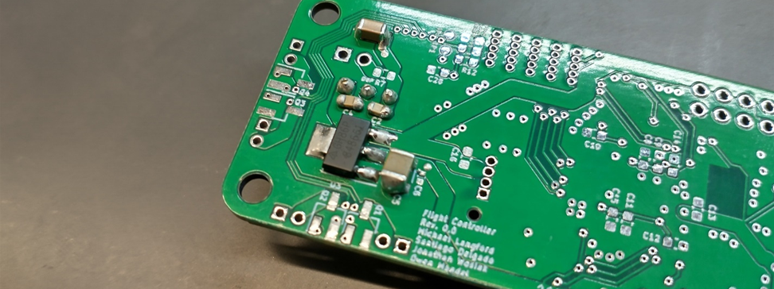

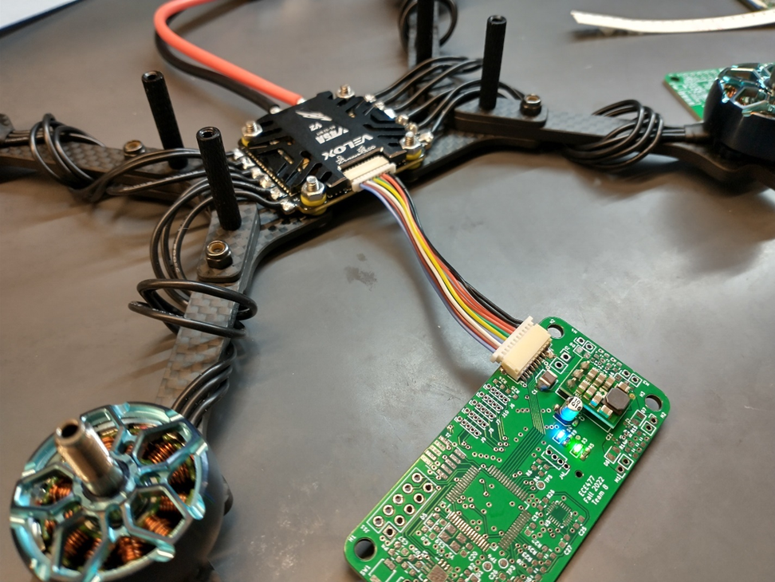

After this, I added all the 3.3V microcontroller caps, and then the microcontroller. This is one of the most difficult parts to solder, and definitely took a while. First I covered the board in flux, and brushed solder across the pads. Then I tacked a pin from each corner down, and then dragged the tinned iron across the pins. Next I added the programming header. At first this appeared to work, but after attempting to program with no success, I realized that some of the solder joints on the micro had very little solder, so I reheated multiple joints individually, and then the device was able to program. 

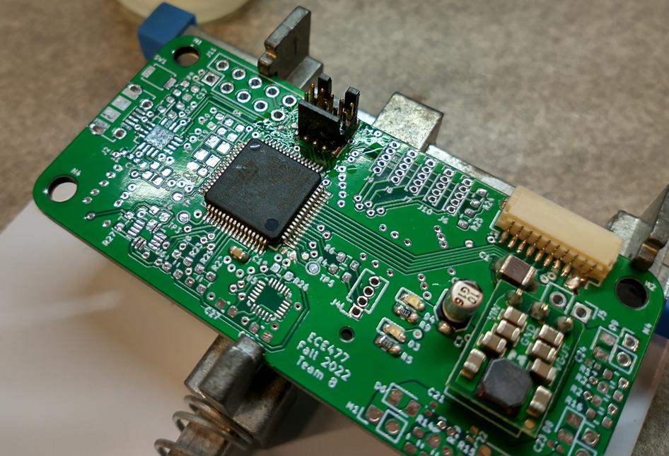

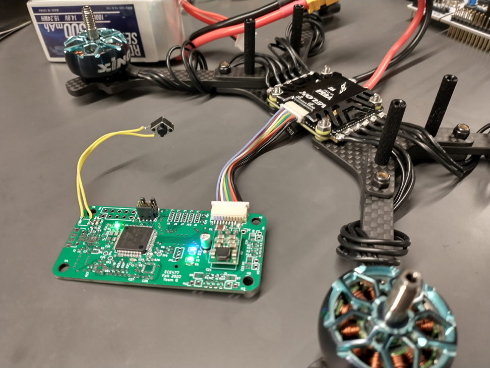

**Full System Setup**

In parallel to building up the hardware, I wanted to perform a full system test of all the different pieces of software, on the chip that we are using. Multiple test programs had been developed for the F411, and then ported over to the main F446 project, as well as having been developed using convenient ports and pins, rather than the ones chosen on the PCB. Much effort was then spent in changing the ports and pin numbers, and debugging issues arising from those changes. This meant I also had to transfer all the individual breadboard setups for the PWM, radio receiver, IMU, etc. all to the same breadboard to ensure all can function correctly simultaneously.

After banging my head against the wall during this process (and realizing that the ST documentation for pin numbers on the Nucleo boards is inconsistent), I got the 4 channel PWM and radio working simultaneously, as well as integrating the IMU into the full final project. 

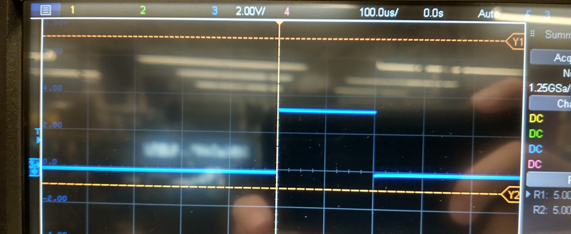

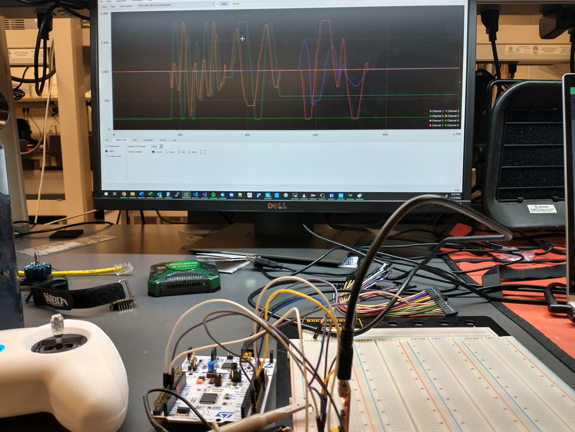

