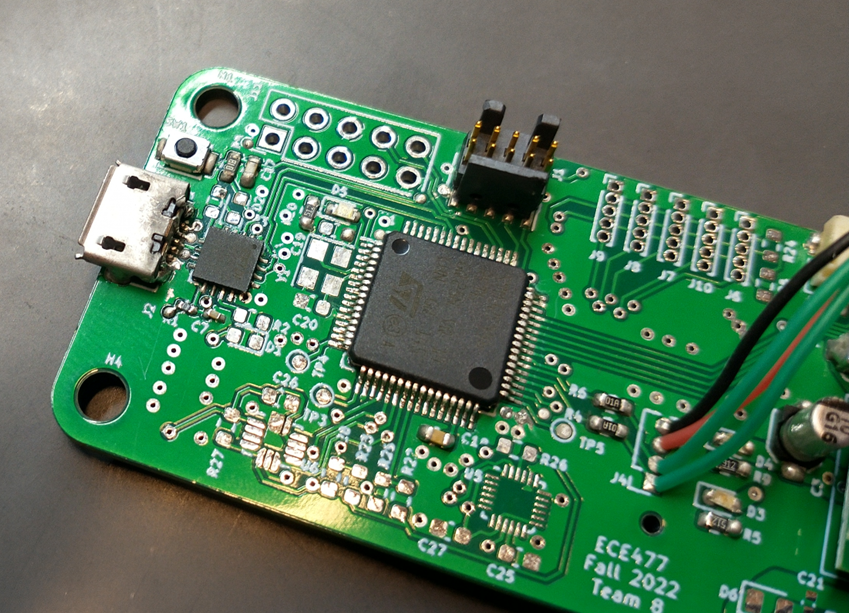
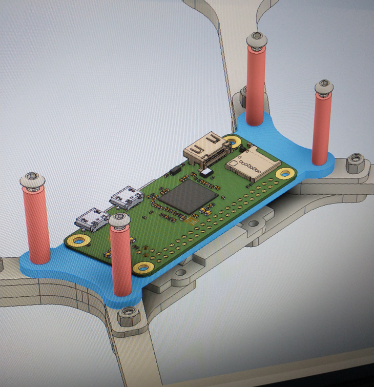
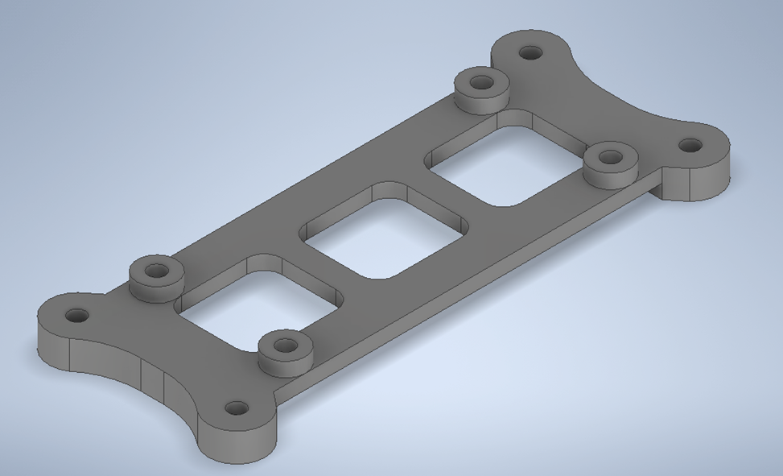
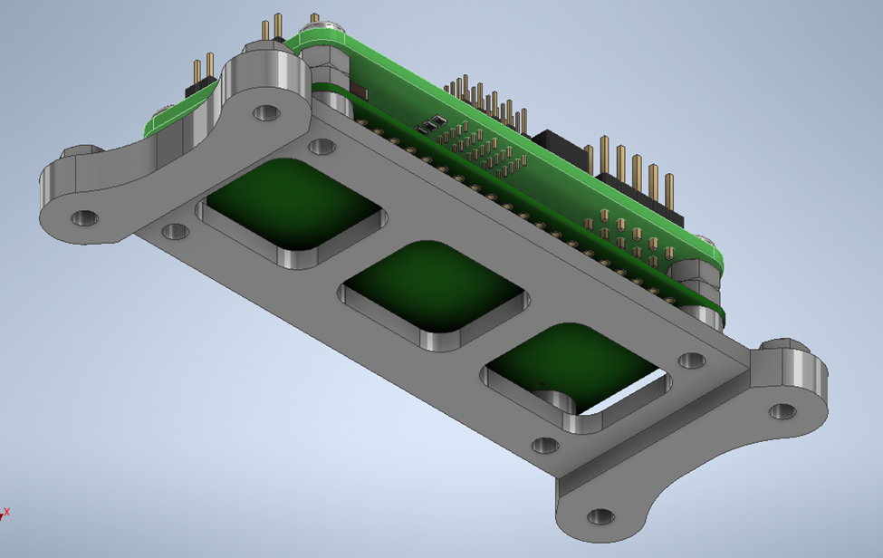
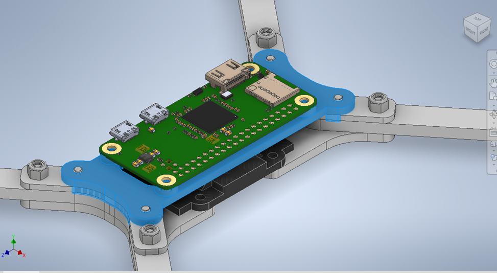
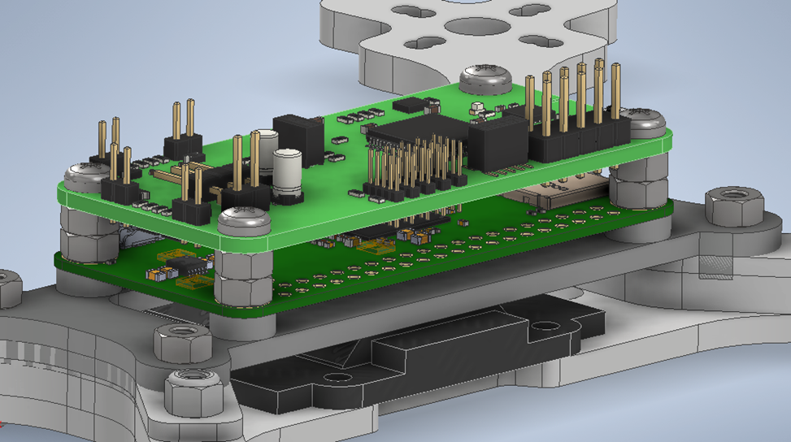

# Week 12

**PCB Development**

My time this week was largely devoted to soldering, testing, resoldering, and retesting the FTDI and IMU devices on the board. Both of these were rather difficult to solder by hand, and took a lot of time to get right. I don’t have a ton of pictures of the carnage, but a lot of mistakes were made and subsequently repaired.

Unfortunately, in the process of debugging the IMU, I lifted a few pads, and shorted out the microcontroller, apparently bricking it. So I removed most the components from the first board, and have started building up a new one. Thankfully I learned what I needed to know from the hand-soldered board, which is that the schematic and layout 

The results from my additions to the board this week were a successful test of the radio along with the motors and serial output over the FTDI to USB, as well as an almost working IMU.

")

Issues encountered soldering the FTDI, LSM6DSO and USB connector:
-	The USB connector proved very difficult to heat up enough to get a good solder joint for the large connectors. Adding lots of solder to this ended up bridging the data pins and making the rest of the process very delicate
-	The data pins were difficult to access well due to the FDTI chip being already in place, so any soldering done on those pins was lower quality and resulted more often in errors.
-	The high temp solder used to coat the pins before reflowing was not sufficient to get contact with all pins initially. It would have been much better to start with paste and reheat the board rather than try to use strand solder, fail, and then move to reheating it.
-	The 2 consecutive ground pads on the LSM6DSO when reheated resulted in much of the nearby solder mask detaching from the heated ground plane. This wasn’t a huge problem until a lot of solder got onto it. In the future, watch out for this spot and apply very little solder.

Once the LSM6DSO was soldered, I tried to get communications to it to work, but with no success. After fly-wiring a 2 diode solution to drop the voltage to VddIO, I could see that the device was listening to the SPI commands sent to it, however its responses were being transmitted in a very strange way. The MISO line would be tristated or floating, not sure which, when not transmitting, resulting in odd noise and exponential decay on the line at those times. When the bus was driven for communications, it would show up as a nice clean signal.

For some reason, this noise seemed to be confusing the STM32 SPI driver layer, which I assume didn’t ignore the noise when it was outside of normal data reception time. I could be wrong, but I anticipate that fixing this noise will solve the comm problems.

Debugging this issue on a dev board showed a similar, but less egregious issue. The noise was still present, but with no DC offset, averaging about 0V. This somehow makes it not interfere with normal communication. Adding a pull-down resistor of about 5K helped remove this noise, at the cost of destabilizing the VDDIO reference voltage due to the modulated current through the pull-down being drawn from the diode-drop circuit. Because the diodes have very little current drawn when the bus is idle, their voltage drop is less than the asymptotic voltage drop of the typical 0.7V. Once the pull-down draws current however as the bus drives the line, that current spikes, and the diode voltage drop increases towards 0.7V.

**Flight Controller Mount Design**

This week I also finished my design of the flight controller mount that we will be 3D printing. I had started last week with a rather simple plate to hold the Pi Zero, with the flight controller mounted directly above it with standoffs.

So this week I went through and applied correct dimensions to each subsection according to the dimensions of the Pi Zero and flight controller, as well as adding the necessary framing, standoffs, screw holes, etc. to properly mount everything.

I also decided to model everything in Inventor including the Pi Zero and the PCB, so I spent quite a bit of time figuring out how to export a model from KiCAD that Inventor could understand without it losing a significant amount of information. I also added the screws and nuts that we will use, both because I think it looks nice, and it makes sure that each part has the needed clearance to be screwed in. 

Because I think it looks cool, here’s a bunch of screenshots of it with the full models. Don’t mind the fact that the part is mounted within the chassis -  that’s a mistake I didn’t bother fixing in the assembly. That’s a MechE problem.

.(too many) Da Chassisssss")