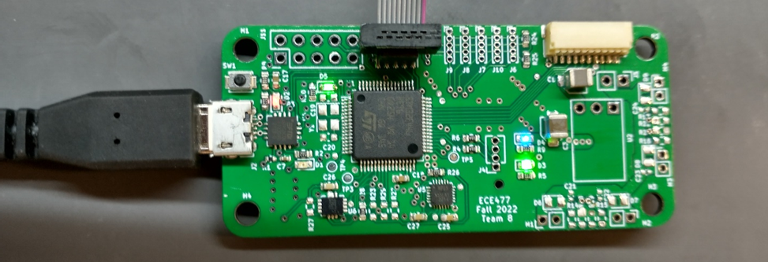

# Week 13

**PCB**

After last week’s less than excellent progress after bricking a chip trying to get the IMU working, I decided to use the hot plate and reflow the entire top of the PCB in one shot. (Unfortunately, I didn’t get pictures of the stencil and reflow process, I was a little rushed) I started by organizing all the parts on a printout I developed last week to help place the parts with the right values in the right spots. I also ordered a bunch of 0.1uF 0603 caps, and 0603 LEDs so I wouldn’t have to ‘borrow’ some from some of my other boards.


With this all ready, I got the stencil ready for use. The stencil we purchased with our board came as a very large thin sheet of metal, with the small cutouts for our board in the center. This was way to large to use as is, so I used the metal sheet cutter to cut it down to size first. With the stencil ready, I set up the board to be stenciled by using a metal right-angle of equal thickness to the PCB to secure the PCB on the table, and then taped the stencil down onto the PCB like a hinge, ensuring each little slot lined up with the correct pad.

Then Joe prepared the solder paste, waiting for it to get slightly warmer than the refrigerator it is stored in, and then we applied it to the stencil by scraping it across with a credit card-like tool. After a couple tries, we got the right amount of solder applied without it smearing around the pads and shorting nearby pads.

Then I took the PCB with paste back to my station, and carefully placed each part onto it’s pads with tweezers, carefully aligning and double-checking them. Once I was confident the placement was correct and aligned, Joe helped me use the (very hot) hot plate to preheat my PCB, and then reflow the paste on the PCB. It was very cool to see the paste boil, the solder melt, and all the components float into place as the solder glistens. After the PCB cooled down, I washed it off and took a look at the results.


Nearly all the components were soldered correctly, but both IMUs, the micro, and the USB connector had shorts due to excess solder paste. The IMU joints were easy to clear, but the micro was surprisingly difficult. Joe had to help me clear them, but afterwards it looked quite nice. The USB was the most frustrating, as it had bridged ID and ground, and VUSB and ground. Anything shorted to ground on the USB connector is difficult to fix, as the USB connector sucks all the heat away as the iron tries to melt the joints. ID I left shorted, as the board doesn’t use it and the bus doesn’t care, but I was able to successfully clear the bridge with VUSB with lots of heat and flux.


Once the top of the PCB was complete, I went back and hand-soldered each cap onto the back of the PCB. This was pretty easy after doing the first board thankfully. After adding the 3.3V regulator, the board was ready to test.


Testing simply consisted of lots of continuity checks (and checks for shorts), and powering the board from the 3.3V supply on the programmer. With LEDs coming on properly, I programmed the board successfully with a ‘blink LED’ test program and then proceeded to test the USB-serial as well. Surprisingly, all hardware, even the IMU, worked first try. Good stuff.




**Mechanical**

Jon got the mounting bracket for the flight controller printed this week, so I tried to get it mounted, and see if it needed any changes and a reprint. After removing the raft and support material, and cleaning off the thin wisps of print material, the bracket was looking good.


An initial evaluation revealed however that I had forgotten a couple very important components when designing this, the motor cables and the motor controller clearance. As can be seen in Fig. 7, the bracket doesn’t leave any space between the screw holes for the motor cables to pass under, as well as coming real close to the top of the motor controller.


These issues didn’t seem to be solvable without damaging the mount, or modification of the motor cable routing (which I definitely didn’t want to change), so I decided to make some modifications and reprint.

I fixed both issues by extruding the part of the bracket that surrounds the mounting screws, but leaving space for the motor cables – this increased the clearance while making space for the wires, solving (I hope) both issues.

I’ve sent this print to Jon, so he’ll hopefully have this printed soon so we can get flying.


**Clock Tree**

With the hardware on the board working, I decided it was the right time to fix an issue I’d been ignoring and waiting to fix, namely the clock speed. The STM32F446 can run up to 180MHz, which is much of why we chose it over other STM32F4 options. However the default clock settings at startup use the HSI (High Speed Internal) RC oscillator, without PLL, which runs the chip at a relatively sluggish 16MHz. The PCB was designed with the use of an external 16MHz crystal oscillator for higher precision, but also use of the internal PLLs and multipliers available to run the system clock at 180MHZ, and the peripheral clocks at their max speed.

So this week I spent multiple hours changing the clock and PLL settings to select (for now) the HSI, but to direct it through the PLLs available to multiply the clock rate up to 180MHz. To help with this, I used the CubeMX editor to play with clock tree values, and then when I was confident they were right, I edited the PLL and clock setup code to reflect those choices. Once this was working, I had to go through each peripheral and determine if it was running at the speed I thought it was, and edit `#defines` to properly calculate their clock speed off of the PLLs and divisor settings I selected.


**Motors & Radio**

This week I also fixed multiple bugs in the motor code such that the max throttle range is used, and with the highest possible fidelity. I had an issue where I was using a range from 0-100,000, and then storing that in a `uint16` (max value of 65535), resulting in overflow and rollover. This caused a dangerous situation where the motors would ramp from full speed to stopped instantly, causing a huge current draw and heating up the motors and the ESC.

https://www.youtube.com/embed/4aSOW4n8nL4

**IMU**

Lastly, I put quite a bit of time into calibrating and adapting the IMU software to filter and combine the accelerometer and gyroscope. The gyro, after fixing some timing issues, worked on the PCB just as it had before on the dev board, with the gyro raw rate being properly converted into degrees per second. Most of all, I increased the SPI bus speed from a divisor=256 from the APB2 peripheral clock (90MHz down to 351kHz) to a divisor=32 (90MHz down to 2.8MHz).
For the accelerometer, I had to write a similar calibration sequence to the gyroscope, except that the accelerometer has one axis with a constant bias from gravity, so that has to be removed prior to the calibration phase, so that the calibration value doesn’t roll over as it gets summed up. I also converted the raw values (-32768 to 32767) to a floating point, where 1.0f maps to +1G (9.81 m/s^2).


I also created a very simple IIR filter for the accelerometer data, single pole:

$$ y[n]=ky[n-1]+(1-k)x[n] $$

$$  \frac{Y(z)}{X(z)} =  \frac{k}{1-(1-k) z^{-1}} \bigg|_{z=j\omega} $$

I’ve plotted the frequency response of the filter (which isn’t amazing, but it runs pretty fast seeing as it’s single pole).


*IIR filter implementation within atan2 conversion*
```cpp

accel_pitch = atan2(accel_x, sqrt(accel_z*accel_z + accel_y*accel_y)) * (180.0f/3.1415963f) * 0.01f + 0.99f*accel_pitch;
accel_roll = atan2(accel_y, sqrt(accel_z*accel_z + accel_x*accel_x)) * (180.0f/3.1415963f) * 0.01f + 0.99f*accel_roll;

```

I also created the conversion code from accelerometer g readings to estimated pitch and roll using the arctan function. The gravity vector is sensed by taking the dot product of the gravity vector and the axes of the accelerometer, giving 3 acceleration values. Assuming no other acceleration is present (haha like that’ll happen), the arctan function can be used to find the angle of the vector formed by the axes readings.

")


Lastly I implemented a filter called the complementary filter, which combines the high frequency gyroscope readings (which are reliable in the short term), and the noisy but long-term stable accelerometer angle, to compute a simple estimate of the true angle. It isn’t amazing, and all these fusion steps need more work, but it’s a start, and indicates the sensors are providing reliable data.

*Complementary filter implementation*
```cpp
compl_pitch += (1.0f-ALPHA)*(-gyro_rate_y*2.0f)*(current_time - last_time) + ALPHA * (accel_pitch-compl_pitch);
compl_roll +=  (1.0f-ALPHA)*(gyro_rate_x*2.0f)*(current_time - last_time) + ALPHA * (accel_roll-compl_roll);
```

