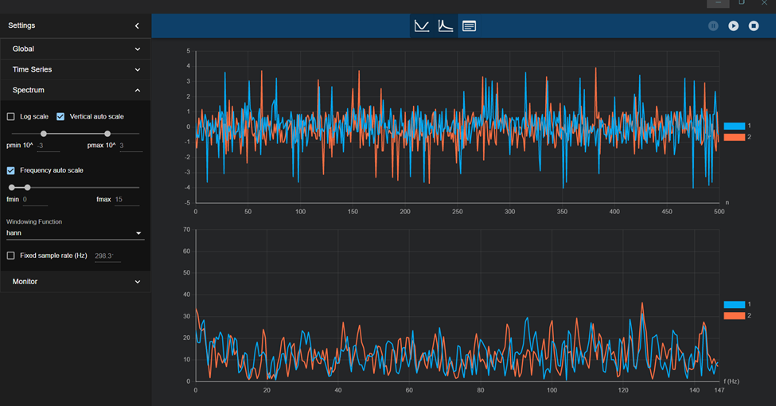
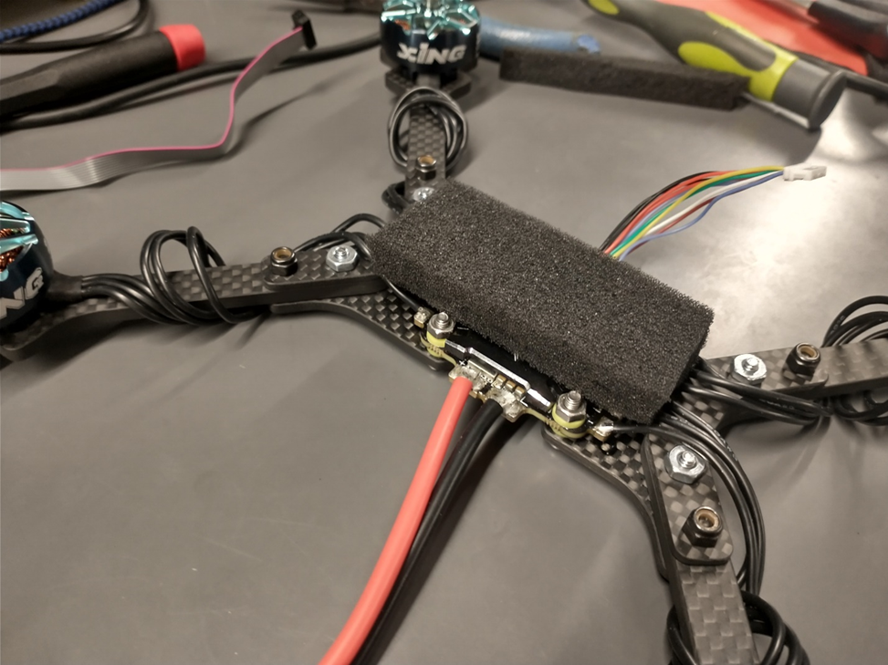

# Week 15

This was mostly last week, but I created an algorithm to modify in real time the parameter controlling the relative trust the complementary filter has in the gyro vs. the accelerometer. It works by sensing when the length of the vector comprising the total acceleration felt by the accelerometer is greater in magnitude than 1G, indicating that noise or movement is taking place. The differential is the used to generate a correction factor to apply to the parameter ‘Alpha’ which estimates which measurement is more accurate.

```cpp
accel_pitch = atan2(accel_x, sqrt(accel_z*accel_z + accel_y*accel_y)) * (180.0f/3.1415963f) * 0.01f + 0.99f*accel_pitch;
accel_roll = atan2(accel_y, sqrt(accel_z*accel_z + accel_x*accel_x)) * (180.0f/3.1415963f) * 0.01f + 0.99f*accel_roll;

total_acceleration_filtered = update_filter(&total_acceleration_filter, sqrt(accel_x*accel_x + accel_y*accel_y + accel_z*accel_z));

total_acceleration_filtered *= ((total_acceleration_filter.length-1)/2.0f)/6.0f;

//trust of the accel
#define ALPHA_0 0.002f//0.61f

float alpha_correction = pow(total_acceleration_filtered-1.0f, 2.0f);
//bigger this is, less it should trust accel
alpha_correction=-alpha_correction*2.0f;
alpha_correction = (alpha_correction < -ALPHA_0) ? -ALPHA_0 : alpha_correction;

#define ALPHA (ALPHA_0 + alpha_correction)

compl_pitch += (1.0f-ALPHA)*(-gyro_rate_y*2.0f)*(current_time - last_time) + ALPHA * (accel_pitch-compl_pitch);
compl_roll +=  (1.0f-ALPHA)*(gyro_rate_x*2.0f)*(current_time - last_time) + ALPHA * (accel_roll-compl_roll);
```

<div class="text-center text-muted">Fig. 15- 1. Source code of filter correction algorithm</div>

In addition to the LSM6DSO, there is also an MPU6500 on the PCB, which has not as yet been used. I also wrote driver code for that this week, which wasn’t hard seeing as I already had code for it from an old project. This meant the bulk of the effort was just switching from the previous project’s SPI implementation to the current one. I then cloned the LSM6DSO driver’s calibration and sensor fusion code, and got things nearly working, and then 4

Due to my original code structure, there was no way to change or specify the CS pin, meaning that the SPI bus would blindly use the CS pin it chose on startup, rather than using different ones per device. So I created a structure that holds the IMU data that can be accessed by any other C file, as well as adding functionality and pin setup code to select which CS pin is active at that point in time, and the SPI driver will switch to using that one.

```cpp
void select_SPI(spi_bus_selection_e spi_bus)
{
  if (spi_bus == SELECT_LSM_SPI)
  {
    selected_SPI =  LSM_SPI;
    selected_GPIO = LSM_SPI_GPIO;
    selected_NSS =  LSM_SPI_NSS_PIN;
  }
  else if (spi_bus == SELECT_MPU_SPI)
  {
    selected_SPI =  MPU_SPI;
    selected_GPIO = MPU_SPI_GPIO;
    selected_NSS =  MPU_SPI_NSS_PIN;
  }
}
```

<div class="text-center text-muted">Fig. 15- 2. SPI bus selection</div>

With this new structure working, I tried running the full PID loop + motor + radio code to test the response of the drone. Unfortunately, I noticed immediately that there was a huge issue with the noise induced in the data by the vibration from the motors running. 
I found an application that can perform a real time FFT on incoming serial data, to take a look at the noise spectrum while the motors are running. I was hoping all the noise was high frequency and could be filtered, however it was broadband, and the gyro was hitting it’s max dynamic range as well. 



With the motors running and the drone still, the pitch and roll quickly diverged from an accurate measurement of the heading.


**Mechanical**

In order to fix the vibration issues, I had to use an alternate mount to the original rigid mounting setup. I found a piece of soft anti-static foam, and glued the 3D printed mount onto the foam, and then onto the motor controller.

I initially just tried using O-rings at the mount points, however this wasn’t sufficient. 





I also mounted the battery to the bottom of the drone using some very strong Velcro-ish stuff. 


As an aside, the usage of the batteries during testing finally necessitated charging, so we used a typical multi-cell LiPo charger to charge them.


**Radio**

The radio also had to be permanently mounted, as it had been connected with a temporary connector initially. I detached the original connector and soldered the radio directly to the original wires. I then hot-glued the radio onto a nylon standoff, and glued that onto an unused part of the PCB.


")

The code to accomplish this was very similar to the radio receiver parsing code, where it looks for valid conditions within a circular buffer. The code automatically adapts to any new definition or change to the internal packet layout, making editing and extension easy.

```cpp
typedef struct {
	uint8_t 		header;
	uint8_t 		camera_status;
	uint16_t 		lidar_reading[4];
	//uint8_t		zero_pad[2];
	float			command_yaw;
	float			command_pitch;
	float			command_roll;
	uint8_t 		ending;
} /*__attribute__ ((packed))*/ pi_packet_t;

extern pi_packet_t saved_pi_packet;
```

To test this setup, Owen and I wired a cable between his Pi and the flight controller, sharing ground in addition to the UART RX and TX lines. I used the actual pins that will be used for the Pi once it mounts directly, to avoid any issues with changing pins.


For the information transmitted from the flight controller to the Pi, we decided upon a printf string of comma separated values for yaw, pitch, roll, and any other values that become necessary. This text is very easy to for the Pi to parse, especially as it has the necessary computing power needed to parse it quickly.

Before testing with the Pi, I used an FDTI to inspect the outbound data from the Pi, and could inject commands to the flight controller and see if those commands were reflected in the output from the USB UART port.


 and PI UART are active simultaneously.")

Once my side was working, we integrated our hardware with a long cable to carry the serial data from board to board. I kept the FTDI listening in on the communications however to verify functionality.

 shows binary stream from Pi.")

After a few kinks were worked out, the LiDAR data streamed over via the serial cable, was interpreted by the Pi UART driver, and recorded. Then this data was printed out via the main log.


**Motors**

This week I also switched to using OneShot125 correctly and running it at maximum data rate, around 3.8kHz, rather than the previous 400Hz.


After testing the PID loops with the motors running, and readying the drone for test flights, I needed to ensure that the propellers on the drone were spinning the correct direction. The torque induced from the motors rotating is very significant, and if the motors spin the wrong direction this torque will not be counteracted and will spin the drone out of control.

For this reason, half the motors have to spin counterclockwise and half clockwise. However, if just any two are chosen, then when the drone attempts to counteract an imbalance in pitch or roll, it may change the speeds of the motor pair that spins in the same direction, resulting in a torque differential, and then spin. Thus, it must have the motors on a diagonal with each other spin in the same direction. Thus when any pair of motors on a side changes speeds, both the CCW spinning motor and the CW spinning motor will change speeds equally, resulting in net zero torque.

Switching motor spin direction can be as simple as swapping two wires in the motor hookup, however I wanted to avoid this as I had already had enough of a painful experience soldering the motors the first time.

Instead of soldering again, it is possible to reprogram the ESC settings to change its pulse order so that the motor spins in reverse of its original direction. This is usually a really simple process for people with commercially available flight controllers with popular software onboard, less so for me with a custom flight controller. Most flight controllers have a feature that allows the flight controller to act as a pass-through reprogrammer for the ESC.

As my poor little flight controller can’t do that, I had to dig around online for other solutions. Apparently, it is possible to use an Arduino nano and some prebaked hex files to get it to act as a programmer. This was very poorly documented, so it took a lot of trial and error and hair-pulling.

I want to include the details of this process in this progress report to serve as a more permanent record of how I got this to work.

First, I acquired an Arduino Nano that was in storage. I then installed the necessary CH340 UART to USB drivers, and connected the Nano.

Next, I created a cable to go between the JST ESC connector and the breadboard with the Nano. This was a huge pain with the pitch of the pins, but I got it to work eventually.

I then flashed the Nano via the BLHeli_32 configurator software:


Next, I had to determine the correct pins on the Nano to hook up the ESC PWM pins to. After (a lot of) hunting around, I found a document identifying for which Arduino board the pins I aught to use, especially for a 4 channel ESC. Seeing as I was using a Nano, this indicated I should use D3,4,5, & 6.


After wiring everything up, my setup was as shown.


Once the wiring was set up properly, I was able to connect to the Nano and then to the ESCs.


With all the ESCs communicating with the configuration software, I was able to identify which motor was connected to which channel, and swap the direction on the needed motor channels.

I then recorded the spin directions on tape to help me keep track of each channel and it’s direction and therefore it’s torque.


https://youtu.be/K2zn1jZydOI

Not mentioned this week due to length:
- Safety and arming code
- Startup log
- PID loop improvements
- Motor LPF with hanning window
- MATLAB
- LIDAR wiring