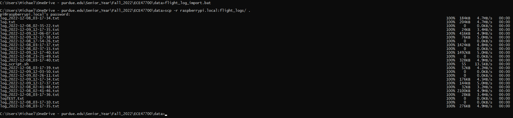

# Week 16


https://youtu.be/wpnE13KWtOQ

**Key Points**

Last week was the drone’s first flight, and subsequent tuning of the IMU signal processing chain and the PID loops.

Most of this involved setting the correct gains on the accelerometer noise estimation, changing the decimation factor and low pass filter bandwidth for the motor output, and drastically increasing derivative feedback in the PID loops.

After flight tests showed the drone to be very controllable and quite stable, I moved on to implementing auto-throttle, where the drone will maintain a precise height off the ground using LiDAR, without input from the pilot. This took a couple days due to the difficulty and danger of testing the system, as well as improper tuning of the PID loop. After figuring out some filtering strategies to handle the low update rate of the LiDAR data impacting the derivative feedback to the PID loop, and some additional PID tuning, the PID control loop now easily and quickly locks onto the height desired after a switch is thrown on the remote.

In terms of autonomous functionality, I mounted the PI Zero onto the drone, created the connector solution from the Pi to the flight controller, and assisted my team members who were responsible for the autonomous functionality in building the LiDAR wire harness, soldering the harness to the Pi, testing it, and configuring the Pi for use. I also implemented an automatic landing system to land the Pi once the target object is found, however this we are unable to test with the propellers on at the moment.

In totality, I am very happy with the performance of the flight controller on the drone, although I would really like to spend more time tuning the signal chain and utilize the second IMU to really dial in the stability and accuracy of the attitude estimation algorithm.

I am not so happy with the navigation system, as it was implemented too late to be properly tested, integrated, and debugged, although more progress was made on it than I feared. Altogether, it demonstrates that the system foundation works very well as a whole, and is a great starting point for more interesting development using the STM32 flight controller + Pi nav computer system. I am excited to try implementing the system on a smaller drone platform, as well as trying to put a GPS and additional electronics on the larger drone, as it has so much thrust to spare. I also want to analyze the flight data from the drone and see if any additional kinematic information can be estimated using the IMU to assist with flight, such as tracking velocity, enhancing hovering ability, etc.

https://youtu.be/g4PSVRbhDk8

Boot log:

```c
-----------------------------------------
ECE477 STM32F446RET6 Flight Controller V0
-----------------------------------------

USB_USART:
	USB_USART_BAUDRATE:      115200
	CLOCK_RATE:              90000000
	USB_USART_CLOCK_RATE:    90000000
	USB_USART_DIV:           48
	USB_USART_DIV_FRACTION:  13
	USB_USART_DIV_MANTISSA:  48
SYSTICK:
	SYSTICK_LOAD:		22499
	AHB_CLOCK:		180000000
	AHB_CLOCK_DIV_8:	22500000
RX_USART:
	RX_USART_BAUDRATE:      420000
	CLOCK_RATE:             90000000
	RX_USART_CLOCK_RATE:    90000000
	RX_USART_DIV:           13
	RX_USART_DIV_FRACTION:  6
	RX_USART_DIV_MANTISSA:  13
	CRSF_RX_BAUDRATE:       420000
	CRSF_NUM_CHANNELS:      16
	CRSF_CHANNEL_VALUE_MIN: 172
	CRSF_CHANNEL_VALUE_MID: 992
	CRSF_CHANNEL_VALUE_MAX: 1811
	CRSF_MAX_PACKET_LEN:    64
PI_USART:
	PI_USART_BAUDRATE:      115200
	CLOCK_RATE:             45000000
	PI_USART_CLOCK_RATE:    45000000
	PI_USART_DIV:           24
	PI_USART_DIV_FRACTION:  6
	PI_USART_DIV_MANTISSA:  24
	PI_FRAME_START_CODE:    65
	PI_FRAME_END_CODE:      66
PWM:
	PWM_FREQ:        3800
	PWM_PERIOD [uS]: 263.157898
	MIN_PULSE  [uS]: 125
	MAX_PULSE  [uS]: 250
	PWM_ARR:         5262
	UPPERBOUNDCRRX:  5000
	LOWERBOUNDCRRX:  2500
	RANGE:           2500
SPI1:
	SPI_CR1_BR_PCLOCK_DIV_32: 0x20
	SPI_PCLOCK_DIV_32:        2812500
LSM6DSO Calibration:
	gyro_cal_x: 4
	gyro_cal_y: 14
	gyro_cal_z: 0
MPU6500 Calibration:
	gyro_cal_x: 6419
	gyro_cal_y: 5340
	gyro_cal_z: 0
```

**Auto-throttle**

In order to implement auto-throttle, or the ability to maintain a dictated height off the ground autonomously, I needed to integrate Santiago’s I2C Lidar code, mount the LiDAR, write the control loop, and debug any issues I came across.

First, I and Santiago integrated the LiDAR code that he’d written and merged with my flight controller code, and verified that the system still booted and ran properly with the I2C enabled, but without making any calls to the LiDAR driver.

Next I installed the LiDAR, which entailed soldering the LiDAR connector on the PCB, mounting the LiDAR, and routing cable to it in such a way that the LiDAR would be removeable, but that the cables couldn’t be sliced by the motors. I also had to create a connector on the flight controller so that the entire cable could be disconnected if necessary.


After completing the wiring to the flight controller, I mounted the LiDAR on one of the outer arms of the drone, with a piece of foam in between. I wrapped the communication cabling around the arm to take up all the slack and prevent it from bouncing up into the rotors.


I then tested the newly mounted LiDAR running in the main loop, which successfully showed the LiDAR data streaming in. Interestingly, if the sensor detects nothing, it returns a distance of zero, rather than its max distance of 600mm. To make the sensor work with my coming control loop, I added some quick logic to change this 0 distance to 600mm.


After testing what would happen if the I2C cable came loose, or the communication with the LiDAR hung during the execution of the main loop, it became clear that any failure would result in the main loop hanging, and loss of control of the drone.

To combat this in the short time available, instead of implementing the I2C distance monitoring in another thread, I implemented a watchdog in the Systick timing interrupt.

This watchdog watches to see if a flag gets reset, and if the flag is not reset for 50 executions of the Systick interrupt (a 1ms interrupt), so 50ms, the motor PWM values are set to zero which will immediately cut the motors. This means the drone will basically fall out of the air, but this is significantly better than it continuing to fly off in a random direction or tumble uncontrollably.

```cpp

#define AHB_CLOCK 		SystemCoreClock		//48 MHz
#define AHB_CLOCK_DIV_8 (AHB_CLOCK/8)	//6 MHz
#define SYSTICK_INT_FREQ 1000			//1KHz desired interrupt frequency
#define SYSTICK_LOAD	((AHB_CLOCK_DIV_8/SYSTICK_INT_FREQ)-1)

void init_SYSTICK()
{
	SysTick->LOAD = SYSTICK_LOAD;
	SysTick->VAL = 0;

	SysTick->CTRL |= (1<<0);
	SysTick->CTRL |= (SysTick_CTRL_TICKINT_Msk | SysTick_CTRL_ENABLE_Msk/* | SysTick_CTRL_CLKSOURCE_Msk*/);

	printf("SYSTICK:\n");
	printf("\tSYSTICK_LOAD:		%d\n", SYSTICK_LOAD);
	printf("\tAHB_CLOCK:		%d\n", AHB_CLOCK);
	printf("\tAHB_CLOCK_DIV_8:	%d\n", AHB_CLOCK_DIV_8);
}

uint8_t watchdog = 0;
uint32_t ticks = 0;

void SysTick_Handler(void)
{
	ticks++;
	//GPIOC->ODR ^= 0x1 << 13;

	if (check_arm_code())
	{
		if (watchdog > 50)
		{
			pwm_output_t zeros;
			zeros.duty_cycle_ch0 = 0;
			zeros.duty_cycle_ch1 = 0;
			zeros.duty_cycle_ch2 = 0;
			zeros.duty_cycle_ch3 = 0;

			set_PWM_duty_cycle(zeros);
		}
		else
		{
			//that way watchdog won't rollover.
			watchdog++;
		}
	}
	else
	{
		watchdog = 0;
	}
}

```

Once I was satisfied with the safety of the code, I had to implement the control loop. I used another PID loop using my same PID loop library code. After spending some time setting bounds on the PID output and attempting to fly it using only proportional feedback (P) in the control loop, I realized that it desperately needed to use derivative feedback to avoid either not being able to control the height of the drone or entering an unstable oscillation, due to the physical transfer function of the drone being a falling mass.

After adding derivative feedback to the PID loop tune, I noticed that nothing was changing the motor output plot. After some thinking and debugging, I quickly realized that this was due to the sudden change and (relative to the main flight loop) slow update rate of the LiDAR data. Instead of smoothly transitioning from one distance reading to the next, it would jump after an update, making the transition instantly. This resulted in 1 sample of the derivative feedback loop reacting to the change, but this 1 outlier would have no effect on the motor output, as the next motor output sample generated would go right back to the previous value before the value changed.

To combat this, I first implemented a FIR filter to induce a smooth change in the data, however this proved computationally intensive, and had too low of cutoff frequency. So instead, I utilize a single pole IIR filter to efficiently allow the newly measured value to be smoothly approached by the computed filter output, without sudden jumps, but also with minimal delay as opposed to delay induced by length of FIR filters.

```cpp
#define UPDATE_PERIOD 100
static int l;
void update_TMF8801(TMF8801_t* dev)
{
	l++;
	if (l > UPDATE_PERIOD)
	{
		l = 0;

		read_distance(dev);
	}

	//do some filtering here
	float fdist = (float)distance;
	filtered_distance += 0.02*(fdist - filtered_distance);
}
```

After implementing this filter, the data smoothly changed between updates of the data, with the settling time of the filter approximately equal to the period of the LiDAR update routine.

With that issue fixed, implementing derivative feedback gave a noticeable impact on the motor outputs in the data plot. With this boosting my confidence, I tried another flight test, which yielded a slightly janky but working auto-throttle test! I retuned the PID loop accordingly, and the auto-throttle now works excellently, quickly reacting to any change in LiDAR reading and swiftly locking on to the targe height.

With this implemented, I can now fly the drone with one hand, only steering it laterally. No throttle necessary!

TODO: insert video

**Pi assembly**

For the autonomous section of the drone, I needed to mount the Pi Zero along with the flight controller. They are designed with the same form factor intentionally, so that the zero can plug directly into the flight controller to communicate with it and send guidance commands.


Aside from the positioning of the boards, I had to figure out the connector interface from Pi to PCB. I ended up choosing a shorter than normal version of 0.1” female headers for the flight controller, plugging into slightly trimmed male headers on the Pi.


 Completed mounting interface.")

With the Pi now receiving power and its UART connection through the above connector, the team set up SSH login through the USB port and tested UART communication with the flight controller using the existing code demo-ed using the Pi 3.

This ended being a massive pain due to some networking issues and a kernel setting that Owen fixed. 


However, at long last, we were able to plug in a USB cable to power the entire flight control & navigation assembly. Then after booting, we could log in to the pi through SSH.


**Flight logs**

With the Pi Zero communicating, the first thing implemented was logging all transmitted data from the Pi Zero to a timestamped log file, which Owen got working quite nicely. I then wrote some simple scripts to rename them for use on a Windows system, and to SCP them off the Pi from the root directory so I could pull them into MATLAB and run simulations and analysis on them.




**Camera & Autonomous mode**

Lastly, I tested the autonomous scripts Owen developed to test their integration with the flight controller, and with the slightly smaller camera used on the Pi Zero.


With the camera working nicely, I tested the steering commands coming from the Pi, ensuring that they were being properly parsed and, when in fully autonomous mode, passed along to the control loops as if they were normal radio control stick inputs.

After editing my control loop code to conditionally take these values as the inputs instead of the control stick values, I both got the commanded steering values from the Pi to come through, but also to clearly control the motors when in auto mode.


Lastly, I implemented a simple landing sequence to land the drone upon it finding the visual target. This meant that, while in auto mode, if a ‘found object’ command was sent, the drone would immediately begin to descend and land by reducing its target height above ground, and its throttle center point that the control loop superimposes its feedback upon.

