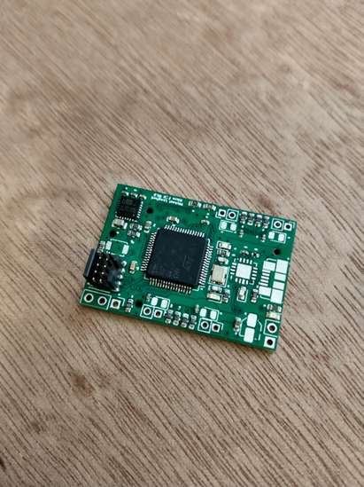
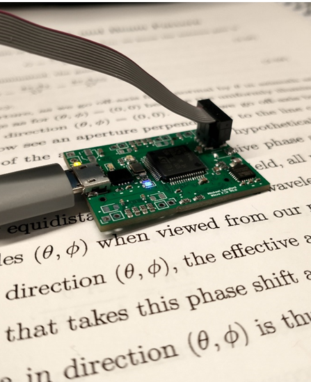

# Week 3

**Parts selection & Weight / Current / Thrust calculations**

In order to determine the proper parts to order for the drone itself, i.e. the frame, motors, battery, propellers, and motors controller, I had to do extensive research.

This week I worked on, and have nearly completed, determining the correct parts. I started with the physical frame, choosing the size that would allow the electronics necessary for completing the project.

This necessitated a 5” size drone frame (5” propellers). 

Next, I created a complex spreadsheet to calculate the necessary battery capacity for a minimum flight time, given inputs concerning the motor thrust, current, and drone parts’ weights.

The spreadsheet first calculates the total weight of the drone, taking into account each part. Prospective parts can be entered so as to see if, for example, a motor controller provides enough current but is too heavy.

With the full weight calculated, the thrust is the next necessary calculation. Using propeller-motor pair data available online for ubiquitous motor-propeller combinations, along with seller data, the current at 75% throttle and the thrust at that throttle could be entered.

From the thrust-current measurement, a crude linearization gives the amps of current per gram of thrust - amps per unit thrust 

$$\left[\frac{A}{g}\right]=\frac{current @ 75pct throttle [A]}{ thrust @ 75pct throttle [g] }$$.

The total thrust necessary to maintain during flight is calculated via the total weight of the drone times 3 – this gives  a significant safety factor for the time of flight where the drone will be changing direction, vibrating, changes speeds rapidly, etc., and is generally considered a good heuristic.

From this necessary maintained thrust value, the constant current is determined by the necessary thrust times the ‘amps per unit thrust’ measurement, divided by 4. This gives the current drawn by one motor at steady state, while the entire drone gives out 3x its weight in thrust.

This current x 4 gives the total current of the drone, plus a large approximation of the flight controller and guidance electronics current draw. This current, multiplied by the necessary flight time, is the minimum energy capacity of the battery to be used, in mAh.

|Minimum Flight Time|	120|	seconds|
|-|-|-|
|frame weight|	100|	grams|
|motor weight|	126.4|	grams|
|propellers|	4|	grams|
|4in1 ESC weight|	21|	grams|
|radio reciever|	2|	grams|
|single-board computer|	10|	grams|
|flight controller|	20|	 |
|camera|	4|	 |
|Typical 4S 1200mAh battery|	100|	grams|
|additional wiring|	20|	grams|
|total weight|	407.4|	grams|
| |	 |	 |
|thrust from chosen 2306 brushless|	1526|	grams|
|amps at above thrust|	51.3|	A|
|amp/g thrust|	0.0336173|	A/grams|
| |	 |	 |
|total thrust necessary|	1222.2|	grams (3x drone weight)|
|thrust per motor|	305.55|	grams|
|current at given thrust|	3.423922018|	A|
|processor and nav current|	3|	A|
|total current|	16.69568807|	(4x motor current, +FC current)|
| |	 |	 |
|hours of flight time|	0.033333333|	h|
| |	 |	 |
|mAh necessary|	556.5229358|	mAh|

To create this sheet required significant research into individual parts, and which motors would work well with which propellers, and what frame size could accommodate what motor controller, and if the motor controller had enough current to be able to properly power the motors.

This resulted in the preliminary selection of the following parts:

|Part|Selection|
|-|-|
|Motor controller / ESC|	 [T-Motor Velox 45A 30x30mm 4in1 ESC](https://www.racedayquads.com/products/t-motor-velox-45a-32bit-3-6s-30x30-4in1-esc-1?variant=32293091115121)|
|Motors	| [iFlight Xing2 2305 2555Kv Motor](https://www.racedayquads.com/products/iflight-xing2-2306-2555kv-motor?variant=32320681279601)|
|Frame	| [RDQ Source One 5” Freestyle Frame](https://www.racedayquads.com/products/rdq-source-one-v3-5-freestyle-frame?variant=29592522293361)|
|Propellers	| [T-Motor T5147 Tri-blade 5”, 4-pack](https://www.racedayquads.com/products/t-motor-t5147-popo-compatible-tri-blade-5-prop-4-pack-choose-your-color?variant=31263896502385)|
|Battery	| [4S 100C 550mAh LiPo](https://www.racedayquads.com/products/rdq-series-15-2v-4s-550mah-100c-lihv-battery-xt30)|

In addition to derivation of required part specs and finding parts to meet them, I continued work on the development board I made a while back.

This week I added an FT230XQ Serial to USB bridge chip onto the board, as well as the USB connector to connect with it.

After a few issues with having to reflash the programmer with the latest ST-LinkV2 firmware, the program worked fine, and it could be seen to work correctly with the TX and RX LEDs flashing upon interaction from a Serial Console connection in PUTTY.

The FT230XQ was a challenge to solder, and required using the hot plate after I kept failing to bridge the pads to a few of the leads on the chip. In addition, the ground plane wouldn’t melt from the surrounding heat, so the hot plate was chosen to fix that issue as well.

After the hot plate, I hand soldered on the USB connector, tested it dry, and then plugged it in and ran some electrical tests. Success! Nothing broke, and now the USB works!

