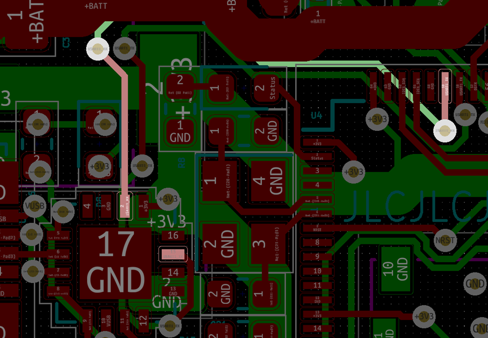
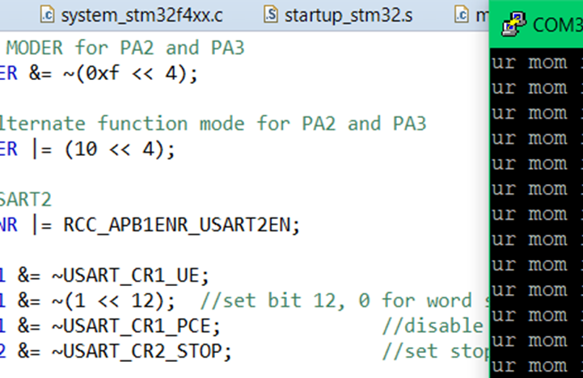
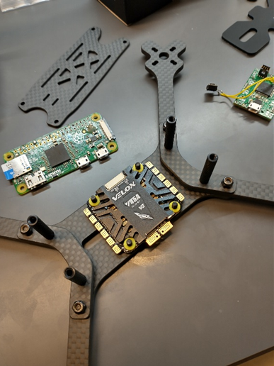

# Week 4

Rx Tx Swapped trace - After success with soldering the FT230XQ onto the PCB, I tested the functionality of both receive and transmit. I could tell that sending data from the computer over PuTTY lit the RX LED when data was sent, but when the STM32 sent data, none was received in PuTTY. After some investigation using my oscilloscope, and looking at my circuit diagram, I realized I had wired Rx to Rx and Tx to Tx for the connection between the FT230XQ and the STM32. This resulted in both devices attempting to transmit on the same line and listen on a different one. As one can see in Fig. 4.1, the traces are both wired improperly.

In order to repair this, I did some surgery on the board, slicing both traces and exposing the bare copper to rewire it by hand. I then soldered wires to the bare copper and swapped the traces, reassigning the wires to their correct orientation. The trace slice can be seen in Fig. 4.2 while still being soldered.

")

The completed trace fix is shown in Fig. 4.3, fully complete with very thin noodle wire used to complete connections.

Working transmission data can be seen in PuTTY after completing these repairs. See. Fig. 4.5.

Next my efforts focused on getting DMA working to send newly received bytes from the computer to a FIFO. I had multiple issues configuring it, even having to install a reset button, as I improperly configured the IO pins so much that Software System Reset stopped working! Eventually I determined the improper assignment to the NVIC byte, and that I was trying to write to the control registers before I enabled the clock to it. Wonder why it didn’t work huh.

For the deliverables this week, I created a more precise power budget for the particular components and subsystems within the PCB and larger system. I looked up ballpark values for large devices, made estimates, and looked at datasheets. Table 4.1 shows the resulting power budget.

| Supply             | Device                | Current Typ [mA] | Current Min [mA] | Current Max [mA] |
| ------------------ | --------------------- | ---------------- | ---------------- | ---------------- |
| 4S Battery         | Motor controller(ESC) | 400              | 400              | 400              |
|                    | Motors                | 26000            | 13000            | 38000            |
|                    | 10V Supply            | 439.6            | 184.2            | 567.6            |
| 10V Supply         | 5V Supply             | 424.6            | 169.2            | 552.6            |
|                    | Power LED             | 15               | 15               | 15               |
| 5V Supply          | Radio Receiver        | 3.4              | 3.4              | 3.4              |
|                    | Pi Zero               | 200              | 50               | 250              |
|                    | Camera                | 100              | 50               | 150              |
|                    | Power LED             | 15               | 15               | 15               |
|                    | 3.3V Supply           | 106.2            | 50.8             | 134.2            |
| 3.3V Supply        | STM32 Microcontroller | 80               | 30               | 100              |
|                    | LSM6DSR 6-axis IMU    | 1.2              | 0.8              | 1.2              |
|                    | FT230XQ UART to USB   | 8                | 5                | 8                |
|                    | Power LED             | 15               | 15               | 15               |
|                    | RX/TX LED             | 2                | 0                | 10               |
| Total Current [mA] |                       | 26839.6          | 13584.2          | 38967.6          |
| Total Current [A]  |                       | 26.84            | 13.58            | 38.97            |

Table 4.1. Power Budget Results

This week the frame arrived for the drone as well as the motor controller and motors. After unpacking all the parts, I began assembling the beginnings of the frame, and experimenting with setup of the onboard electronics. Fig. 4.6a shows the frame parts, and Fig. 4.6b shows them (mostly) assembled.

Schedule creation was a critical product of one of this week’s team meetings. Together with the team I developed a Gantt style chart to show dependency and project trajectory for various subtasks and how they integrate into the project as a whole. Table 6.2 Shows the schedule devised.

|             |                          |                    | Week 4                                               | Week 5                                               | Week 6                                             | Week 7                                             | Week 8                                             | Week 9 | Week 10                                           | Week 11                                           | Week 12                                           | Week 13                                           | Week 14 | Week 15 | Week 16 |
| ----------- | ------------------------ | ------------------ | ---------------------------------------------------- | ---------------------------------------------------- | -------------------------------------------------- | -------------------------------------------------- | -------------------------------------------------- | ------ | ------------------------------------------------- | ------------------------------------------------- | ------------------------------------------------- | ------------------------------------------------- | ------- | ------- | ------- |
| Interfacing |                          |                    |                                                      |                                                      |                                                    |                                                    |                                                    |        |                                                   |                                                   |                                                   |                                                   |         |         |
|             | Protocols                |                    |                                                      |                                                      |                                                    |                                                    |                                                    |        |                                                   |                                                   |                                                   |                                                   |         |         |         |
|             |                          | SPI                | 

 | 

 |                                                    |                                                    |                                                    |        |                                                   |                                                   |                                                   |                                                   |         |         |         |
|             |                          | I2C                | 

 | 

 |                                                    |                                                    |                                                    |        |                                                   |                                                   |                                                   |                                                   |         |         |         |
|             |                          | UART               | 

 | 

 |                                                    |                                                    |                                                    |        |                                                   |                                                   |                                                   |                                                   |         |         |         |
|             |                          | PWM                | 

 | 

 |                                                    |                                                    |                                                    |        |                                                   |                                                   |                                                   |                                                   |         |         |         |
|             |                          | Analog Read        |                                                      |                                                      |                                                    |                                                    |                                                    |        |                                                   |                                                   |                                                   |                                                   |         |         |         |
|             | Drivers                  |                    |                                                      |                                                      |                                                    |                                                    |                                                    |        |                                                   |                                                   |                                                   |                                                   |         |         |         |
|             |                          | Motor PWM          |                                                      | 

   | 

 |                                                    |                                                    |        |                                                   |                                                   |                                                   |                                                   |         |         |         |
|             |                          | Radio              |                                                      | 

   | 

 |                                                    |                                                    |        |                                                   |                                                   |                                                   |                                                   |         |         |         |
|             |                          | MPU9250            |                                                      | 

   | 

 |                                                    |                                                    |        |                                                   |                                                   |                                                   |                                                   |         |         |         |
|             |                          | LSM6DSOWTR         |                                                      | 

   | 

 |                                                    |                                                    |        |                                                   |                                                   |                                                   |                                                   |         |         |         |
|             |                          | ICM20948           |                                                      | 

   | 

 |                                                    |                                                    |        |                                                   |                                                   |                                                   |                                                   |         |         |         |
|             |                          | VL53L1X            |                                                      | 

   | 

 |                                                    |                                                    |        |                                                   |                                                   |                                                   |                                                   |         |         |         |
|             |                          | Pi communication   |                                                      | 

   | 

 |                                                    |                                                    |        |                                                   |                                                   |                                                   |                                                   |         |         |         |
|             |                          | Battery monitor    |                                                      |                                                      |                                                    |                                                    |                                                    |        |                                                   |                                                   |                                                   |                                                   |         |         |         |
|             |                          | Driver integration |                                                      |                                                      | 

 | 

 | 

 |        |                                                   |                                                   |                                                   |                                                   |         |         |         |
| Algorithms  |                          |                    |                                                      |                                                      |                                                    |                                                    |                                                    |        |                                                   |                                                   |                                                   |                                                   |         |         |
|             | Sensor Fusion            |                    |                                                      |                                                      | 

  | 

  |                                                    |        |                                                   |                                                   |                                                   |                                                   |         |         |         |
|             | PID Loop                 |                    |                                                      |                                                      | 

  | 

  |                                                    |        |                                                   |                                                   |                                                   |                                                   |         |         |         |
|             | Push to motors           |                    |                                                      |                                                      | 

  | 

  |                                                    |        |                                                   |                                                   |                                                   |                                                   |         |         |         |
|             | Calibration              |                    |                                                      |                                                      |                                                    | 

  | 

  |        |                                                   |                                                   |                                                   |                                                   |         |         |         |
| Prototyping |                          |                    |                                                      |                                                      |                                                    |                                                    |                                                    |        |                                                   |                                                   |                                                   |                                                   |         |         |
|             | Assemble prototype board |                    |                                                      |                                                      | 

    | 

    | 

    |        |                                                   |                                                   |                                                   |                                                   |         |         |         |
|             | Physical drone assembly  |                    | 

   | 

   |                                                    |                                                    |                                                    |        |                                                   |                                                   |                                                   |                                                   |         |         |         |
|             | 3D printed mounts        |                    |                                                      | 

   | 

 | 

 |                                                    |        |                                                   |                                                   |                                                   |                                                   |         |         |         |
| PCB Design  |                          |                    |                                                      |                                                      |                                                    |                                                    |                                                    |        |                                                   |                                                   |                                                   |                                                   |         |         |
|             | Schematic Design         |                    | 

    | 

    |                                                    |                                                    |                                                    |        |                                                   |                                                   |                                                   |                                                   |         |         |         |
|             | PCB Layout               |                    |                                                      | 

    | 

  | 

  |                                                    |        |                                                   |                                                   |                                                   |                                                   |         |         |         |
|             | Verify / Order PCB       |                    |                                                      |                                                      |                                                    |                                                    | 

  |        |                                                   |                                                   |                                                   |                                                   |         |         |         |
|             | Assemble PCB             |                    |                                                      |                                                      |                                                    |                                                    |                                                    |        | 

 | 

 |                                                   |                                                   |         |         |         |
|             | Unit test PCB hardware   |                    |                                                      |                                                      |                                                    |                                                    |                                                    |        |                                                   | 

 | 

 |                                                   |         |         |         |
|             | Install PCB              |                    |                                                      |                                                      |                                                    |                                                    |                                                    |        |                                                   |                                                   | 

 | 

 |         |         |         |

In addition to the schedule, a more precise block diagram for the project was made, shown in Fig. 4.7a and 4.7b.

