# Week 5

**Radio Binding**

The first hurdle this week was getting the newly arrived radio transmitter and receiver to talk to each other and bind. They both use a newer air protocol called ELRS, or ExpressLRS. The receiver chosen uses an ESP8266, and is able to provide its own wireless access point to wirelessly login and configure the receiver through WiFi. The Transmitter is significantly more finicky, requiring a USB connection after a very precise power up sequence to be able to connect and configure it through a configurator.

To begin, I first soldered some wires to the receiver to be able to prototype with it. I used my favorite 30AWG wire, super thin and easy to work with.

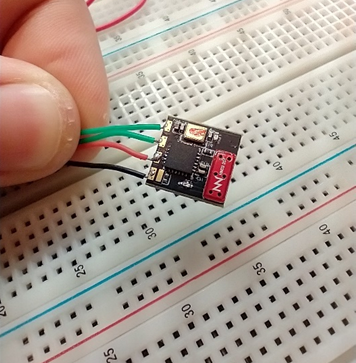
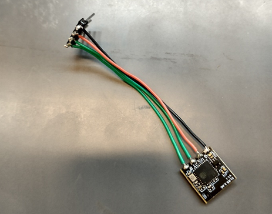

After thoroughly reading documentation, it seemed there were 2 primary binding methods, one where the bind switch on the transmitter is pushed when the receiver is in bind mode, and the other being manually giving each an identical passphrase known as the ‘bind phrase’ during configuration such that they automatically bind on power up. The bind switch option requires placing the receiver in bind mode by powering up and immediately disconnecting power 3 times in a row to the receiver. This was a bit hard to find, but eventually I came across how to do this.

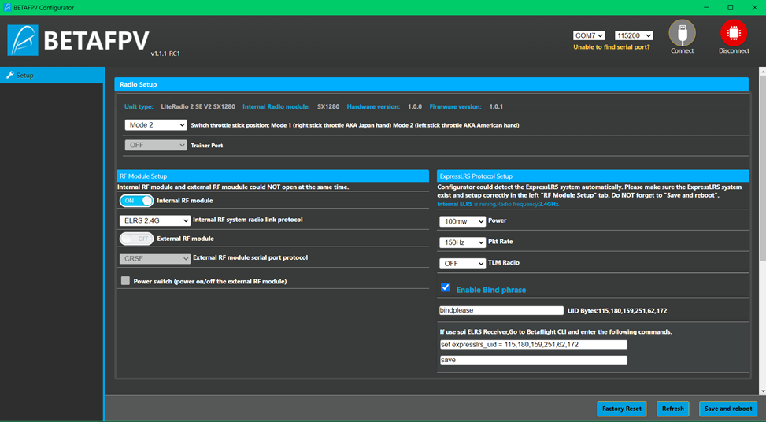

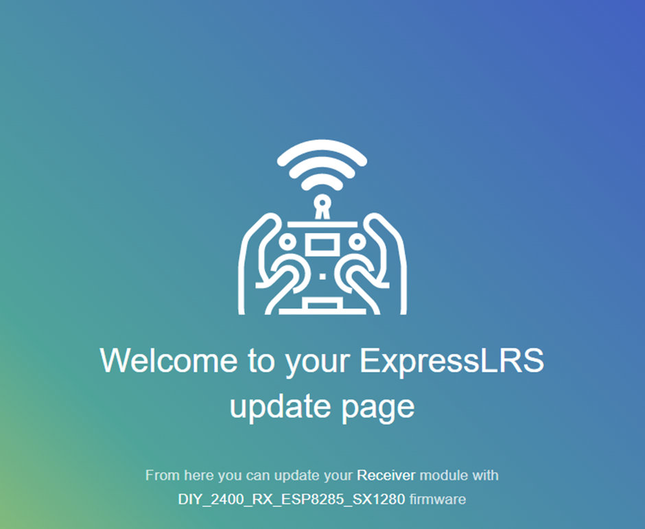
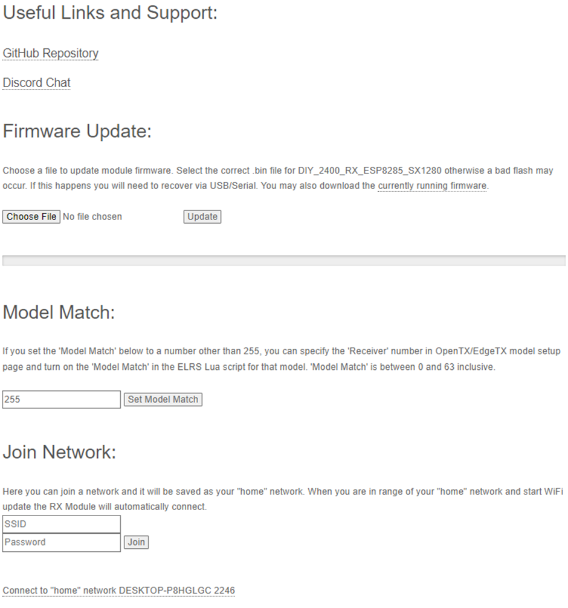

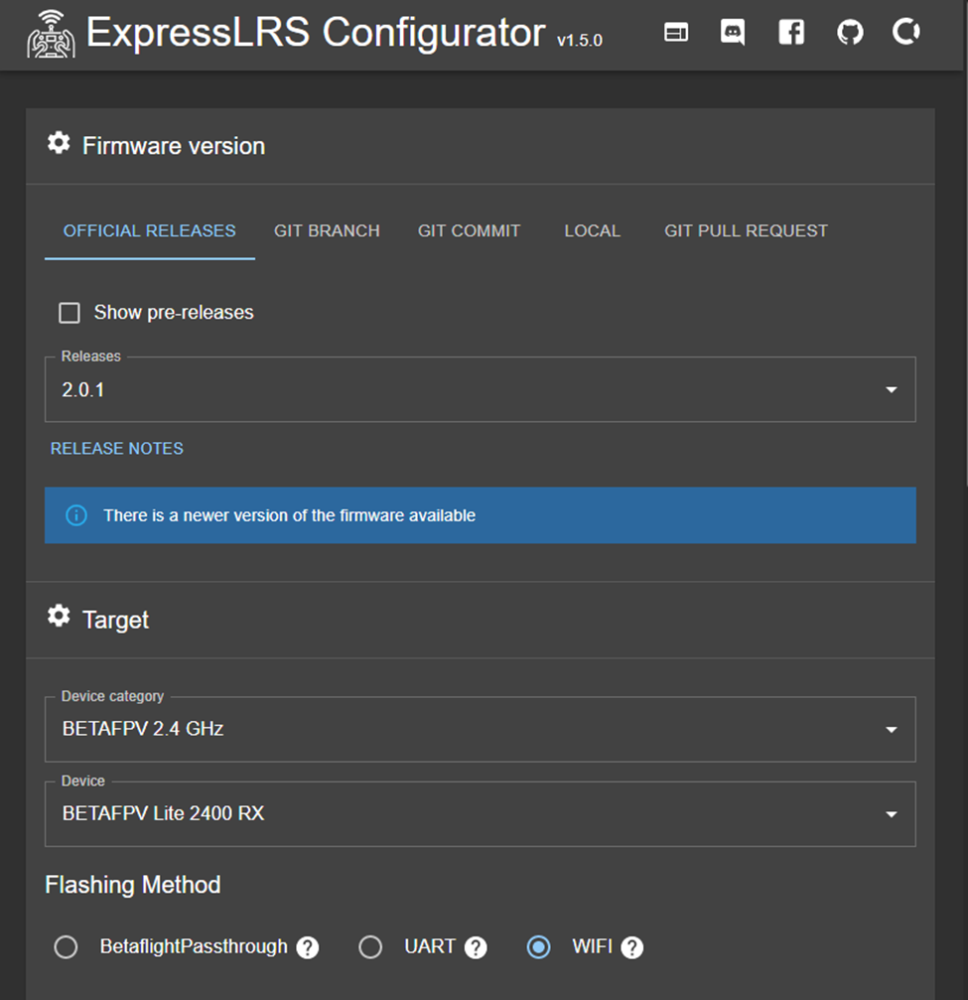

It soon became apparent that neither option worked, and after much debugging and hair pulling, I realized that the transmitter firmware is not being actively kept up to date with the version of software on the receiver – a big issue, as that means that the receiver is not trying to talk to the transmitter in an agreed upon format.

I discovered I needed to reflash the receiver with an older firmware version such that the TX and RX versions would match. Once I did this, they magically bound to each other, even though the version I flashed claimed to be the original source version the receiver came with. It was very strange.
In order to do all this, I powered the receiver from a USB to serial converter, and wired TX to RX so I could listen in on any debug output from the receiver in PuTTY. Once I finally got it to bind, I could look both in PuTTY and the oscilloscope and see packets arrive. 

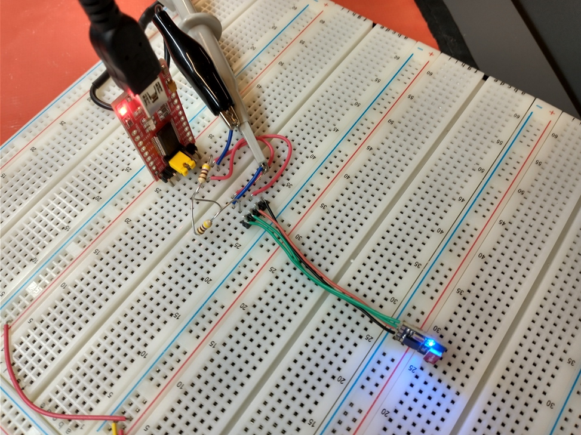

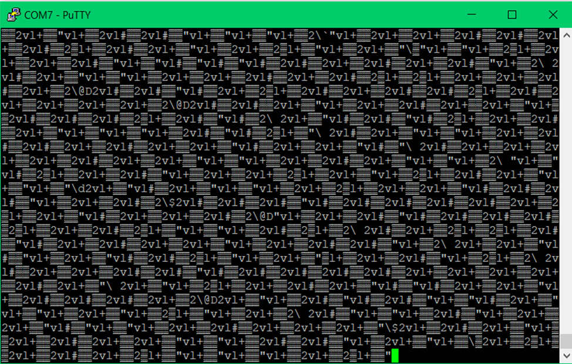

Once binding was complete, the next goal was to attempt to parse the data and read the individual channels using an STM32. To get there, I first investigated the stream using PuTTY, an oscilloscope, logic analyzer, and recordings of serial data from PuTTY to find repeating sequences in the data.

Oscilloscope data can be seen in Fig. 5.7, with the scope locking onto a repeating packet of high baudrate serial data.

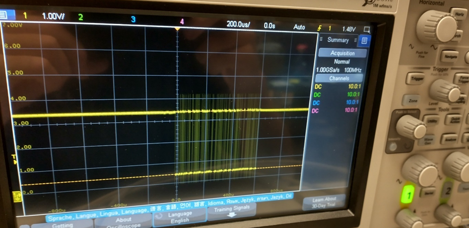

 and decoding uart data with oscilloscope.")

After determining the message format visually, I used the Waveforms program and the AD2 to decode the UART data from the receiver. Fig. 5.9 shows the AD2 decoding the 420KBaud UART data from the receiver, showing the 150Hz frame format. 

Unfortunately, this protocol is very undocumented, and the only way to decode it is to look at open source code that also utilizes this protocol, and to look at the raw data. Every packet seems to begin with a byte 0xC8, followed by a byte 0x1B, which seems to correspond to 2 less than the total length of the sequence. As one moves the sticks on the transmitter to get the packet data to change, a particular pair or so of bytes vary, but so do the final 2 bytes of the sequence. This, and reading code online, leads me to believe this is a 16 bit CRC of the transmitted sequence.

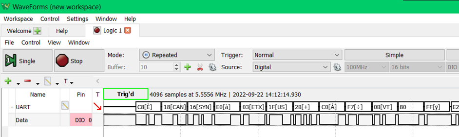
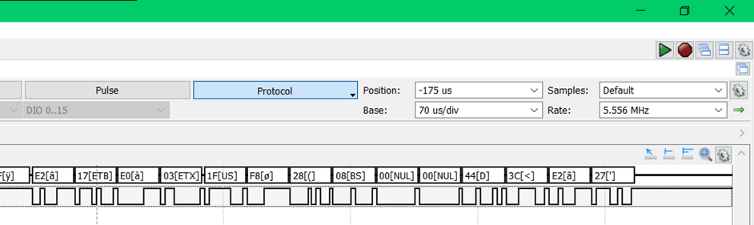

With this knowledge, I started writing code for the STM32 to interpret the incoming data. I modified my USB serial driver to be general, using #defines to determine the DMA channels, IO, GPIO banks, interrupts, etc. Then I used this code to set up a similar DMA driven system to pull in the bitstream from the receiver. I then wrote some simple channel interpretation code that watches for the initial byte 0xC8, and then parses the indicated amount of data from the second byte. I then wired the ST Nucleo board up to the proper pins and powered the receiver from the Nucleo instead of the original setup with the USB to serial converter board.  Fig. 5.9 shows this new setup.

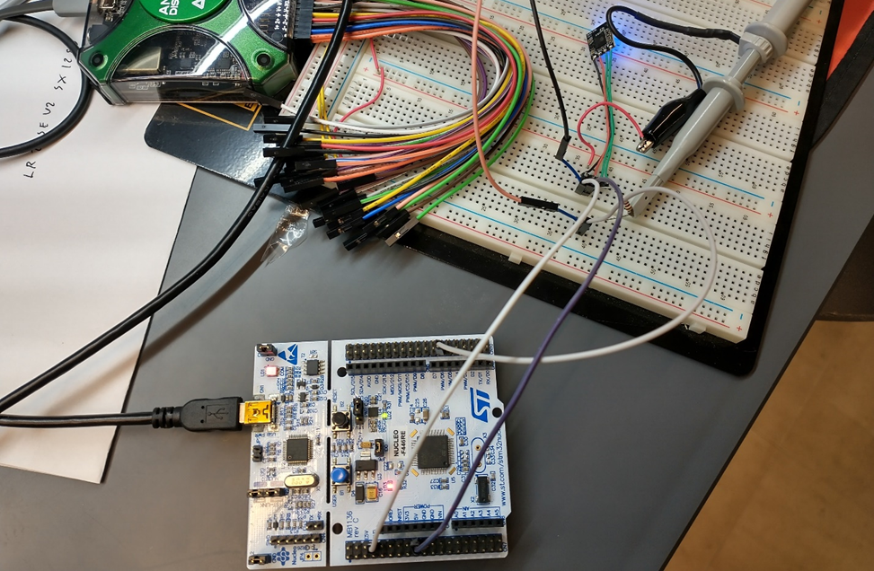

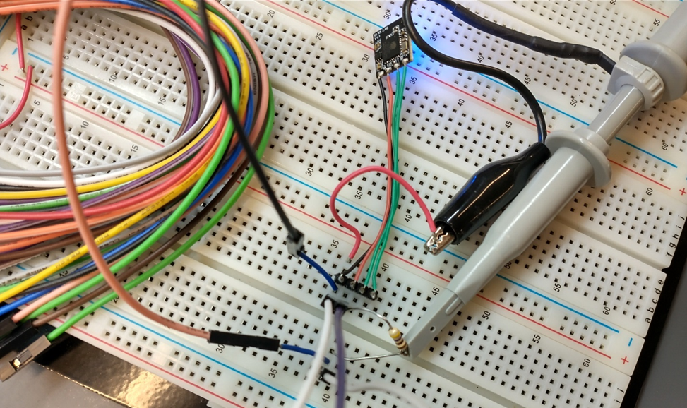

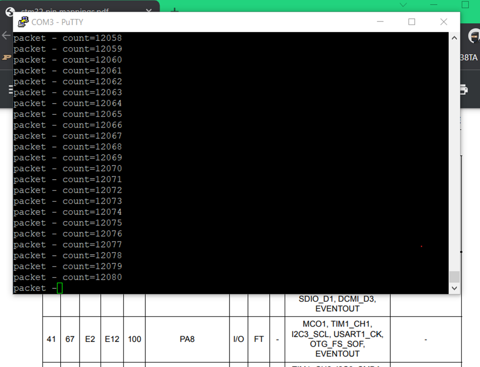

Finally, after some reading of forums online, I heard the bit length of each channel’s data was 10 bits. I attempted to pull in channel data after the header 10 bits at a time, which showed some success, however the data kept rolling over, not going negative correctly, etc., which makes me think the bit offsets aren’t quite right. Online code also shows it to actually be 11 bits, which makes sense if that last bit is just the sign bit. I’ll be modifying my parsing code and the data should be coming properly very soon.

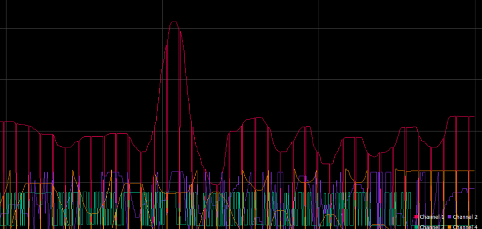
