# Week 7

**PCB Design**

This week was mostly spent finishing the schematic and PCB layout for the flight controller. Both had reached a good point last week, and so the remaining efforts were implementing the IMU recommended designs, touching up the PCB component positions, silkscreen references, routing power traces, and cleaning up traces and ground planes to maximize signal integrity and current capacity, and minimize voltage drop and noise.

Again, I won’t show how the sausage is made too much, as it is a very, very iterative process and stuff keeps moving around on the PCB until I am satisfied with its position.

However, as things move around, the optimal location to have the signal pins originate off the microcontroller can change. So, in addition to selecting optimal final locations for the components, I frequently checked the datasheet, and a handy ST tool to check which UARTs, SPI busses, etc. could be enabled on which IO pins.

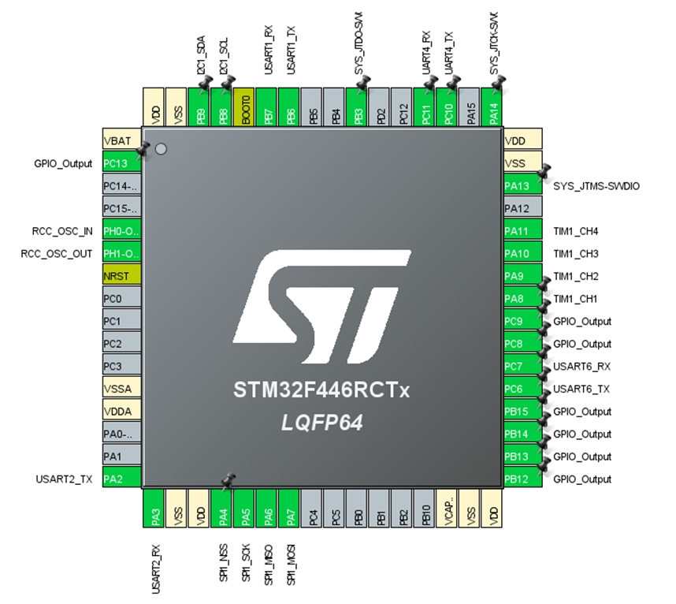

Using this tool, I could validate that my pin configuration was workable with my physical layout, and then implement that on my schematic.

Implementing the IMU was mildly interesting, as I want the capability to use either the MPU9250, the LSM6DS3, or both. So in addition to adding the recommended parts, caps, etc., I added a network of 0 ohm resistor switches to enable the desired configuration as needed.

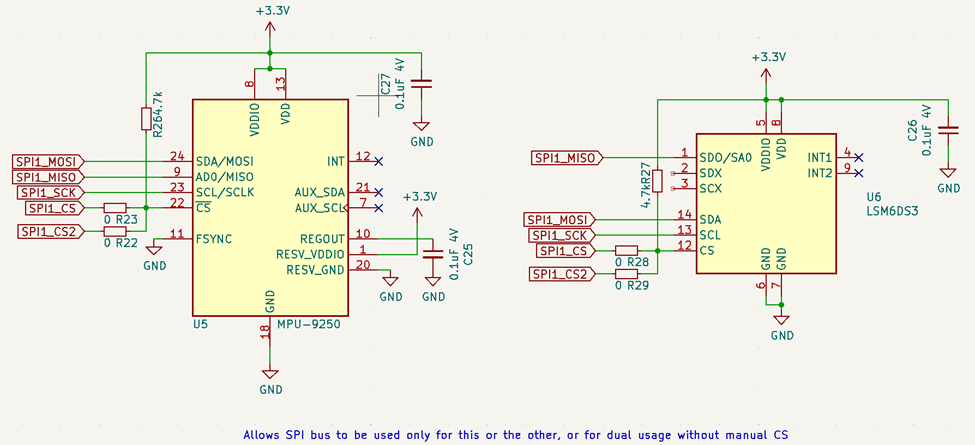

I also added the PI Zero connector that I had put off for last, selecting a part of the Pi header to interface to that contains the UART, +5V, and ground. This is pins 1 through 10 at the far edge of the PI PCB. This ended up being a relatively convenient spot after I moved a couple things out of its way.

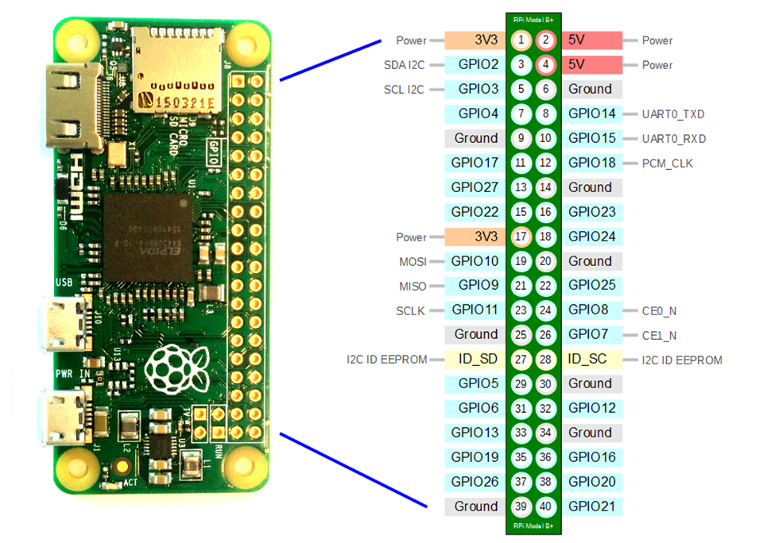

Now that the part was in the ~mostly correct spot, I had to ensure that the connector would line up perfectly by looking up the exact dimensions of the board, and by verifying the setup by printing a to-scale version of the board and checking it against the Pi Zero I own.

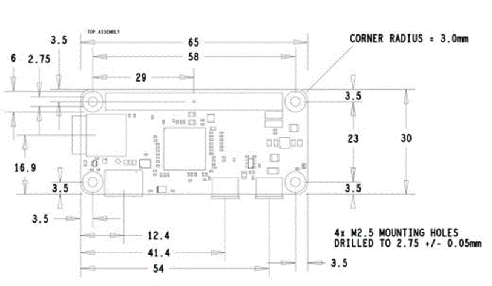

Using these measurements, I worked to place it in what I believed was the best position. Then I printed off the too scale version and compared. I noticed that while all the corner holes were properly aligned, the connector was about a millimeter too far to the right. I then readjusted and printed again. Much better! A visual check shows the pins at the exact right spot.

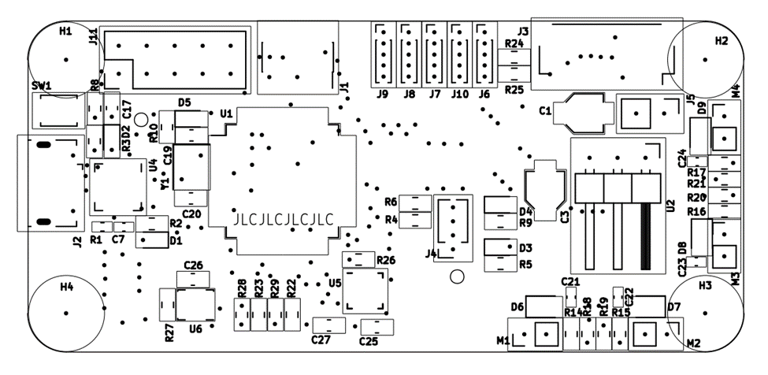

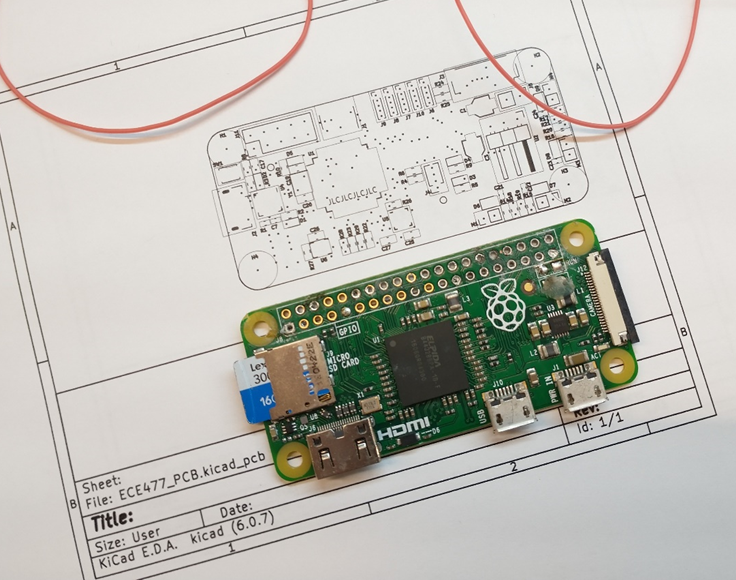

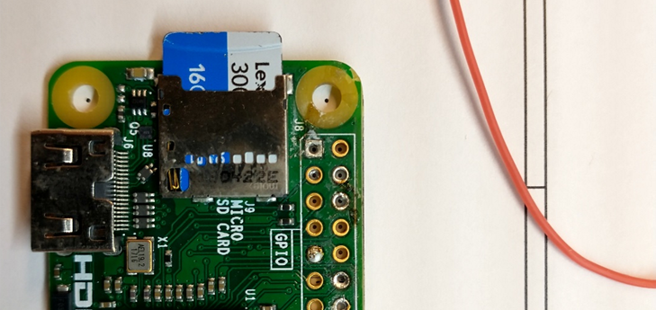

After much additional moving and redrawing, I got the board to a physically and electrically satisfactory point, with correct footprint positions, trace widths, silkscreen, etc.

The result looks like this.

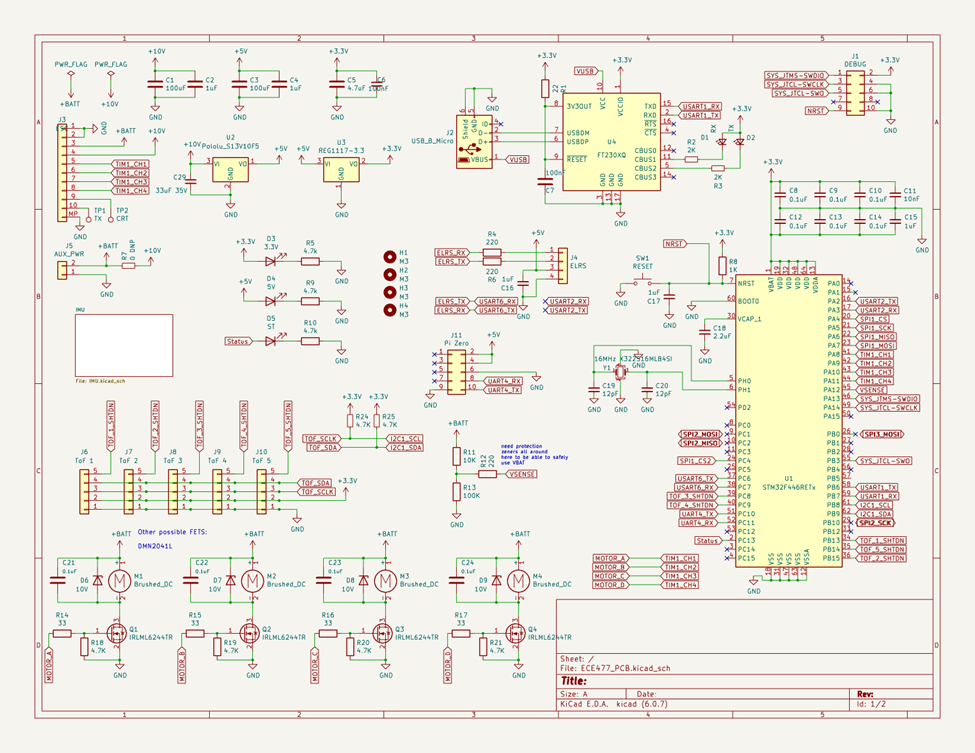

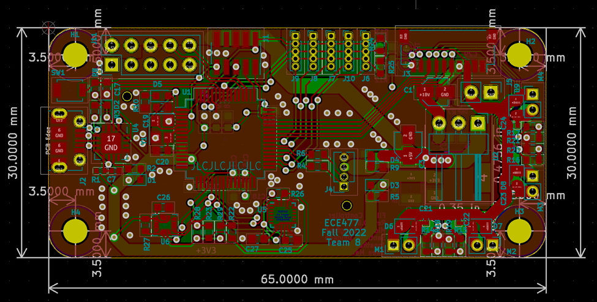

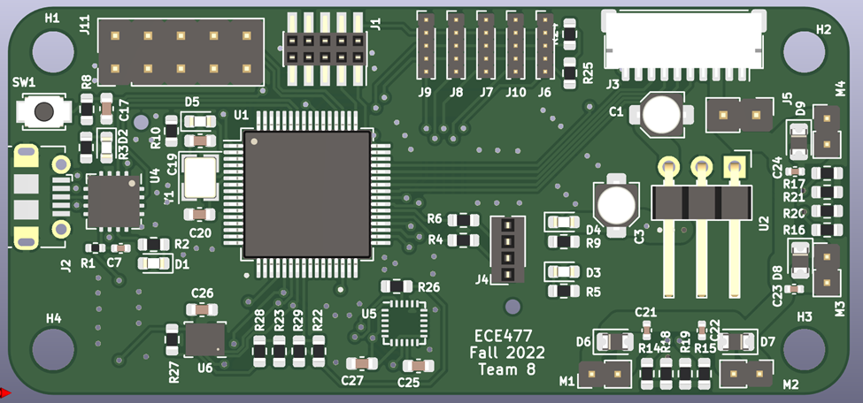

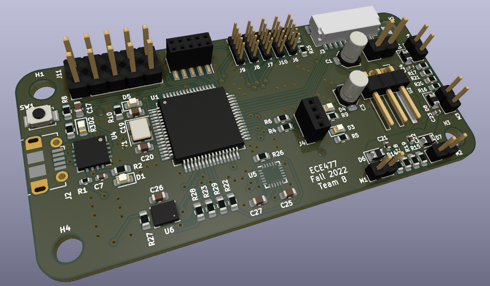

**Radio Code**

I also revisited my radio CRSF interpretation code this week, in order to improve my relatively hacky code – which worked but performed almost no data validation (dangerous!), and was very inefficient.

For the new design, I chose a circular buffer, where the ‘start’ of the buffer would be shifted up until the end of the buffer, and then back around, rather than shifting the buffer contents while looking for a valid packet. This is significantly more efficient. Once it sees a valid starting character, it places a struct pointer at that location in memory, and begins to decode the data from that position, pulling out descriptors like the frame length from the point indicated my the struct definition. If needed, the ‘rolled over’ part of memory in the circular buffer is copied over to free space at the end of the buffer so the data frame is contiguous. Then the address, frame type, and CRC are checked. If these are valid, then the channel data is copied over to the global location for the latest radio channel data.

This system actually worked almost perfectly first try, which was great! I only had to fix a couple pointer casts and offsets, and the system was good to go. Another benefit is I went to the source code on the ELRS site and used their #defines and enums, so that my code is using not only the right values, but the canonical names for each field.

```c

if ((crsf_addr_e)(*rx_buffer_start) == CRSF_ADDRESS_FLIGHT_CONTROLLER)
{
  //go through and attempt to parse
  //place the data struct at this location and see if it passes
  //first task is to verify the length is within bounds, and
  //that the message type is what we're looking for
  //Then verify it has a valid CRC
  //move everything from the beginning of memory to

  crsf_packet_t* crsf_packet = (crsf_packet_t*)rx_buffer_start;

  if (crsf_packet->header.type == CRSF_FRAMETYPE_RC_CHANNELS_PACKED)
  {
    if (crsf_packet->header.frame_size == sizeof(crsf_channels_t)+2/*type, crc, and payload*/)
    {
      //validate CRC

      //copy everything from bottom to the rx_buffer_start point into the upper half of the array to make it contiguous
      memcpy(rx_buffer + BUFFER_SIZE, rx_buffer, rx_buffer_start-rx_buffer);

      uint8_t calculated_crc = calc_crc(&(crsf_packet->header.type), sizeof(crsf_channels_t)+1/*don't include the CRC in the CRC calc haha*/);
      uint8_t rx_crc = crsf_packet->crc;

      if (rx_crc == calculated_crc)
      {
        //valid packet
        //TODO save the last 30 or so channel packets for filtering if needed
        memcpy((void*)&saved_channel_data, (void*)&(crsf_packet->channels), sizeof(crsf_channels_t));
        return 1;
      }
    }
  }
}

```

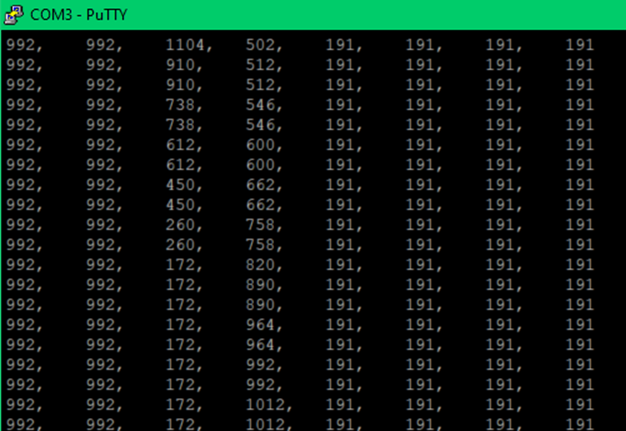

```c
typedef struct
{
    uint16_t ch0 : 11;
    uint16_t ch1 : 11;
    uint16_t ch2 : 11;
    uint16_t ch3 : 11;
    uint16_t ch4 : 11;
    uint16_t ch5 : 11;
    uint16_t ch6 : 11;
    uint16_t ch7 : 11;
    uint16_t ch8 : 11;
    uint16_t ch9 : 11;
    uint16_t ch10 : 11;
    uint16_t ch11 : 11;
    uint16_t ch12 : 11;
    uint16_t ch13 : 11;
    uint16_t ch14 : 11;
    uint16_t ch15 : 11;
} __attribute__ ((packed)) crsf_channels_t;

typedef struct
{
    uint8_t device_addr; // from crsf_addr_e
    uint8_t frame_size;  // counts size after this byte, so it must be the payload size + 2 (type and crc)
    uint8_t type;        // from crsf_frame_type_e
} __attribute__ ((packed)) crsf_header_t;

typedef struct
{
	crsf_header_t header;
	crsf_channels_t channels;
	uint8_t crc;
} __attribute__ ((packed)) crsf_packet_t;

typedef enum
{
    CRSF_FRAMETYPE_GPS = 0x02,
    CRSF_FRAMETYPE_BATTERY_SENSOR = 0x08,
    CRSF_FRAMETYPE_LINK_STATISTICS = 0x14,
    CRSF_FRAMETYPE_RC_CHANNELS_PACKED = 0x16,
    CRSF_FRAMETYPE_ATTITUDE = 0x1E,
    CRSF_FRAMETYPE_FLIGHT_MODE = 0x21,
    // Extended Header Frames, range: 0x28 to 0x96
    CRSF_FRAMETYPE_DEVICE_PING = 0x28,
    CRSF_FRAMETYPE_DEVICE_INFO = 0x29,
    CRSF_FRAMETYPE_PARAMETER_SETTINGS_ENTRY = 0x2B,
    CRSF_FRAMETYPE_PARAMETER_READ = 0x2C,
    CRSF_FRAMETYPE_PARAMETER_WRITE = 0x2D,
    CRSF_FRAMETYPE_COMMAND = 0x32,
    // MSP commands
    CRSF_FRAMETYPE_MSP_REQ = 0x7A,   // response request using msp sequence as command
    CRSF_FRAMETYPE_MSP_RESP = 0x7B,  // reply with 58 byte chunked binary
    CRSF_FRAMETYPE_MSP_WRITE = 0x7C, // write with 8 byte chunked binary (OpenTX outbound telemetry buffer limit)
} crsf_frame_type_e;

typedef enum
{
    CRSF_ADDRESS_BROADCAST = 0x00,
    CRSF_ADDRESS_USB = 0x10,
    CRSF_ADDRESS_TBS_CORE_PNP_PRO = 0x80,
    CRSF_ADDRESS_RESERVED1 = 0x8A,
    CRSF_ADDRESS_CURRENT_SENSOR = 0xC0,
    CRSF_ADDRESS_GPS = 0xC2,
    CRSF_ADDRESS_TBS_BLACKBOX = 0xC4,
    CRSF_ADDRESS_FLIGHT_CONTROLLER = 0xC8,
    CRSF_ADDRESS_RESERVED2 = 0xCA,
    CRSF_ADDRESS_RACE_TAG = 0xCC,
    CRSF_ADDRESS_RADIO_TRANSMITTER = 0xEA,
    CRSF_ADDRESS_CRSF_RECEIVER = 0xEC,
    CRSF_ADDRESS_CRSF_TRANSMITTER = 0xEE,
} crsf_addr_e;
```