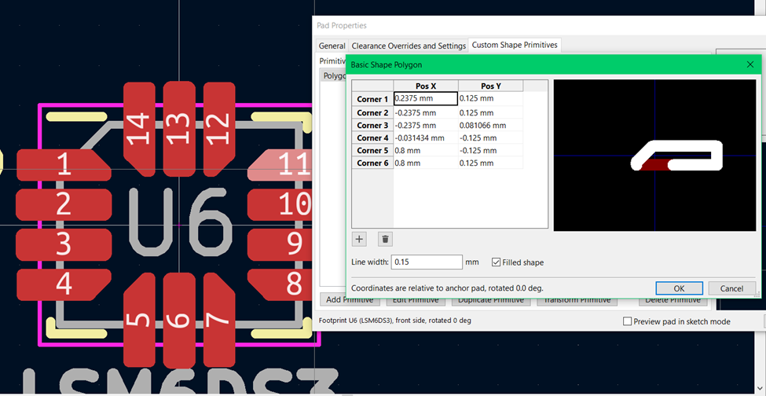
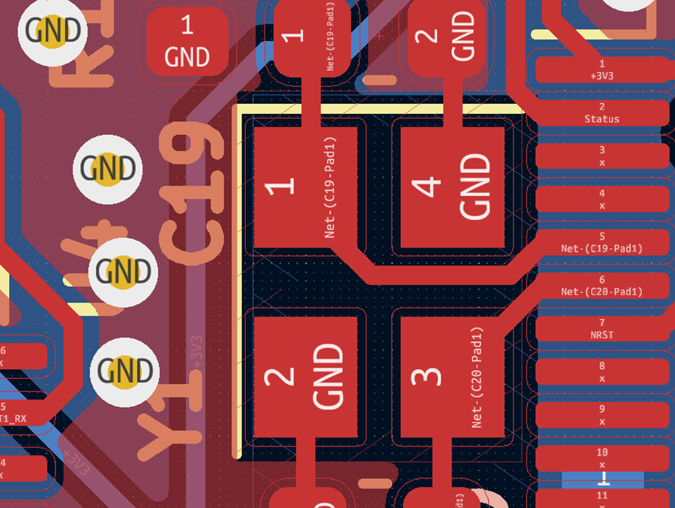
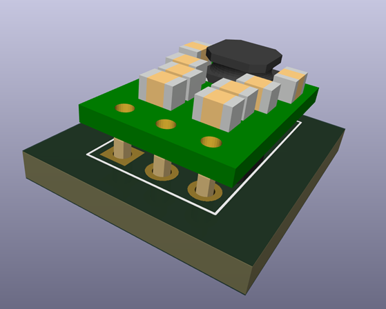
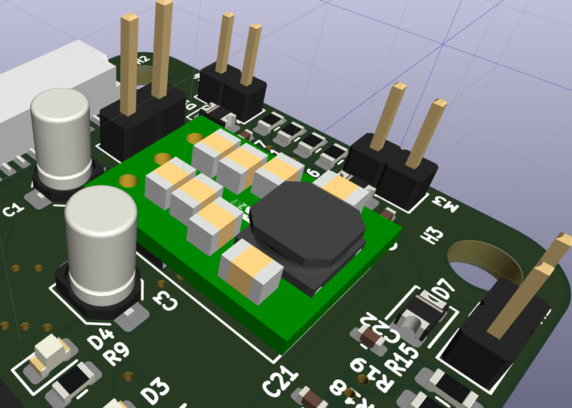

# Week 9

**PCB Design**

This week was mostly spent finishing the schematic and PCB layout for the flight controller. I took the input and corrections gathered from the midterm design review and implemented that guidance on the board design.

The critical points noted during the design review were:
•	Extend pads on QFN for IMUs and FTDI
•	Fix voltage divider inversion
•	Add capacitor on VSense
•	Remove ground plane around and beneath oscillator
•	Change footprint of voltage regulator to the actual footprint, rather than a footprint of equal size and pads with improper silkscreen and boundary.

The fix for the voltage regulator was significantly more involved. I first had to find a 3D model for the part itself, which luckily Pololu provides as a .STEP file, a common Autodesk part file. I then struggled with multiple export utilities, trying to find one that would export to .WRL (KiCAD’s supported 3D model filetype), but retain it’s material / color information.

After a few tries, I then imported the model file and set its position, scale and the boundary for the footprint.

