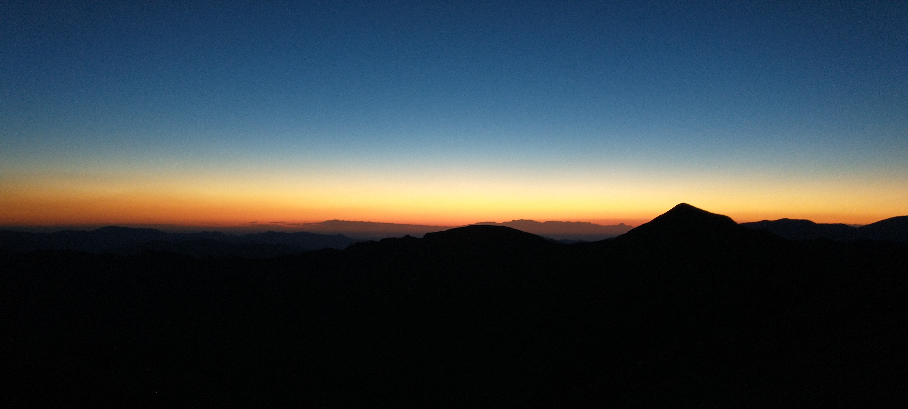
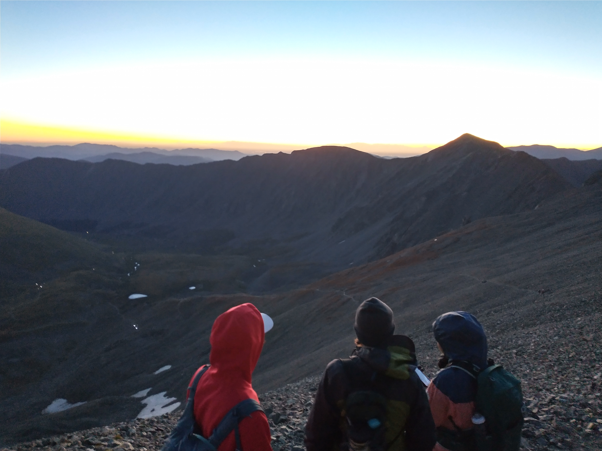
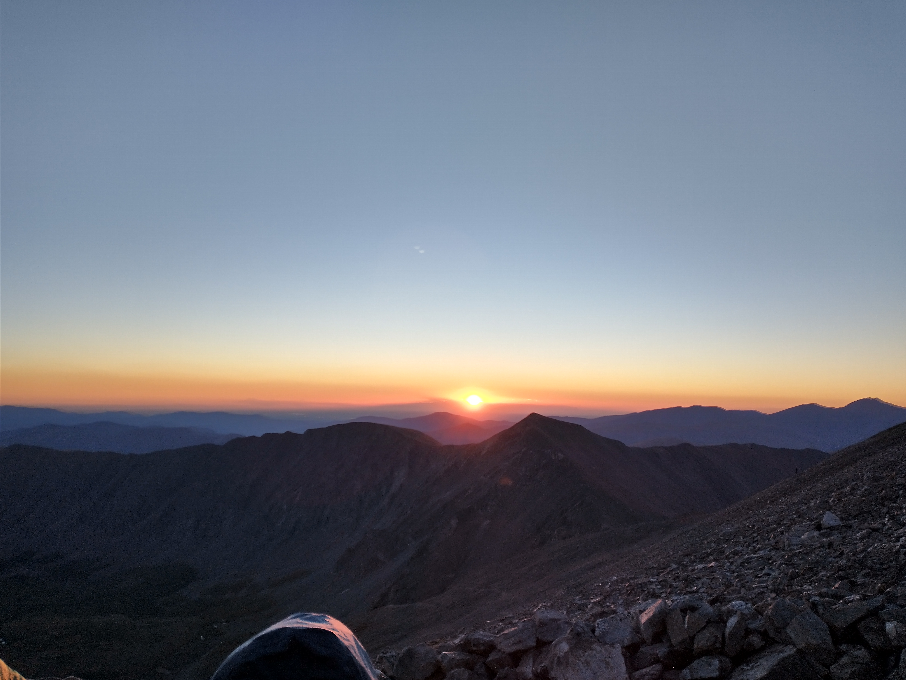
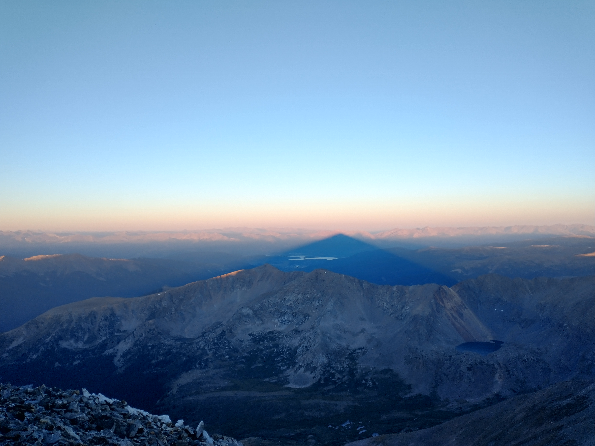
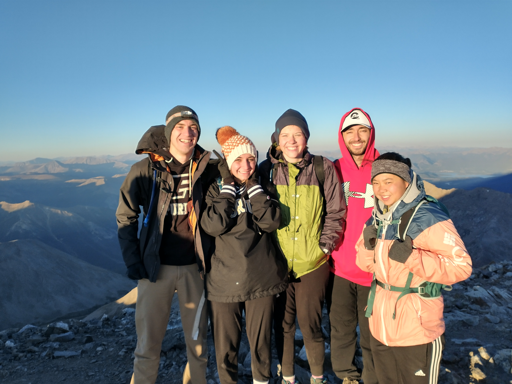

# {{ title }}

**Start Time:** 03:31
**Distance:** 7.1 Miles
**Elevation Gain:** 2,995 ft
**End Time:** 09:16
**RT Time:** 05:45

<iframe class="alltrails" src="https://www.alltrails.com/widget/map/map-september-9-2023-5d55e7c?u=i&sh=lc1gzx" width="100%" height="400" frameborder="0" scrolling="no" marginheight="0" marginwidth="0" title="AllTrails: Trail Guides and Maps for Hiking, Camping, and Running"></iframe>