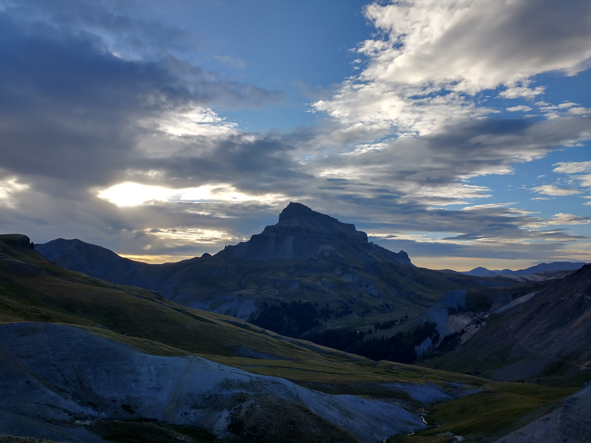
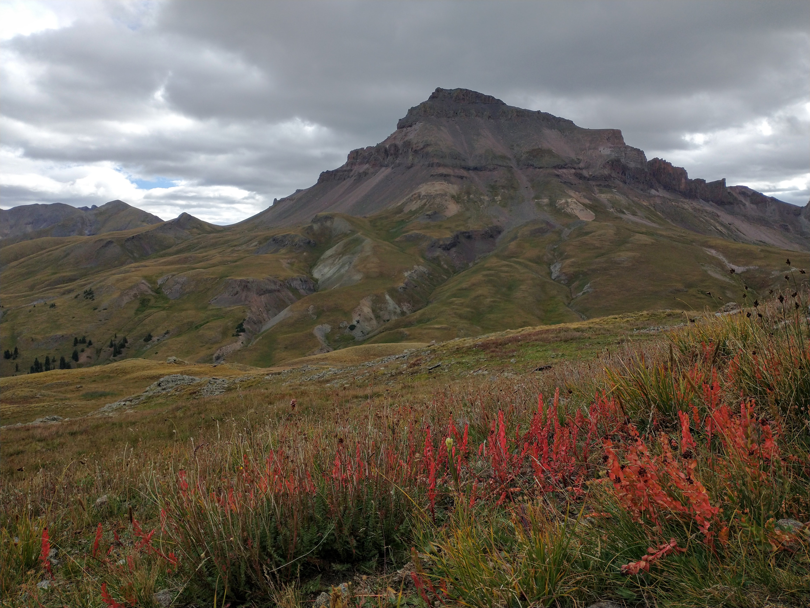

# {{ title }}

**Date:** 09/02/2023

**Start Time:** 04:22
**Distance:** 23.2 Miles
**Elevation Gain:** 6,870 ft
**End Time:** 18:43
**RT Time:** 14:21

<iframe class="alltrails" src="https://www.alltrails.com/widget/map/map-september-3-2023-fa3a3c4?u=i&sh=lc1gzx" width="100%" height="400" frameborder="0" scrolling="no" marginheight="0" marginwidth="0" title="AllTrails: Trail Guides and Maps for Hiking, Camping, and Running"></iframe>

