# {{ title }}

**Part 1 - Grand Teton**

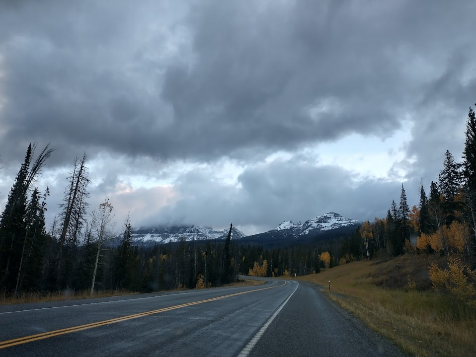

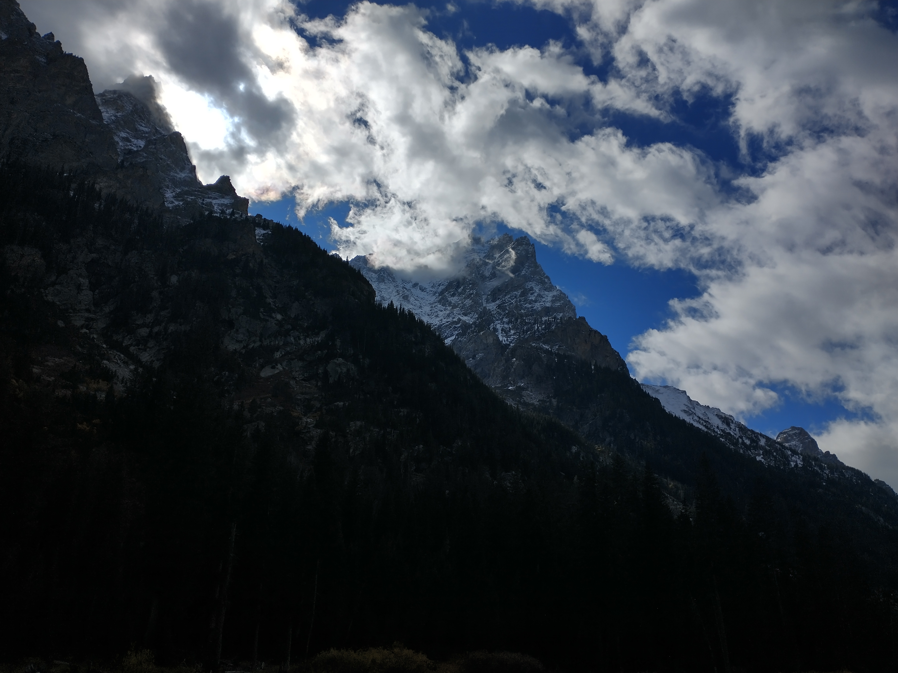

<iframe class="alltrails" src="https://www.alltrails.com/widget/trail/us/wyoming/cascade-canyon-trail?u=i&sh=lc1gzx" width="100%" height="400" frameborder="0" scrolling="no" marginheight="0" marginwidth="0" title="AllTrails: Trail Guides and Maps for Hiking, Camping, and Running"></iframe>

---

**Part 2 - Yellowstone**

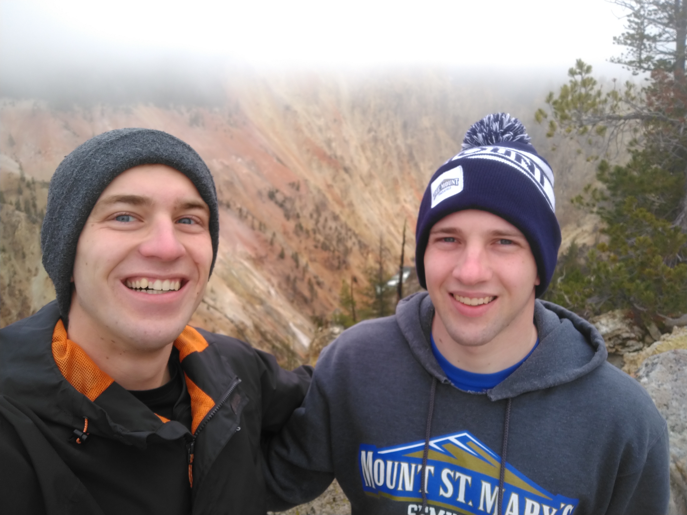

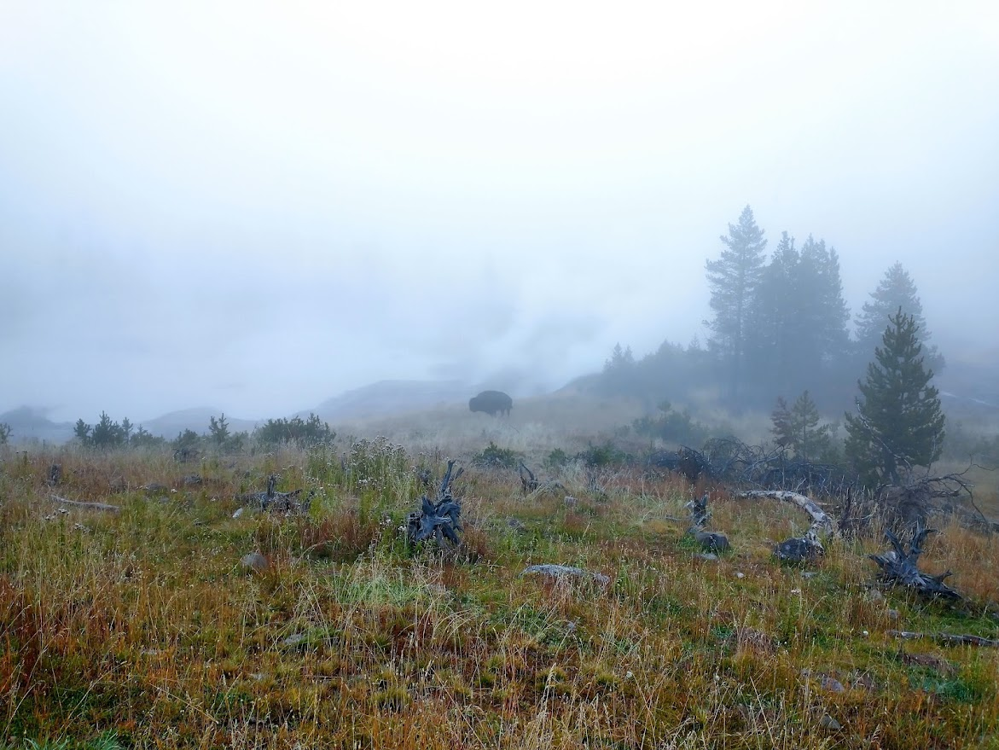

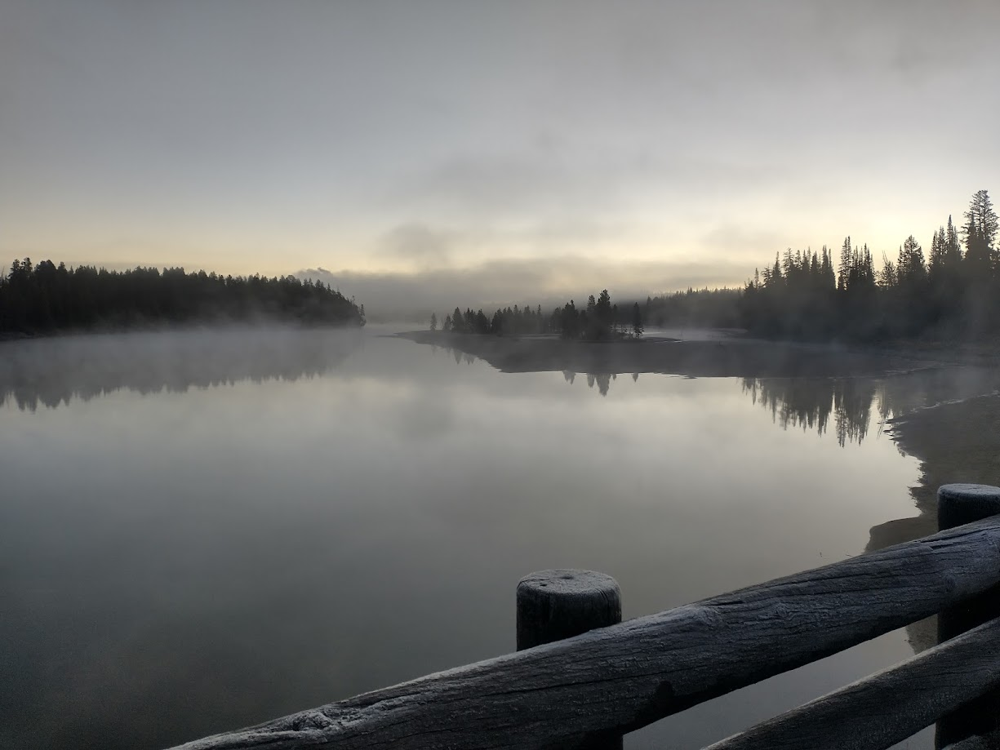

 don't do it justice")

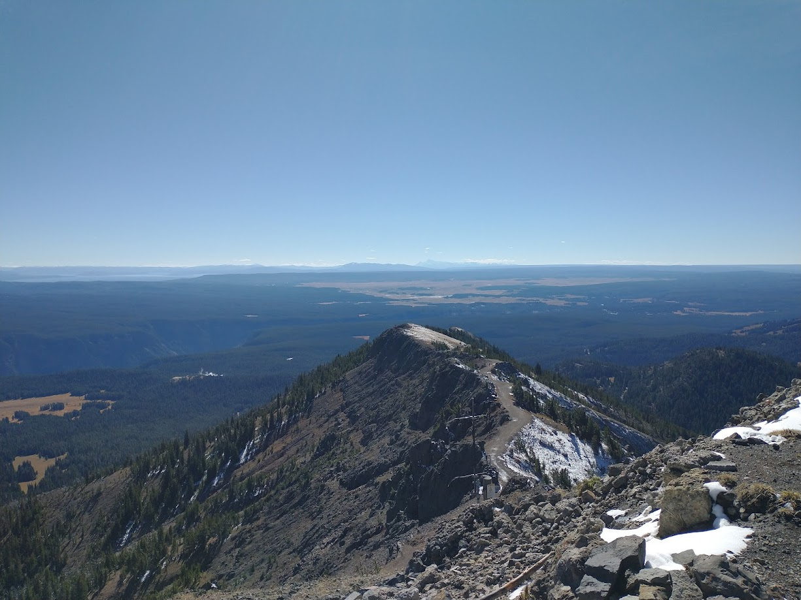

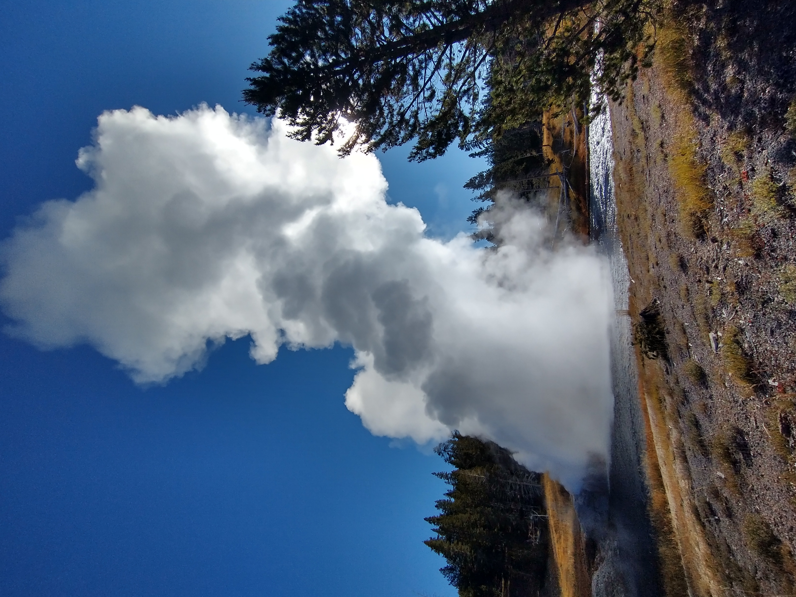

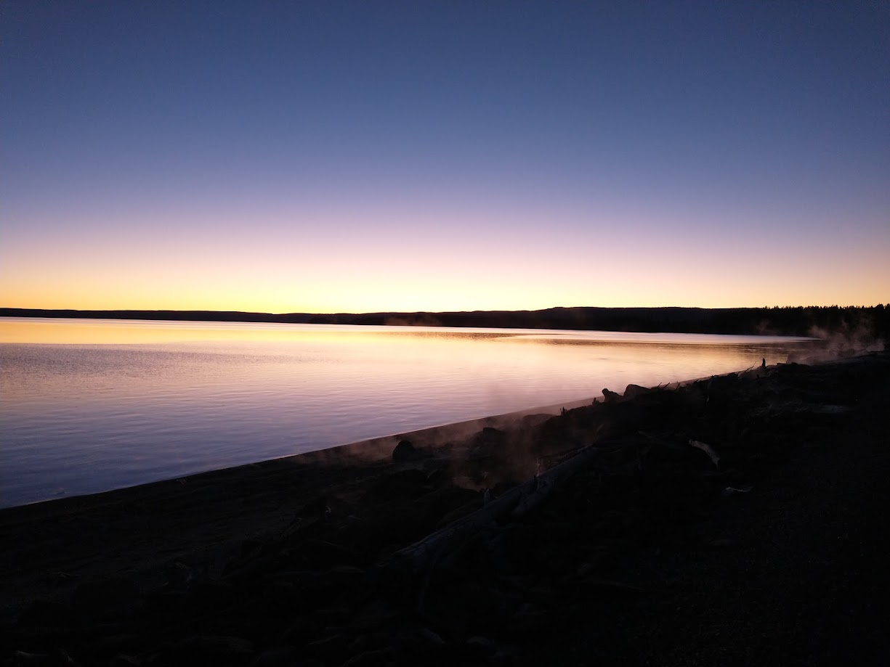

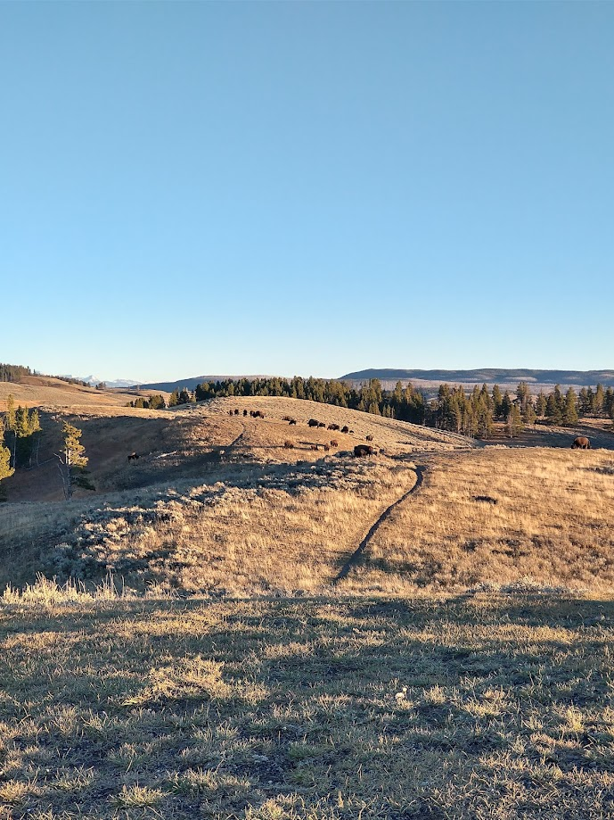

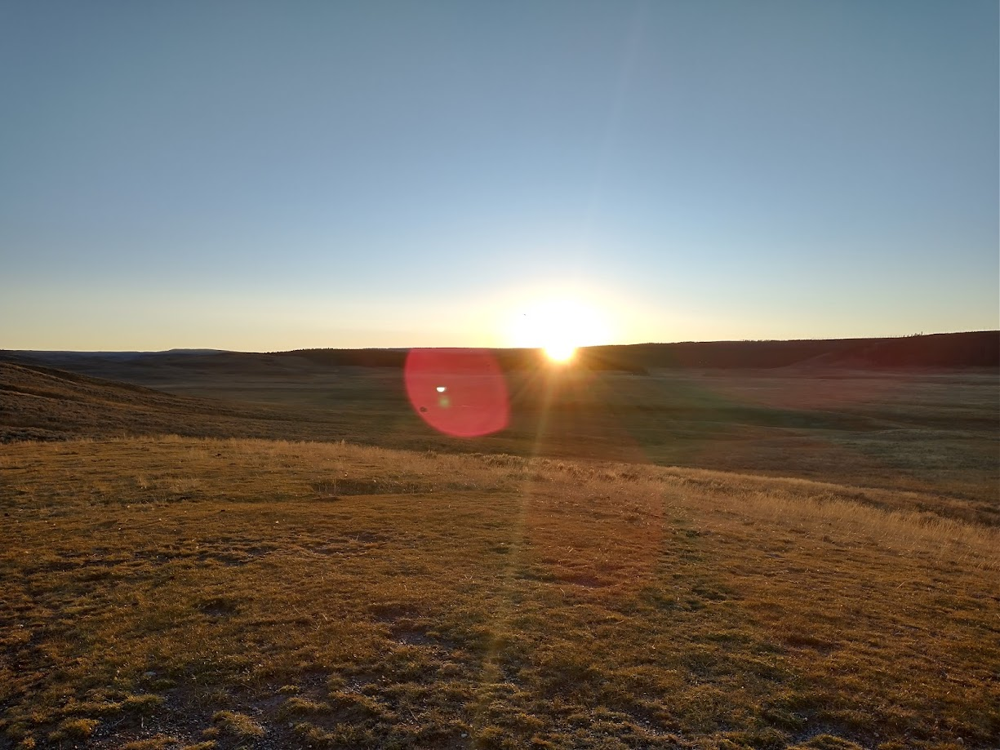

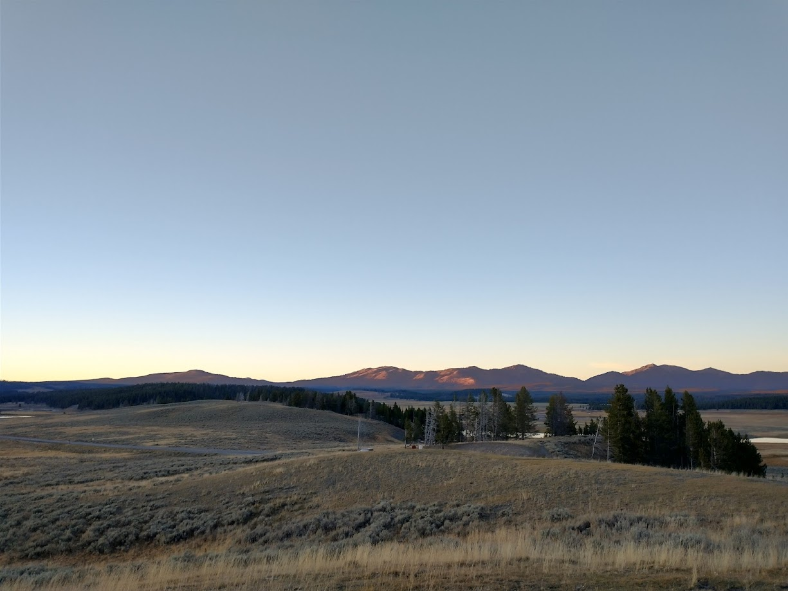