---

### John Chapters 12 - ?

---

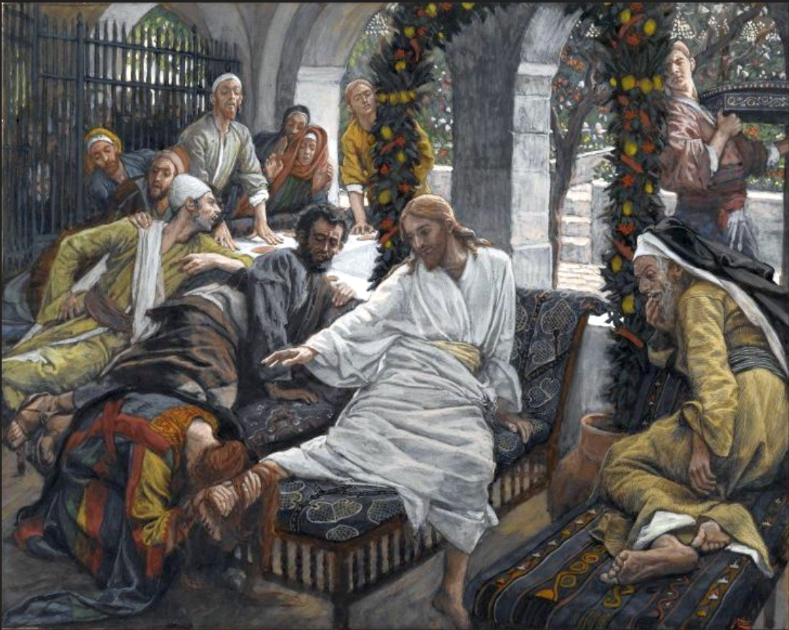

**12** Six days before the Passover, Jesus came to Bethany, where Lazarus lived, whom Jesus had raised from the dead. *2* Here a dinner was given in Jesus’ honor. Martha served, while Lazarus was among those reclining at the table with him. *3* Then Mary took about a pint[a] of pure nard, an expensive perfume; she poured it on Jesus’ feet and wiped his feet with her hair. And the house was filled with the fragrance of the perfume.

*4* But one of his disciples, Judas Iscariot, who was later to betray him, objected, *5* “Why wasn’t this perfume sold and the money given to the poor? It was worth a year’s wages.[b]” *6* He did not say this because he cared about the poor but because he was a thief; as keeper of the money bag, he used to help himself to what was put into it.

*7* “Leave her alone,” Jesus replied. “It was intended that she should save this perfume for the day of my burial. *8* You will always have the poor among you,[c] but you will not always have me.”

*9* Meanwhile a large crowd of Jews found out that Jesus was there and came, not only because of him but also to see Lazarus, whom he had raised from the dead. *10* So the chief priests made plans to kill Lazarus as well, *11* for on account of him many of the Jews were going over to Jesus and believing in him.

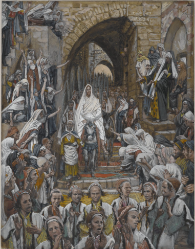

The next day the great crowd that had come for the festival heard that Jesus was on his way to Jerusalem. 13 They took palm branches and went out to meet him, shouting,

“Hosanna![d]”

“Blessed is he who comes in the name of the Lord!”[e]

“Blessed is the king of Israel!”

14 Jesus found a young donkey and sat on it, as it is written:

15 “Do not be afraid, Daughter Zion;
see, your king is coming,
seated on a donkey’s colt.”[f]

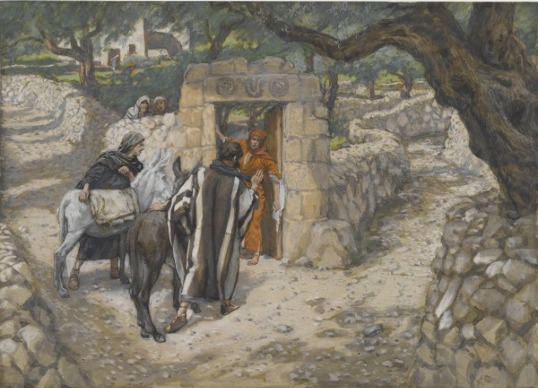

16 At first his disciples did not understand all this. Only after Jesus was glorified did they realize that these things had been written about him and that these things had been done to him.

17 Now the crowd that was with him when he called Lazarus from the tomb and raised him from the dead continued to spread the word. 18 Many people, because they had heard that he had performed this sign, went out to meet him. 19 So the Pharisees said to one another, “See, this is getting us nowhere. Look how the whole world has gone after him!”

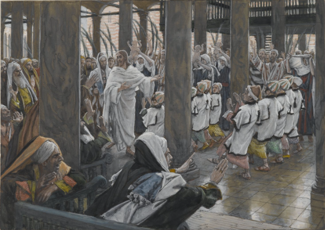

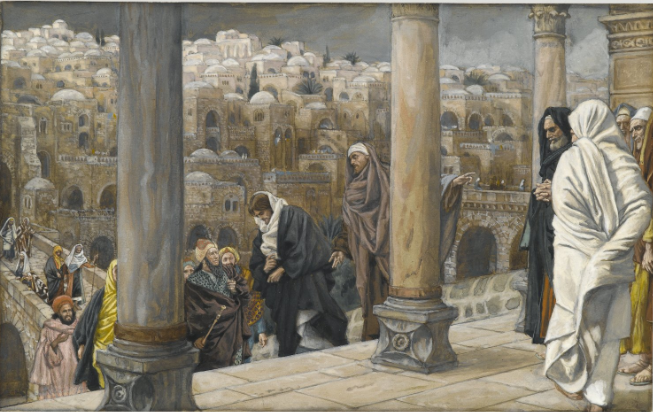

20 Now there were some Greeks among those who went up to worship at the festival. 21 They came to Philip, who was from Bethsaida in Galilee, with a request. “Sir,” they said, “we would like to see Jesus.” 22 Philip went to tell Andrew; Andrew and Philip in turn told Jesus.

23 Jesus replied, “The hour has come for the Son of Man to be glorified. 24 Very truly I tell you, unless a kernel of wheat falls to the ground and dies, it remains only a single seed. But if it dies, it produces many seeds. 25 Anyone who loves their life will lose it, while anyone who hates their life in this world will keep it for eternal life. 26 Whoever serves me must follow me; and where I am, my servant also will be. My Father will honor the one who serves me.

27 “Now my soul is troubled, and what shall I say? ‘Father, save me from this hour’? No, it was for this very reason I came to this hour. 28 Father, glorify your name!”

Then a voice came from heaven, “I have glorified it, and will glorify it again.” 29 The crowd that was there and heard it said it had thundered; others said an angel had spoken to him.

30 Jesus said, “This voice was for your benefit, not mine. 31 Now is the time for judgment on this world; now the prince of this world will be driven out. 32 And I, when I am lifted up[g] from the earth, will draw all people to myself.” 33 He said this to show the kind of death he was going to die.

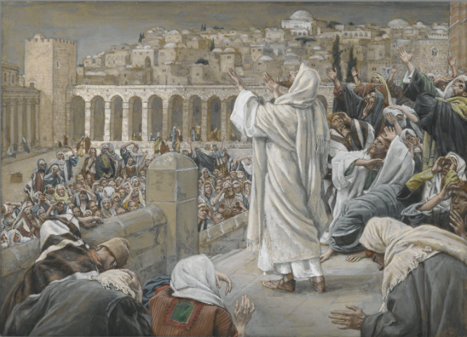

34 The crowd spoke up, “We have heard from the Law that the Messiah will remain forever, so how can you say, ‘The Son of Man must be lifted up’? Who is this ‘Son of Man’?”

35 Then Jesus told them, “You are going to have the light just a little while longer. Walk while you have the light, before darkness overtakes you. Whoever walks in the dark does not know where they are going. 36 Believe in the light while you have the light, so that you may become children of light.” When he had finished speaking, Jesus left and hid himself from them.

37 Even after Jesus had performed so many signs in their presence, they still would not believe in him. 38 This was to fulfill the word of Isaiah the prophet:

“Lord, who has believed our message
    and to whom has the arm of the Lord been revealed?”[h]

39 For this reason they could not believe, because, as Isaiah says elsewhere:

40 “He has blinded their eyes
    and hardened their hearts,
so they can neither see with their eyes,
    nor understand with their hearts,
    nor turn—and I would heal them.”[i]
    
41 Isaiah said this because he saw Jesus’ glory and spoke about him.

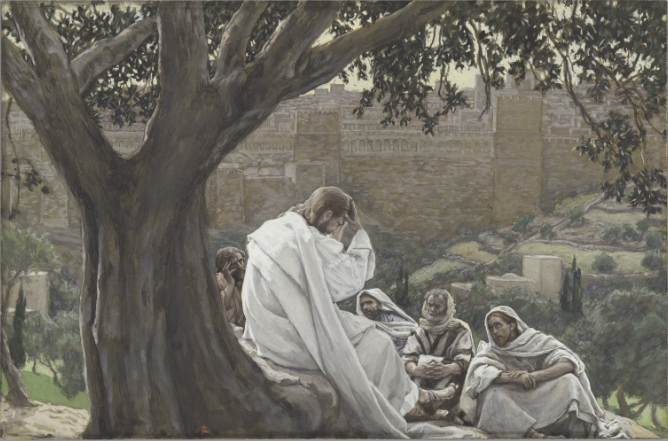

42 Yet at the same time many even among the leaders believed in him. But because of the Pharisees they would not openly acknowledge their faith for fear they would be put out of the synagogue; 43 for they loved human praise more than praise from God.

44 Then Jesus cried out, “Whoever believes in me does not believe in me only, but in the one who sent me. 45 The one who looks at me is seeing the one who sent me. 46 I have come into the world as a light, so that no one who believes in me should stay in darkness.

47 “If anyone hears my words but does not keep them, I do not judge that person. For I did not come to judge the world, but to save the world. 48 There is a judge for the one who rejects me and does not accept my words; the very words I have spoken will condemn them at the last day. 49 For I did not speak on my own, but the Father who sent me commanded me to say all that I have spoken. 50 I know that his command leads to eternal life. So whatever I say is just what the Father has told me to say.”

**13** It was just before the Passover Festival. Jesus knew that the hour had come for him to leave this world and go to the Father. Having loved his own who were in the world, he loved them to the end.

2 The evening meal was in progress, and the devil had already prompted Judas, the son of Simon Iscariot, to betray Jesus. 3 Jesus knew that the Father had put all things under his power, and that he had come from God and was returning to God; 4 so he got up from the meal, took off his outer clothing, and wrapped a towel around his waist. 5 After that, he poured water into a basin and began to wash his disciples’ feet, drying them with the towel that was wrapped around him.

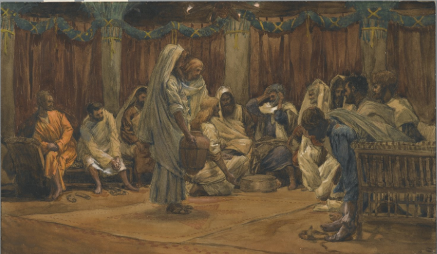 

6 He came to Simon Peter, who said to him, “Lord, are you going to wash my feet?”

7 Jesus replied, “You do not realize now what I am doing, but later you will understand.”

8 “No,” said Peter, “you shall never wash my feet.”

Jesus answered, “Unless I wash you, you have no part with me.”

9 “Then, Lord,” Simon Peter replied, “not just my feet but my hands and my head as well!”

10 Jesus answered, “Those who have had a bath need only to wash their feet; their whole body is clean. And you are clean, though not every one of you.” 11 For he knew who was going to betray him, and that was why he said not every one was clean.

12 When he had finished washing their feet, he put on his clothes and returned to his place. “Do you understand what I have done for you?” he asked them. 13 “You call me ‘Teacher’ and ‘Lord,’ and rightly so, for that is what I am. 14 Now that I, your Lord and Teacher, have washed your feet, you also should wash one another’s feet. 15 I have set you an example that you should do as I have done for you. 16 Very truly I tell you, no servant is greater than his master, nor is a messenger greater than the one who sent him. 17 Now that you know these things, you will be blessed if you do them.

18 “I am not referring to all of you; I know those I have chosen. But this is to fulfill this passage of Scripture: ‘He who shared my bread has turned[a] against me.’[b]

19 “I am telling you now before it happens, so that when it does happen you will believe that I am who I am. 20 Very truly I tell you, whoever accepts anyone I send accepts me; and whoever accepts me accepts the one who sent me.”

21 After he had said this, Jesus was troubled in spirit and testified, “Very truly I tell you, one of you is going to betray me.”

22 His disciples stared at one another, at a loss to know which of them he meant. 23 One of them, the disciple whom Jesus loved, was reclining next to him. 24 Simon Peter motioned to this disciple and said, “Ask him which one he means.”

25 Leaning back against Jesus, he asked him, “Lord, who is it?”

26 Jesus answered, “It is the one to whom I will give this piece of bread when I have dipped it in the dish.” Then, dipping the piece of bread, he gave it to Judas, the son of Simon Iscariot. 27 As soon as Judas took the bread, Satan entered into him.

So Jesus told him, “What you are about to do, do quickly.” 28 But no one at the meal understood why Jesus said this to him. 29 Since Judas had charge of the money, some thought Jesus was telling him to buy what was needed for the festival, or to give something to the poor. 30 As soon as Judas had taken the bread, he went out. And it was night.

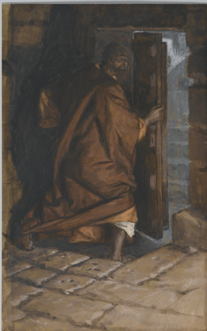

31 When he was gone, Jesus said, “Now the Son of Man is glorified and God is glorified in him. 32 If God is glorified in him,[c] God will glorify the Son in himself, and will glorify him at once.

33 “My children, I will be with you only a little longer. You will look for me, and just as I told the Jews, so I tell you now: Where I am going, you cannot come.

34 “A new command I give you: Love one another. As I have loved you, so you must love one another. 35 By this everyone will know that you are my disciples, if you love one another.”

36 Simon Peter asked him, “Lord, where are you going?”

Jesus replied, “Where I am going, you cannot follow now, but you will follow later.”

37 Peter asked, “Lord, why can’t I follow you now? I will lay down my life for you.”

38 Then Jesus answered, “Will you really lay down your life for me? Very truly I tell you, before the rooster crows, you will disown me three times!

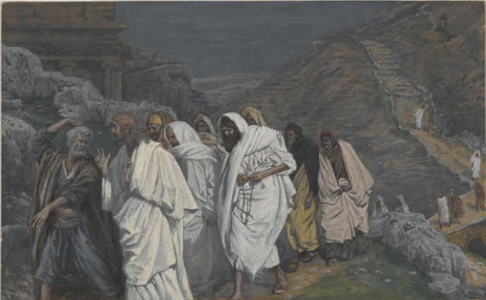

**14** “Do not let your hearts be troubled. You believe in God[a]; believe also in me. 2 My Father’s house has many rooms; if that were not so, would I have told you that I am going there to prepare a place for you? 3 And if I go and prepare a place for you, I will come back and take you to be with me that you also may be where I am. 4 You know the way to the place where I am going.”

5 Thomas said to him, “Lord, we don’t know where you are going, so how can we know the way?”

6 Jesus answered, “I am the way and the truth and the life. No one comes to the Father except through me. 7 If you really know me, you will know[b] my Father as well. From now on, you do know him and have seen him.”

8 Philip said, “Lord, show us the Father and that will be enough for us.”

9 Jesus answered: “Don’t you know me, Philip, even after I have been among you such a long time? Anyone who has seen me has seen the Father. How can you say, ‘Show us the Father’? 10 Don’t you believe that I am in the Father, and that the Father is in me? The words I say to you I do not speak on my own authority. Rather, it is the Father, living in me, who is doing his work. 11 Believe me when I say that I am in the Father and the Father is in me; or at least believe on the evidence of the works themselves. 12 Very truly I tell you, whoever believes in me will do the works I have been doing, and they will do even greater things than these, because I am going to the Father. 13 And I will do whatever you ask in my name, so that the Father may be glorified in the Son. 14 You may ask me for anything in my name, and I will do it.

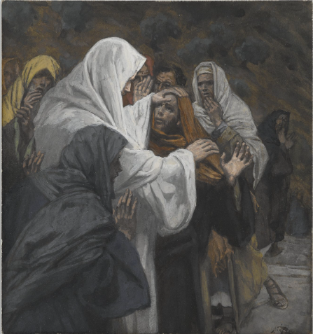