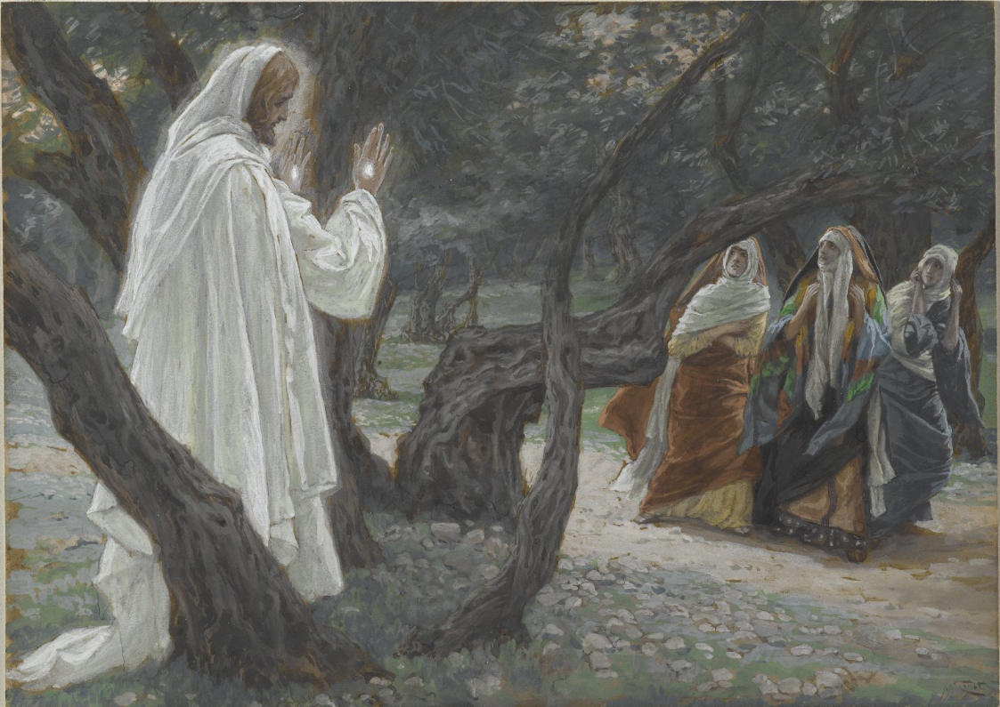

### Notes from Fr. Brian's study

---

- Knowing that I can / it is my duty to / it is my purpose to participate in the redemption of the world is what gets me out of bed in the morning
- God is breaking into this world, Christ is the new Adam, beginning a new humanity, restoring all of creation
- all of creation is broken and distorted by sin, Christ restores this
- christianity is not moralism. it is god's plan to save the entire world
- the Church is his vehicle for the redemption of the world
- Romans tells the story of how God is faithful (his Righteousness)
- the resurrection is where creation is first raised up again to its original glory
- 'creation became futile' it was broken 'not of its own will but by the will of him who subjected it in hope" not sure what that last bit means
- if it becomes futile that must kinda mean that it is unable to do what it originally was made for by its nature. like its nature and telos was frustrated
- our minds are darkened by sin
- we are the pinnacle of creation. the creation story mimics the building of a temple. what's at the center? an image. We are made in the image and likeness of God
- we are unable to follow God's law without the gift of the Spirit
- the Old Law was good, but without the gift of the Spirit the Israelites were too weak to follow it. So too are we unable without the Spirit.
- the pillar of fire and the 'seeing of the voices/toungues' in exodus mirrors the 'tongues' of fire that are described on pentecost
- pentecost is the feast of weeks / 50 days / 7 weeks that celebrates the giving of the Old Law
- original sin of man was idolatry of some form
- 8:18 and following
- "The Spirit Himself intercedes for us with sighs too deep for words"
- Prophecy from Ezekiel somewhere, ch. 16?? 48?? idk. speaks of son of man who will come w the spirit of God and allow them to fulfill the law
- as Christians we are entrusted with participating in our own particular way with carrying out the work of redemption in this world by participating in Christ's work of salvation
- the suffering of this world seems much more bearable when the Holy Spirit renews our minds and allows to think as He does
- Christ comes to renew all things. "Behold, I make all things new". Christ comes to break into this broken and twisted world, transform us, renew our darkened minds, free all of humanity from slavery to sin, and restore all of Creation

